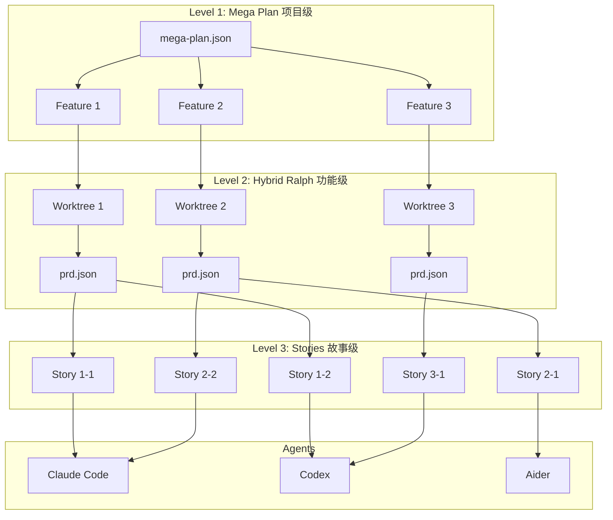
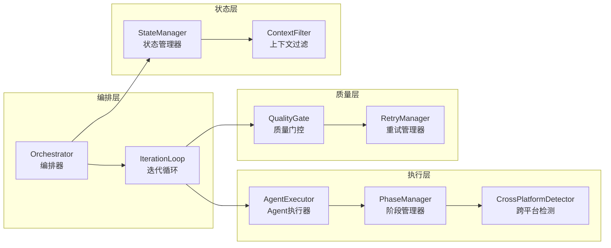
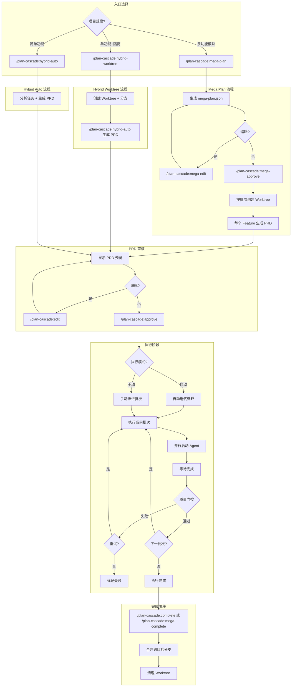
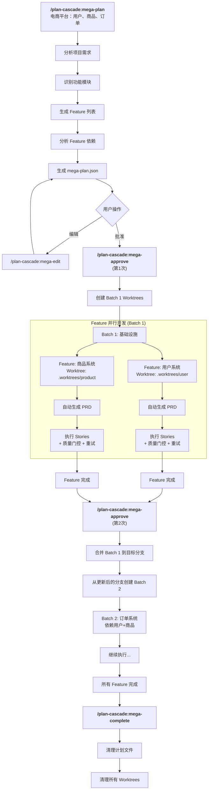
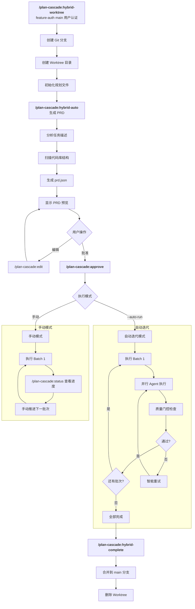
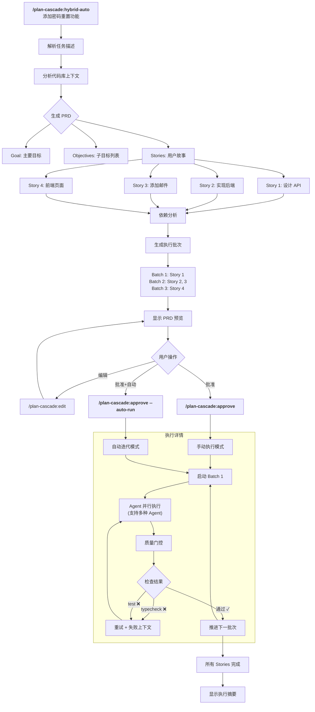
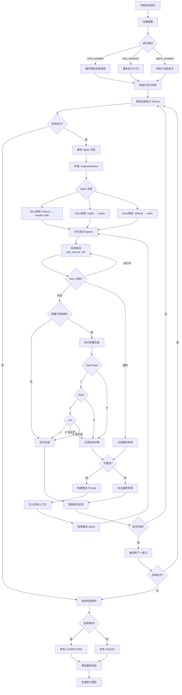
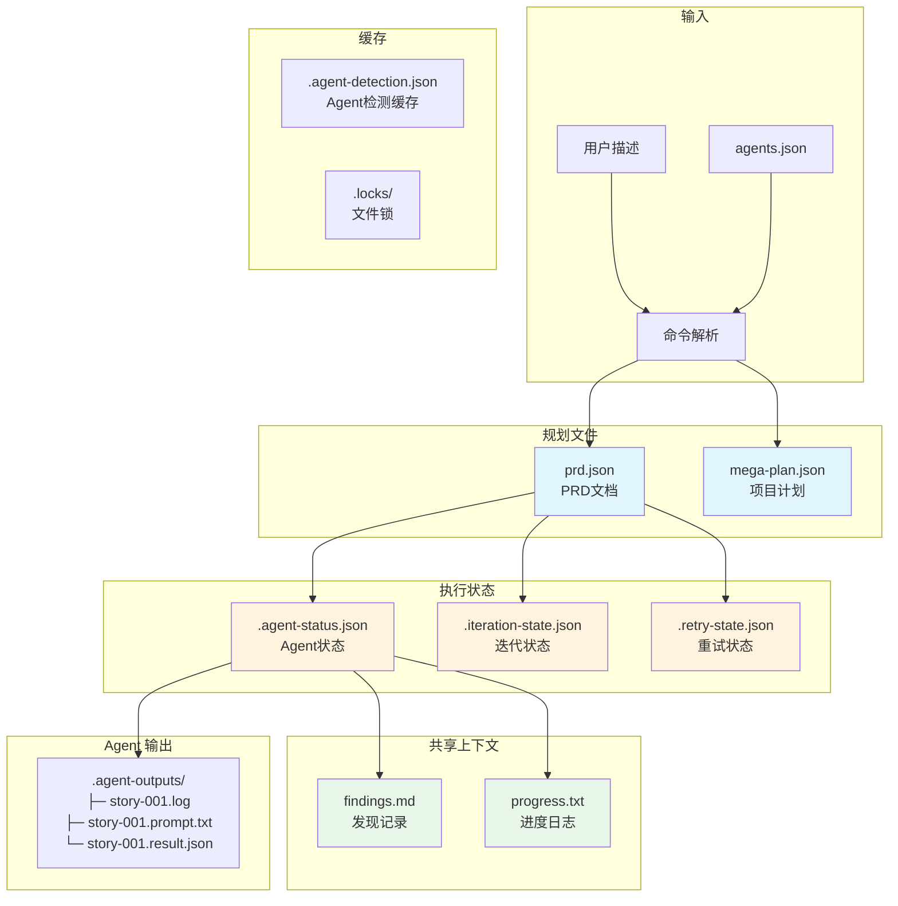

# Plan Cascade

> **三层级联的并行开发框架** — 从项目到功能到故事，层层分解、并行执行

[](https://opensource.org/licenses/MIT)
[](https://claude.ai/code)
[](https://modelcontextprotocol.io)
[](https://github.com/Taoidle/plan-cascade)
[](https://pypi.org/project/plan-cascade/)

## 项目起源

本项目 fork 自 [OthmanAdi/planning-with-files](https://github.com/OthmanAdi/planning-with-files)（v2.7.1），在其 Manus 风格的文件规划基础上，大幅扩展了功能：

| 特性 | 原版 planning-with-files | Plan Cascade |
|------|-------------------------|--------------|
| 架构 | 单层规划 | **三层级联**（项目→功能→故事） |
| 并行 | 单任务 | **多层并行**（Feature 并行 + Story 并行） |
| PRD | 无 | **自动生成** + 依赖分析 |
| 编排 | 无 | **Mega Plan 项目级编排** |
| 合并 | 无 | **依赖顺序批量合并** |
| 多 Agent | 无 | **支持 Codex、Amp、Aider 等多种 Agent** |
| 自动迭代 | 无 | **自动批次执行 + 质量门控 + 智能重试** |
| 工具支持 | Claude Code, Cursor, etc. | **Claude Code + MCP 兼容工具** |

---

## 概述

Plan Cascade 是一个**三层级联的 AI 并行开发框架**，专为大型软件项目设计。它将复杂项目逐层分解，通过多 Agent 协作实现高效的并行开发。

### 核心理念

- **层层分解**：项目 → 功能 → 故事，逐级细化任务粒度
- **并行执行**：无依赖的任务在同一批次中并行处理
- **多 Agent 协作**：根据任务特点自动选择最优 Agent
- **质量保障**：自动化质量门控 + 智能重试机制
- **状态追踪**：基于文件的状态共享，支持断点恢复

### 三层架构



### 层级详解

| 层级 | 名称 | 职责 | 产物 |
|------|------|------|------|
| **Level 1** | Mega Plan | 项目级编排，管理多个 Feature 的依赖和执行顺序 | `mega-plan.json` |
| **Level 2** | Hybrid Ralph | 功能级开发，在独立 Worktree 中执行，自动生成 PRD | `prd.json`, `findings.md` |
| **Level 3** | Stories | 故事级执行，由 Agent 并行处理，支持质量门控和重试 | 代码变更, `progress.txt` |

### 核心组件



### 支持的使用方式

| 方式 | 说明 | 适用场景 |
|------|------|----------|
| **Claude Code 插件** | 原生集成，功能最完整 | Claude Code 用户 |
| **MCP 服务器** | 通过 MCP 协议集成 | Cursor, Windsurf, Cline 等 |
| **Standalone CLI** | 独立命令行工具 | 任何终端环境 |
| **Desktop 应用** | 图形化界面 | 偏好 GUI 的用户 |

---

## 核心流程

Plan Cascade 提供三个主要入口命令，适用于不同规模的开发场景：

| 入口命令 | 适用场景 | 特点 | MCP 工具 |
|----------|----------|------|----------|
| `/plan-cascade:mega-plan` | 大型项目（多个相关功能） | Feature 级并行 + Story 级并行 | `mega_generate` |
| `/plan-cascade:hybrid-worktree` | 单个复杂功能 | Worktree 隔离 + Story 并行 | `prd_generate` |
| `/plan-cascade:hybrid-auto` | 简单功能 | 快速 PRD 生成 + Story 并行 | `prd_generate` |

### 完整工作流概览



### `/plan-cascade:mega-plan` 流程：大型项目

适用于包含多个相关功能模块的大型项目开发。

**适用场景：**

| 类型 | 场景 | 示例 |
|------|------|------|
| ✅ 适用 | 多功能模块的新项目开发 | 构建 SaaS 平台（用户 + 订阅 + 计费 + 后台） |
| ✅ 适用 | 涉及多子系统的大规模重构 | 单体应用重构为微服务架构 |
| ✅ 适用 | 功能群开发 | 电商平台（用户、商品、购物车、订单） |
| ❌ 不适用 | 单个功能开发 | 仅实现用户认证（用 Hybrid Ralph） |
| ❌ 不适用 | Bug 修复 | 修复登录页表单验证问题 |

**重要：批次间顺序执行**

Mega-plan 使用**批次间顺序执行**模式，确保每个批次从更新后的目标分支创建 worktree：

```
mega-approve (第1次) → 启动 Batch 1
    ↓ Batch 1 完成
mega-approve (第2次) → 合并 Batch 1 → 从更新后的分支创建 Batch 2
    ↓ Batch 2 完成
mega-approve (第3次) → 合并 Batch 2 → ...
    ↓ 所有批次完成
mega-complete → 清理计划文件
```

关键点：
- `mega-approve` 需要多次调用（每个批次一次）
- 每个批次从**更新后的目标分支**创建 worktree
- 计划文件不会被提交（已加入 .gitignore）



### `/plan-cascade:hybrid-worktree` 流程：隔离开发

适用于需要分支隔离的单个复杂功能开发。

**适用场景：**

| 类型 | 场景 | 示例 |
|------|------|------|
| ✅ 适用 | 包含多子任务的完整功能 | 用户认证（注册 + 登录 + 密码重置） |
| ✅ 适用 | 需要分支隔离的实验功能 | 新支付渠道集成测试 |
| ✅ 适用 | 中等规模重构（5-20 文件） | API 层统一错误处理改造 |
| ❌ 不适用 | 简单单文件修改 | 修改一个组件的样式 |
| ❌ 不适用 | 快速原型验证 | 验证某个库是否可用 |



### `/plan-cascade:hybrid-auto` 流程：快速开发

适用于简单功能的快速开发，无需 Worktree 隔离。

**快速开始示例：**

```bash
# 场景一：大型项目
/plan-cascade:mega-plan "构建电商平台：用户认证、商品管理、购物车、订单处理"
/plan-cascade:mega-approve --auto-prd
/plan-cascade:mega-status
/plan-cascade:mega-complete

# 场景二：单个功能（使用 Worktree 隔离）
/plan-cascade:hybrid-worktree feature-auth main "实现用户认证：登录、注册、密码重置"
/plan-cascade:approve --auto-run
/plan-cascade:hybrid-complete

# 场景三：简单功能
/plan-cascade:hybrid-auto "添加密码重置功能"
/plan-cascade:approve --auto-run
```



### 自动迭代详细流程

`/plan-cascade:approve --auto-run` 或单独的 `/plan-cascade:auto-run` 命令会启动自动迭代循环：



### 数据流与状态文件



### 文件说明

| 文件 | 类型 | 说明 |
|------|------|------|
| `prd.json` | 规划 | PRD 文档，包含目标、故事、依赖关系 |
| `mega-plan.json` | 规划 | 项目级计划，管理多个 Feature |
| `agents.json` | 配置 | Agent 配置，包含阶段默认和降级链 |
| `findings.md` | 共享 | Agent 发现记录，支持标签过滤 |
| `progress.txt` | 共享 | 进度时间线，包含 Agent 执行信息 |
| `.agent-status.json` | 状态 | Agent 运行/完成/失败状态 |
| `.iteration-state.json` | 状态 | 自动迭代进度和批次结果 |
| `.retry-state.json` | 状态 | 重试历史和失败记录 |
| `.agent-detection.json` | 缓存 | 跨平台 Agent 检测结果（1小时TTL） |
| `.agent-outputs/` | 输出 | Agent 日志、Prompt 和结果文件 |

---

## 多 Agent 协作

Plan Cascade 支持使用不同的 AI Agent 工具来执行 Story，可根据任务特点选择最合适的 Agent。

### 支持的 Agent

| Agent | 类型 | 说明 |
|-------|------|------|
| `claude-code` | task-tool | Claude Code Task tool（内置，始终可用） |
| `codex` | cli | OpenAI Codex CLI |
| `amp-code` | cli | Amp Code CLI |
| `aider` | cli | Aider AI 结对编程助手 |
| `cursor-cli` | cli | Cursor CLI |
| `claude-cli` | cli | Claude CLI（独立版） |

### Agent 优先级

```
1. 命令参数 --agent              # 最高优先级（全局覆盖）
2. 阶段覆盖 --impl-agent 等      # 阶段特定覆盖
3. Story 级别 agent 字段         # story.agent
4. Story 类型覆盖               # bugfix → codex, refactor → aider
5. 阶段默认 Agent               # phase_defaults 配置
6. 降级链                       # fallback_chain
7. claude-code                  # 最终降级（始终可用）
```

使用 `--no-fallback` 可禁用自动降级，当指定 Agent 不可用时直接失败。

### 使用示例

```bash
# 使用默认 agent (claude-code)
/plan-cascade:hybrid-auto "实现用户认证"

# 指定使用 codex 执行
/plan-cascade:hybrid-auto "实现用户认证" --agent codex

# 在 prd.json 中为特定 story 指定 agent
{
  "stories": [
    {
      "id": "story-001",
      "agent": "aider",  // 这个 story 使用 aider
      ...
    }
  ]
}

# Mega Plan 中指定 PRD 和 Story 的 agent
/plan-cascade:mega-plan "电商平台" --prd-agent codex --story-agent amp-code
```

### 状态追踪

Agent 执行状态通过文件共享：

```
.agent-status.json         # Agent 运行/完成/失败状态
.agent-outputs/
├── story-001.log          # Agent 输出日志
├── story-001.prompt.txt   # 发送给 Agent 的 prompt
├── story-001.result.json  # 执行结果（退出码、成功/失败）
progress.txt               # 包含 Agent 信息的进度日志
```

### 自动降级

如果指定的 CLI Agent 不可用（未安装或不在 PATH 中），系统会自动降级到 `claude-code`：

```
[AgentExecutor] Agent 'codex' unavailable (CLI 'codex' not found in PATH), falling back to claude-code
```

---

## 自动迭代与质量门控

### 自动迭代循环（Auto-Run）

Plan Cascade 支持完全自动化的批次执行，无需手动干预：

```bash
# 启动自动迭代，直到所有 Story 完成
/plan-cascade:auto-run

# 限制最大迭代次数
/plan-cascade:auto-run --mode max_iterations --max-iterations 10

# 仅执行当前批次
/plan-cascade:auto-run --mode batch_complete

# 批准 PRD 后立即开始自动迭代
/plan-cascade:approve --auto-run
```

#### 迭代模式

| 模式 | 说明 |
|------|------|
| `until_complete` | 持续执行直到所有 Story 完成（默认） |
| `max_iterations` | 执行最多 N 次迭代后停止 |
| `batch_complete` | 仅执行当前批次后停止 |

#### 状态文件

```
.iteration-state.json    # 迭代进度状态
.retry-state.json        # 重试历史记录
.agent-detection.json    # Agent 检测缓存
```

### 质量门控（Quality Gates）

每个 Story 完成后自动运行质量验证：

| 门控类型 | 工具 | 说明 |
|----------|------|------|
| `typecheck` | tsc, mypy, pyright | 类型检查（自动检测） |
| `test` | pytest, jest, npm test | 单元测试 |
| `lint` | eslint, ruff | 代码风格检查（可选） |
| `custom` | 自定义脚本 | 用户自定义验证 |

#### 配置示例

在 `prd.json` 中配置：

```json
{
  "quality_gates": {
    "enabled": true,
    "gates": [
      {"name": "typecheck", "type": "typecheck", "required": true},
      {"name": "tests", "type": "test", "required": true},
      {"name": "lint", "type": "lint", "required": false}
    ]
  }
}
```

### 智能重试管理

失败的 Story 会自动重试，并注入失败上下文：

```json
{
  "retry_config": {
    "max_retries": 3,
    "inject_failure_context": true
  }
}
```

重试提示会包含：
- 上次失败的错误信息
- 质量门控失败详情
- 建议的修复方向

### 阶段化 Agent 分配

不同执行阶段可使用不同的 Agent：

| 阶段 | 默认 Agent | 降级链 |
|------|-----------|--------|
| `planning` | codex | claude-code |
| `implementation` | claude-code | codex, aider |
| `retry` | claude-code | aider |
| `refactor` | aider | claude-code |

#### 配置示例

在 `agents.json` 中配置：

```json
{
  "phase_defaults": {
    "implementation": {
      "default_agent": "claude-code",
      "fallback_chain": ["codex", "aider"],
      "story_type_overrides": {
        "refactor": "aider",
        "bugfix": "codex"
      }
    }
  },
  "story_type_defaults": {
    "feature": "claude-code",
    "bugfix": "codex",
    "refactor": "aider"
  }
}
```

### 跨平台 Agent 检测

自动检测已安装的 Agent，支持：

- **PATH 环境变量** - 标准命令查找
- **常用安装路径** - 平台特定位置
- **Windows 注册表** - 已安装应用程序
- **版本检测** - 获取 Agent 版本信息

```bash
# 查看检测结果
/plan-cascade:agent-config --action detect

# 刷新检测缓存
/plan-cascade:agent-config --action refresh
```

---

## 支持的工具

| 工具 | 类型 | 状态 |
|------|------|------|
| **Claude Code** | Plugin | ✅ 完整支持 |
| **Cursor** | MCP Server | ✅ 支持 |
| **Windsurf** | MCP Server | ✅ 支持 |
| **Cline** | MCP Server | ✅ 支持 |
| **Continue** | MCP Server | ✅ 支持 |
| **Zed** | MCP Server | ✅ 支持 |
| **Amp Code** | MCP Server | ✅ 支持 |
| **Plan Cascade CLI** | CLI | ✅ 新增 |
| **Plan Cascade Desktop** | Desktop | ✅ 新增 |

---

## 安装

### Standalone CLI

```bash
# 从 PyPI 安装
pip install plan-cascade

# 简单模式 - 快速开始
plan-cascade run "实现用户登录功能"

# 专家模式 - 更多控制
plan-cascade run "实现用户登录功能" --expert

# 配置向导
plan-cascade config --setup

# 查看版本
plan-cascade version
```

### Claude Code 插件

```bash
# 从 GitHub 安装
claude plugins install Taoidle/plan-cascade

# 或克隆后本地安装
git clone https://github.com/Taoidle/plan-cascade.git
claude plugins install ./plan-cascade
```

### MCP 服务器（Cursor、Windsurf 等）

```bash
# 1. 克隆项目
git clone https://github.com/Taoidle/plan-cascade.git
cd plan-cascade

# 2. 安装依赖
pip install 'mcp[cli]'

# 3. 配置你的工具（以 Cursor 为例）
./mcp-configs/setup-mcp.sh cursor   # macOS/Linux
.\mcp-configs\setup-mcp.ps1 cursor  # Windows
```

详细配置见 [mcp-configs/README.md](mcp-configs/README.md)

### Desktop 应用

下载适合您平台的安装包：

| 平台 | 安装包格式 | 说明 |
|------|-----------|------|
| **Windows** | `.msi` 或 `.exe` | 标准 Windows 安装程序 |
| **macOS (Intel)** | `.dmg` | x64 架构 |
| **macOS (Apple Silicon)** | `.dmg` | ARM64 架构 |
| **Linux** | `.AppImage` 或 `.deb` | 通用 Linux 格式 |

从 [GitHub Releases](https://github.com/Taoidle/plan-cascade/releases) 下载最新版本。

**Desktop 特性：**
- 图形化界面，无需命令行
- 简单/专家双模式切换
- 实时进度可视化
- 可作为 Claude Code 的 GUI 前端

---

## MCP 服务器

Plan Cascade 提供完整的 MCP 服务器，支持 18 个工具和 8 个资源。

### 可用工具

#### 项目级（Mega Plan）

| 工具 | 说明 |
|------|------|
| `mega_generate` | 从描述生成项目计划 |
| `mega_add_feature` | 添加 Feature 到计划 |
| `mega_validate` | 验证计划结构 |
| `mega_get_batches` | 获取并行执行批次 |
| `mega_update_feature_status` | 更新 Feature 状态 |
| `mega_get_merge_plan` | 获取合并计划 |

#### 功能级（PRD）

| 工具 | 说明 |
|------|------|
| `prd_generate` | 从描述生成 PRD |
| `prd_add_story` | 添加 Story 到 PRD |
| `prd_validate` | 验证 PRD 结构 |
| `prd_get_batches` | 获取执行批次 |
| `prd_update_story_status` | 更新 Story 状态 |
| `prd_detect_dependencies` | 自动检测依赖 |

#### 执行级

| 工具 | 说明 |
|------|------|
| `get_story_context` | 获取 Story 完整上下文 |
| `get_execution_status` | 获取执行状态 |
| `append_findings` | 记录发现 |
| `mark_story_complete` | 标记完成 |
| `get_progress` | 获取进度 |
| `cleanup_locks` | 清理锁文件 |

#### Agent 管理

| 工具 | 说明 |
|------|------|
| `get_agent_status` | 获取 Agent 运行状态 |
| `get_available_agents` | 列出可用 Agent |
| `set_default_agent` | 设置默认 Agent |
| `execute_story_with_agent` | 使用指定 Agent 执行 Story |
| `get_agent_result` | 获取 Agent 执行结果 |
| `get_agent_output` | 获取 Agent 输出日志 |
| `wait_for_agent` | 等待 Agent 完成 |
| `stop_agent` | 停止运行中的 Agent |
| `check_agents` | 检查并更新所有 Agent 状态 |

### 可用资源

| 资源 URI | 说明 |
|----------|------|
| `plan-cascade://prd` | 当前 PRD |
| `plan-cascade://mega-plan` | 当前项目计划 |
| `plan-cascade://findings` | 开发发现 |
| `plan-cascade://progress` | 进度时间线 |
| `plan-cascade://mega-status` | Mega-plan 执行状态 |
| `plan-cascade://mega-findings` | 项目级发现 |
| `plan-cascade://story/{id}` | 特定 Story 详情 |
| `plan-cascade://feature/{id}` | 特定 Feature 详情 |

### 配置示例

```bash
# 查看所有配置示例
ls mcp-configs/

# 快速配置
./mcp-configs/setup-mcp.sh cursor     # Cursor
./mcp-configs/setup-mcp.sh windsurf   # Windsurf
./mcp-configs/setup-mcp.sh claude     # Claude Code
```

详细文档见 [docs/MCP-SERVER-GUIDE.md](docs/MCP-SERVER-GUIDE.md)

---

## 命令参考

### Claude Code 命令

#### 项目级（Mega Plan）

```bash
/plan-cascade:mega-plan <描述>           # 生成项目计划
/plan-cascade:mega-edit                  # 编辑计划
/plan-cascade:mega-approve [--auto-prd]  # 批准并执行
/plan-cascade:mega-status                # 查看进度
/plan-cascade:mega-complete [branch]     # 合并并清理
```

#### 功能级（Hybrid Ralph）

```bash
/plan-cascade:hybrid-worktree <name> <branch> <desc>  # 创建开发环境
/plan-cascade:hybrid-auto <desc> [--agent <name>]     # 生成 PRD（可指定 Agent）
/plan-cascade:approve [--agent <name>] [--auto-run]   # 执行 PRD（可指定 Agent，可自动迭代）
/plan-cascade:auto-run [--mode <mode>]                # 启动自动迭代
/plan-cascade:iteration-status [--verbose]            # 查看迭代进度
/plan-cascade:agent-config [--action <action>]        # 配置 Agent
/plan-cascade:hybrid-status                           # 查看状态
/plan-cascade:agent-status [--story-id <id>]          # 查看 Agent 状态
/plan-cascade:hybrid-complete [branch]                # 完成并合并
/plan-cascade:edit                                    # 编辑 PRD
/plan-cascade:show-dependencies                       # 依赖图
```

#### 自动迭代参数

```bash
# approve 命令新增参数
--impl-agent <name>     # 实现阶段使用的 Agent
--planning-agent <name> # 规划阶段使用的 Agent
--retry-agent <name>    # 重试时使用的 Agent
--no-fallback           # 禁用自动降级
--auto-run              # 批准后立即开始自动迭代
--auto-run-mode <mode>  # 自动迭代模式

# auto-run 命令参数
--mode <mode>           # until_complete | max_iterations | batch_complete
--max-iterations <n>    # 最大迭代次数（默认 50）
--agent <name>          # 强制所有阶段使用指定 Agent
--no-quality-gates      # 禁用质量门控
--dry-run               # 预览模式，不实际执行
```

#### 基础规划

```bash
/plan-cascade:start                      # 开始基础规划模式
/plan-cascade:worktree <name> <branch>   # 创建 Worktree（无 PRD）
/plan-cascade:complete [branch]          # 完成基础规划
```

---

## 项目结构

```
plan-cascade/
├── .claude-plugin/
│   └── plugin.json          # 插件配置
├── agents.json              # Agent 配置文件
├── commands/                # 顶层命令 (16 个)
│   ├── mega-*.md           # Mega Plan 命令
│   ├── hybrid-*.md         # Hybrid Ralph 命令
│   └── *.md                # 基础命令
├── skills/
│   ├── mega-plan/          # 项目级技能
│   │   ├── SKILL.md
│   │   ├── core/           # Python 核心模块
│   │   └── commands/
│   ├── hybrid-ralph/       # 功能级技能
│   │   ├── SKILL.md
│   │   ├── core/
│   │   │   ├── orchestrator.py         # 编排器（含自动迭代）
│   │   │   ├── agent_executor.py       # Agent 执行器（含阶段分配）
│   │   │   ├── agent_monitor.py        # Agent 监控器
│   │   │   ├── iteration_loop.py       # 自动迭代循环
│   │   │   ├── quality_gate.py         # 质量门控系统
│   │   │   ├── retry_manager.py        # 重试管理器
│   │   │   ├── cross_platform_detector.py  # 跨平台检测
│   │   │   ├── phase_config.py         # 阶段配置
│   │   │   └── ...
│   │   ├── scripts/
│   │   │   ├── agent-wrapper.py        # CLI Agent 包装器
│   │   │   └── ...
│   │   └── commands/
│   │       ├── auto-run.md             # 自动迭代命令
│   │       ├── iteration-status.md     # 迭代状态命令
│   │       ├── agent-config.md         # Agent 配置命令
│   │       ├── agent-status.md         # Agent 状态命令
│   │       └── ...
│   └── planning-with-files/ # 基础规划技能
│       ├── SKILL.md
│       └── templates/
├── mcp_server/              # MCP 服务器
│   ├── server.py           # 主入口
│   ├── resources.py        # MCP 资源
│   └── tools/              # MCP 工具
│       ├── prd_tools.py
│       ├── mega_tools.py
│       └── execution_tools.py  # 包含 Agent 管理工具
├── mcp-configs/             # MCP 配置示例
│   ├── README.md
│   ├── cursor-mcp.json
│   ├── windsurf-mcp.json
│   ├── setup-mcp.sh        # 安装脚本 (Unix)
│   └── setup-mcp.ps1       # 安装脚本 (Windows)
└── docs/                    # 文档
    └── MCP-SERVER-GUIDE.md
```

---

## 更新日志

### v3.3.0

- **Standalone CLI** - 独立命令行工具
  - `pip install plan-cascade` 直接安装
  - 简单模式/专家模式双模式支持
  - 配置向导 `plan-cascade config --setup`
- **Desktop 桌面应用** - 图形化界面
  - 支持 Windows (.msi/.exe)、macOS (.dmg)、Linux (.AppImage/.deb)
  - 实时进度可视化
  - 可作为 Claude Code 的 GUI
- **GitHub Actions CI/CD** - 自动化发布
  - Python 包自动发布到 PyPI（Trusted Publishing）
  - Desktop 应用多平台构建和发布
  - Dependabot 依赖更新
- **Mega-plan 批次执行改进**
  - 批次间顺序执行，确保依赖正确处理
  - 每个批次从更新后的目标分支创建 worktree
  - 计划文件不会被提交
- 版本号同步修复

### v3.2.0

- **自动迭代循环** - 完全自动化的批次执行
  - 三种迭代模式：until_complete、max_iterations、batch_complete
  - 支持暂停、恢复、停止
  - 迭代状态持久化 (.iteration-state.json)
- **质量门控系统** - Story 完成后自动验证
  - 支持 typecheck、test、lint、custom 门控
  - 自动检测项目类型（Node.js、Python、Rust、Go）
  - 可配置必选/可选门控
- **智能重试管理** - 失败自动重试
  - 最多 3 次重试（可配置）
  - 指数退避延迟
  - 失败上下文注入到重试 prompt
  - 支持重试时切换 Agent
- **跨平台 Agent 检测** - 增强的 Agent 发现
  - 支持 Windows、macOS、Linux
  - 检测 PATH、常用位置、Windows 注册表
  - 检测结果缓存（1 小时 TTL）
  - 版本信息获取
- **阶段化 Agent 分配** - 不同阶段使用不同 Agent
  - 支持 planning、implementation、retry、refactor、review 阶段
  - Story 类型自动推断（feature、bugfix、refactor 等）
  - 可配置降级链
- 新增命令：`/plan-cascade:auto-run`、`/plan-cascade:iteration-status`、`/plan-cascade:agent-config`
- `/plan-cascade:approve` 命令新增 `--auto-run`、`--impl-agent`、`--no-fallback` 等参数
- agents.json 新增 `phase_defaults` 和 `story_type_defaults` 配置

### v3.1.0

- **多 Agent 协作** - 支持使用不同 Agent 执行 Story
  - 支持 Codex、Amp Code、Aider、Cursor CLI 等
  - 自动降级：CLI 不可用时降级到 claude-code
  - Agent 包装器：统一的进程管理和状态追踪
  - Agent 监控器：轮询状态、读取结果
- 9 个新 MCP 工具用于 Agent 管理
- agents.json 配置文件
- `/plan-cascade:agent-status` 命令

### v3.0.0

- **MCP 服务器** - 支持 Cursor、Windsurf、Cline 等 MCP 兼容工具
- 18 个 MCP 工具 + 8 个 MCP 资源
- 多平台配置示例和安装脚本
- 与 Claude Code 插件完全兼容

### v2.8.0

- **Mega Plan** - 项目级多功能编排系统
- 三层级联架构（项目 → 功能 → 故事）
- 公共 findings 机制
- 依赖驱动的批次执行

### v2.7.x

- Auto/Manual 执行模式
- 操作系统自动检测
- 命令自动批准配置

完整更新日志见 [CHANGELOG.md](CHANGELOG.md)

---

## 致谢

本项目基于以下优秀项目构建：

- **[OthmanAdi/planning-with-files](https://github.com/OthmanAdi/planning-with-files)** - 原始项目，提供了核心的 Manus 风格文件规划模式和基础框架
- **[snarktank/ralph](https://github.com/snarktank/ralph)** - 启发了 PRD 格式和任务分解方法
- **Manus AI** - 上下文工程模式的先驱
- **Anthropic** - Claude Code、Plugin 系统和 MCP 协议

---

## 许可证

MIT License

---

**项目地址**: [Taoidle/plan-cascade](https://github.com/Taoidle/plan-cascade)

[](https://star-history.com/#Taoidle/plan-cascade&Date)
