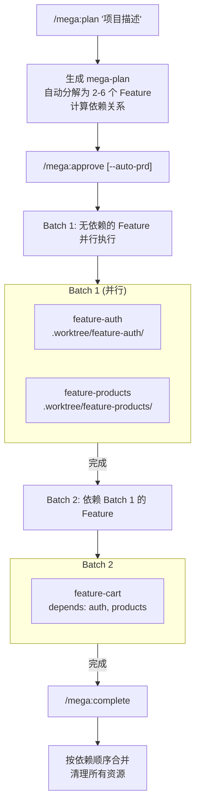
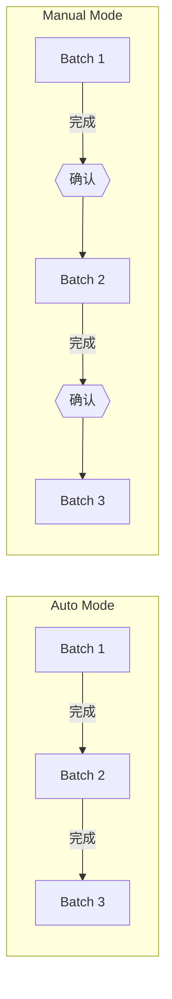

# Plan Cascade

> **三层级联的并行开发框架** — 从项目到功能到故事，层层分解、并行执行

[](https://opensource.org/licenses/MIT)
[](https://claude.ai/code)
[](https://github.com/Taoidle/plan-cascade)

## 项目起源

本项目 fork 自 [OthmanAdi/planning-with-files](https://github.com/OthmanAdi/planning-with-files)（v2.7.1），在其 Manus 风格的文件规划基础上，大幅扩展了功能：

| 特性 | 原版 planning-with-files | Plan Cascade |
|------|-------------------------|--------------|
| 架构 | 单层规划 | **三层级联**（项目→功能→故事） |
| 并行 | 单任务 | **多层并行**（Feature 并行 + Story 并行） |
| PRD | 手动创建 | **自动生成** + 依赖分析 |
| 编排 | 无 | **Mega Plan 项目级编排** |
| 合并 | 单次合并 | **依赖顺序批量合并** |

---

## 概述

Plan Cascade 是一个 Claude Code 插件，提供**三层级联**的并行开发能力：

```
┌─────────────────────────────────────────────────────────────┐
│  Level 1: Mega Plan (项目级)                                 │
│  ├── 将大型项目分解为多个 Feature                             │
│  ├── 管理 Feature 之间的依赖关系                              │
│  └── 统一合并所有完成的 Feature                               │
├─────────────────────────────────────────────────────────────┤
│  Level 2: Hybrid Ralph (功能级)                              │
│  ├── 每个 Feature 在独立的 Git Worktree 中开发                │
│  ├── 自动生成 PRD，分解为多个 Story                           │
│  └── 完成后合并到目标分支                                     │
├─────────────────────────────────────────────────────────────┤
│  Level 3: Stories (故事级)                                   │
│  ├── 每个 Story 由独立 Agent 执行                             │
│  ├── 无依赖的 Story 并行执行                                  │
│  └── 按批次自动或手动流转                                     │
└─────────────────────────────────────────────────────────────┘
```

## 安装

```bash
# 从 GitHub 安装
claude plugins install Taoidle/plan-cascade

# 或克隆后本地安装
git clone https://github.com/Taoidle/plan-cascade.git
claude plugins install ./plan-cascade
```

## 使用场景

| 场景 | 推荐方案 | 命令 |
|------|---------|------|
| 大型项目（多个相关功能） | Mega Plan | `/mega:plan` |
| 单个复杂功能 | Hybrid Ralph + Worktree | `/hybrid-worktree` |
| 简单任务 | Hybrid Ralph | `/hybrid-auto` |

### 适用场景详解

#### Mega Plan（项目级编排）

| 类型 | 场景 | 示例 |
|------|------|------|
| ✅ 适用 | 多功能模块的新项目开发 | 构建 SaaS 平台（用户 + 订阅 + 计费 + 后台） |
| ✅ 适用 | 涉及多子系统的大规模重构 | 单体应用重构为微服务架构 |
| ✅ 适用 | 功能群开发 | 电商平台（用户、商品、购物车、订单） |
| ✅ 适用 | 多人协作项目 | 团队成员各自负责不同 Feature |
| ❌ 不适用 | 单个功能开发 | 仅实现用户认证（用 Hybrid Ralph） |
| ❌ 不适用 | Bug 修复 | 修复登录页表单验证问题 |
| ❌ 不适用 | 紧急热修复 | 生产环境紧急问题（流程过重） |
| ❌ 不适用 | 探索性开发 | 需求不明确的原型验证 |

#### Hybrid Ralph + Worktree（功能级开发）

| 类型 | 场景 | 示例 |
|------|------|------|
| ✅ 适用 | 包含多子任务的完整功能 | 用户认证（注册 + 登录 + 密码重置） |
| ✅ 适用 | 需要分支隔离的实验功能 | 新支付渠道集成测试 |
| ✅ 适用 | 中等规模重构（5-20 文件） | API 层统一错误处理改造 |
| ✅ 适用 | 需要回滚能力的风险改动 | 数据库 Schema 迁移 |
| ❌ 不适用 | 简单单文件修改 | 修改一个组件的样式 |
| ❌ 不适用 | 快速原型验证 | 验证某个库是否可用 |
| ❌ 不适用 | 已有功能小幅调整 | 调整按钮位置 |
| ❌ 不适用 | 配置文件修改 | 更新环境变量 |

#### Hybrid Auto（无 Worktree）

| 类型 | 场景 | 示例 |
|------|------|------|
| ✅ 适用 | 当前分支的中等复杂度功能 | 在 feature 分支添加表单验证 |
| ✅ 适用 | 快速迭代开发 | 持续优化现有功能 |
| ✅ 适用 | 已有分支的功能扩展 | 给现有 API 添加新字段 |
| ✅ 适用 | CI/CD 自动化任务 | 自动代码生成、批量修改 |
| ❌ 不适用 | 需要与主分支隔离 | 可能废弃的实验功能 |
| ❌ 不适用 | 多人同时工作 | 需要独立工作区 |
| ❌ 不适用 | 大规模改动 | 影响 20+ 文件的重构 |

#### 多 Worktree 并行

| 类型 | 场景 | 示例 |
|------|------|------|
| ✅ 适用 | 多个独立功能同时开发 | 「暗色模式」+「多语言支持」并行 |
| ✅ 适用 | 频繁切换多个功能 | 开发 A 等待 Review 时开发 B |
| ✅ 适用 | 长期功能与紧急任务并存 | 大功能开发中插入小需求 |
| ❌ 不适用 | 功能有强依赖关系 | 购物车依赖用户系统（用 Mega Plan） |
| ❌ 不适用 | 磁盘空间有限 | 每个 Worktree 占用独立空间 |

#### 何时不需要本插件

| 场景 | 说明 | 建议 |
|------|------|------|
| 简单 Bug 修复 | 单点问题，定位清晰 | 直接修复 |
| 小幅代码调整 | 改几行代码、调参数 | 直接修改 |
| 文档更新 | README、注释、文档 | 直接编辑 |
| 配置修改 | 环境变量、配置文件 | 直接改 |
| 依赖更新 | 升级 package 版本 | 直接升级 |
| 代码格式化 | lint、prettier 修复 | 运行工具 |

> **判断标准：** 如果任务影响范围清晰且复杂度低，直接操作更高效。

---

## 快速开始

### 场景一：大型项目（Mega Plan）

适用于需要开发多个相互依赖功能的项目。

```bash
# 1. 创建项目计划（自动分解为多个 Feature）
/mega:plan "构建电商平台：用户认证、商品管理、购物车、订单处理"

# 2. 审核计划后开始执行
/mega:approve              # 手动审批每个 Feature 的 PRD
/mega:approve --auto-prd   # 或自动批准所有 PRD，立即执行

# 3. 监控进度
/mega:status

# 4. 全部完成后统一合并
/mega:complete
```

### 场景二：单个功能开发（Hybrid Ralph）

适用于开发单个独立功能。

```bash
# 1. 创建隔离的开发环境
/hybrid-worktree feature-auth main "实现用户认证：登录、注册、密码重置"

# 2. 审核 PRD 后开始执行
/approve

# 3. 完成后合并
/hybrid-complete
```

### 场景三：多任务并行（多个 Worktree）

在不同终端同时开发多个独立功能。

```bash
# 终端 1
/hybrid-worktree feature-auth main "用户认证"
/approve

# 终端 2（同时进行）
/hybrid-worktree feature-api main "API 重构"
/approve

# 各自完成后分别合并
/hybrid-complete
```

---

## Mega Plan 详解

Mega Plan 是项目级编排系统，用于管理多个相关功能的并行开发。

### 工作流程



### 文件结构

```
project-root/
├── mega-plan.json          # 项目计划
├── mega-findings.md        # 公共发现（只读共享）
├── .mega-status.json       # 执行状态
└── .worktree/
    ├── feature-auth/       # Feature 1 工作区
    │   ├── prd.json       # Feature PRD（3-7 个 Story）
    │   ├── findings.md    # Feature 独立发现
    │   └── mega-findings.md # 公共发现副本（只读）
    └── feature-products/   # Feature 2 工作区
        └── ...
```

### 命令参考

| 命令 | 说明 |
|------|------|
| `/mega:plan <描述>` | 从描述生成项目计划 |
| `/mega:edit` | 编辑项目计划 |
| `/mega:approve` | 批准计划，手动审批 PRD |
| `/mega:approve --auto-prd` | 批准计划，自动审批所有 PRD |
| `/mega:status` | 查看项目进度 |
| `/mega:complete [branch]` | 合并所有 Feature 并清理 |

---

## Hybrid Ralph 详解

Hybrid Ralph 是功能级开发系统，将单个功能分解为可并行执行的 Story。

### PRD 自动生成

```bash
/hybrid-worktree my-feature main "实现用户认证系统"
```

自动生成的 `prd.json` 包含：

```json
{
  "goal": "实现用户认证系统",
  "stories": [
    {
      "id": "story-001",
      "title": "设计数据库 Schema",
      "dependencies": [],
      "status": "pending"
    },
    {
      "id": "story-002",
      "title": "实现注册 API",
      "dependencies": ["story-001"],
      "status": "pending"
    }
  ]
}
```

### 执行模式

| 模式 | 说明 | 适用场景 |
|------|------|---------|
| **Auto** | 批次自动流转 | 日常开发、信任 PRD |
| **Manual** | 每批次需确认 | 关键功能、需审查 |



### 命令参考

| 命令 | 说明 |
|------|------|
| `/hybrid-worktree <name> <branch> <desc>` | 创建 Worktree 并生成 PRD |
| `/hybrid-auto <desc>` | 仅生成 PRD（不创建 Worktree） |
| `/approve` | 批准 PRD 并开始执行 |
| `/hybrid-status` | 查看 Story 执行状态 |
| `/hybrid-complete [branch]` | 合并并清理 Worktree |
| `/edit` | 编辑 PRD |
| `/show-dependencies` | 显示依赖关系图 |

---

## 完整命令参考

### 项目级（Mega Plan）

```bash
/mega:plan <描述>           # 生成项目计划
/mega:edit                  # 编辑计划
/mega:approve [--auto-prd]  # 批准并执行
/mega:status                # 查看进度
/mega:complete [branch]     # 合并并清理
```

### 功能级（Hybrid Ralph）

```bash
/hybrid-worktree <name> <branch> <desc>  # 创建开发环境
/hybrid-auto <desc>                       # 生成 PRD
/approve                                  # 执行 PRD
/hybrid-status                            # 查看状态
/hybrid-complete [branch]                 # 完成并合并
/edit                                     # 编辑 PRD
/show-dependencies                        # 依赖图
```

### 基础规划

```bash
/start                      # 开始基础规划模式
/worktree <name> <branch>   # 创建 Worktree（无 PRD）
/complete [branch]          # 完成基础规划
```

---

## 配置

### 命令自动批准（可选）

项目包含 `.claude/settings.local.json`，自动批准常用命令：

- Git: `git *`
- 导航: `cd *`, `pwd`, `ls *`
- 文件: `cat *`, `grep *`, `find *`
- 运行: `python3 *`, `node *`, `npm *`

自定义配置：

```json
{
  "permissions": {
    "allow": ["Bash(git *)", "Bash(cd *)"]
  }
}
```

---

## 项目结构

```
plan-cascade/
├── .claude-plugin/
│   └── plugin.json         # 插件配置
├── commands/               # 顶层命令
│   ├── mega-*.md          # Mega Plan 命令
│   ├── hybrid-*.md        # Hybrid Ralph 命令
│   └── *.md               # 基础命令
├── skills/
│   ├── mega-plan/         # 项目级技能
│   │   ├── SKILL.md
│   │   ├── core/          # Python 核心模块
│   │   ├── commands/
│   │   └── scripts/
│   ├── hybrid-ralph/      # 功能级技能
│   │   ├── SKILL.md
│   │   ├── core/
│   │   └── commands/
│   └── planning-with-files/  # 基础规划技能
└── docs/                   # 文档
```

---

## 更新日志

### v2.8.0
- **Mega Plan** - 项目级多功能编排系统
- 三层级联架构（项目 → 功能 → 故事）
- 公共 findings 机制
- 依赖驱动的批次执行

### v2.7.x
- Auto/Manual 执行模式
- 操作系统自动检测
- 命令自动批准配置
- Worktree 路径修复

完整更新日志见 [CHANGELOG.md](CHANGELOG.md)

---

## 致谢

本项目基于以下优秀项目构建：

- **[OthmanAdi/planning-with-files](https://github.com/OthmanAdi/planning-with-files)** - 原始项目，提供了核心的 Manus 风格文件规划模式和基础框架
- **[snarktank/ralph](https://github.com/snarktank/ralph)** - 启发了 PRD 格式和任务分解方法
- **Manus AI** - 上下文工程模式的先驱
- **Anthropic** - Claude Code 和 Plugin 系统

---

## 许可证

MIT License

---

**项目地址**: [Taoidle/plan-cascade](https://github.com/Taoidle/plan-cascade)

[](https://star-history.com/#Taoidle/plan-cascade&Date)
