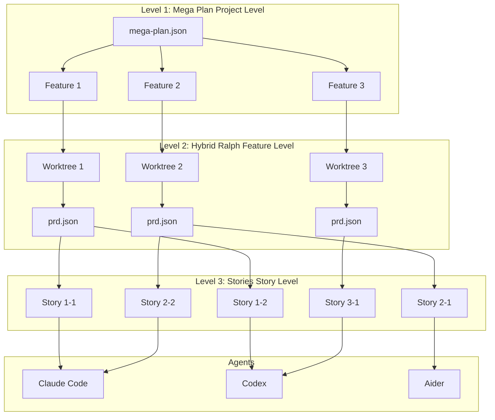
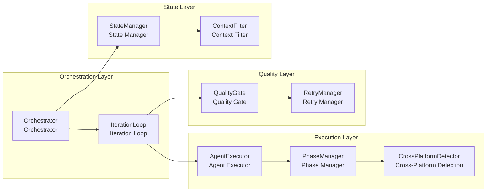
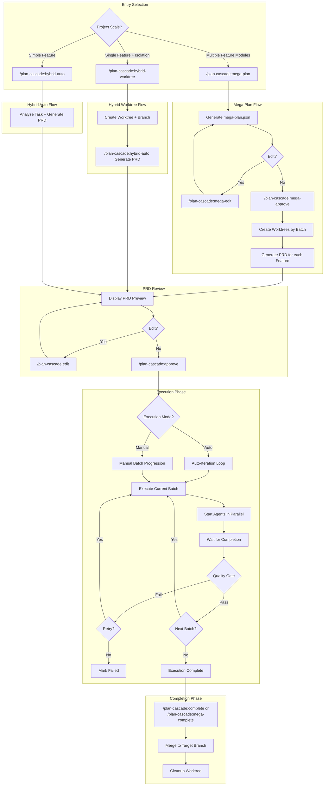
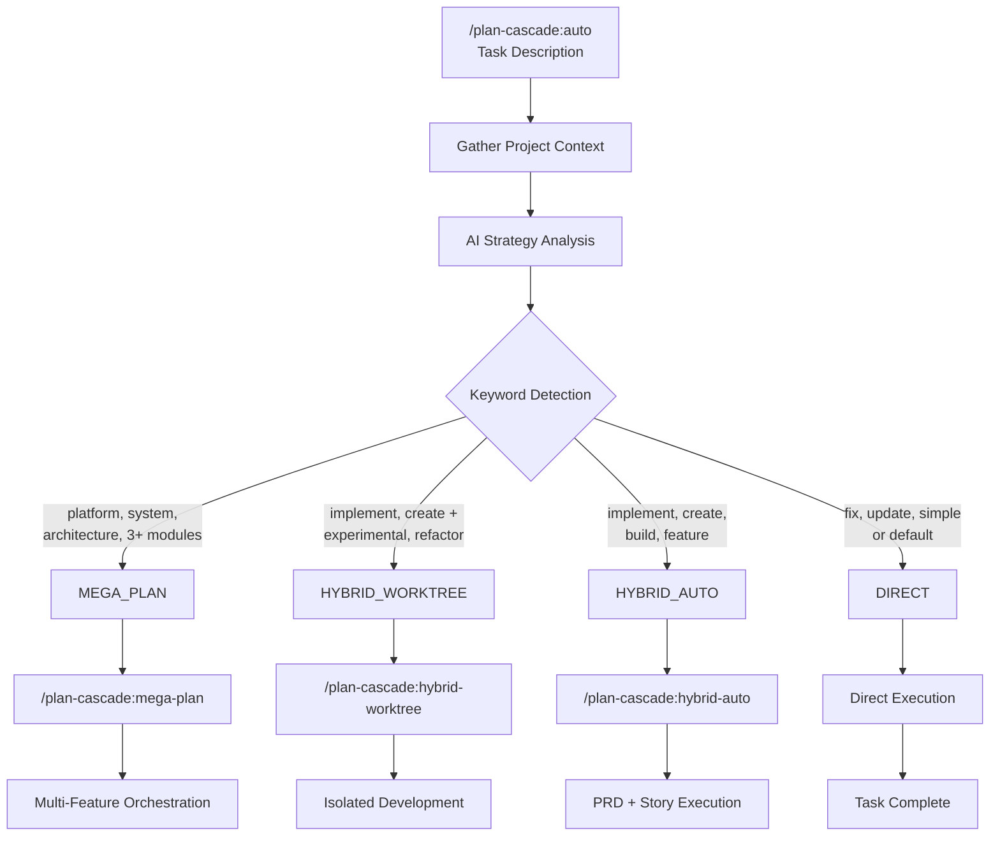
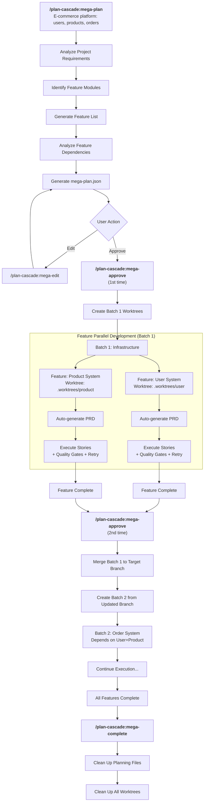
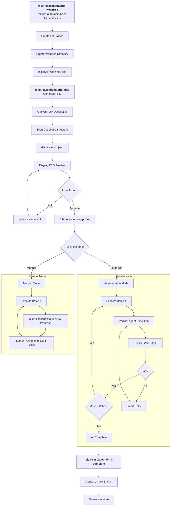
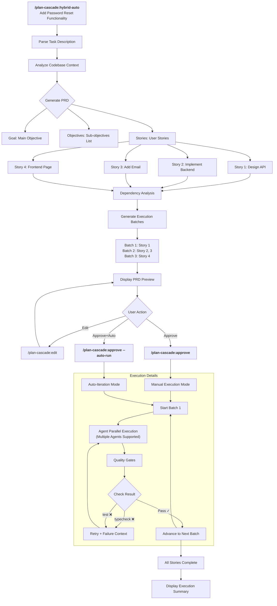
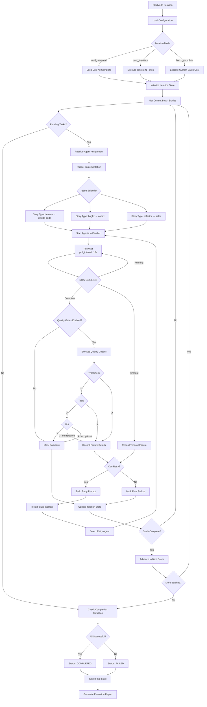
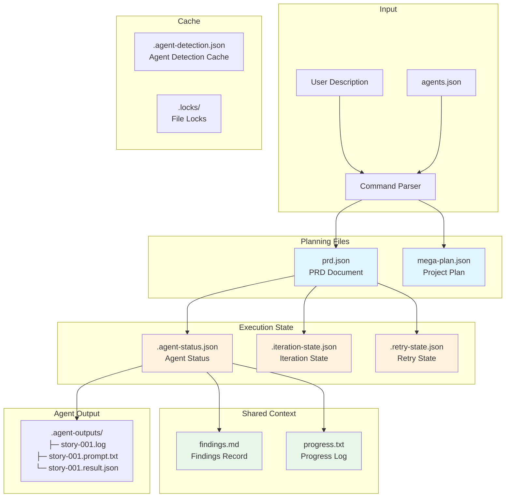

[中文版](System-Architecture_zh.md)

# Plan Cascade - System Architecture and Workflow Design

**Version**: 4.1.0
**Last Updated**: 2026-01-29

This document contains detailed architecture diagrams, flowcharts, and system design for Plan Cascade.

---

## Table of Contents

1. [Three-Tier Architecture](#1-three-tier-architecture)
2. [Core Components](#2-core-components)
3. [Complete Workflow](#3-complete-workflow)
4. [Auto Strategy Workflow](#4-auto-strategy-workflow)
5. [Mega Plan Workflow](#5-mega-plan-workflow)
6. [Hybrid Worktree Workflow](#6-hybrid-worktree-workflow)
7. [Hybrid Auto Workflow](#7-hybrid-auto-workflow)
8. [Auto-Iteration Workflow](#8-auto-iteration-workflow)
9. [Data Flow and State Files](#9-data-flow-and-state-files)
10. [Dual-Mode Architecture](#10-dual-mode-architecture)
11. [Multi-Agent Collaboration Architecture](#11-multi-agent-collaboration-architecture)

---

## 1. Three-Tier Architecture



### Tier Details

| Tier | Name | Responsibility | Artifact |
|------|------|----------------|----------|
| **Level 1** | Mega Plan | Project-level orchestration, manages dependencies and execution order of multiple Features | `mega-plan.json` |
| **Level 2** | Hybrid Ralph | Feature-level development, executes in isolated Worktree, auto-generates PRD | `prd.json`, `findings.md` |
| **Level 3** | Stories | Story-level execution, processed in parallel by Agents, supports quality gates and retries | Code changes, `progress.txt` |

---

## 2. Core Components



### Component Descriptions

| Component | Responsibility |
|-----------|----------------|
| **Orchestrator** | Core orchestrator, coordinates all components |
| **IterationLoop** | Auto-iteration loop, manages batch execution |
| **AgentExecutor** | Agent execution abstraction, supports multiple Agents |
| **PhaseManager** | Phase management, selects Agent based on phase |
| **QualityGate** | Quality gates, validates code quality |
| **RetryManager** | Retry management, handles failure retries |
| **StateManager** | State management, persists execution state |
| **ContextFilter** | Context filter, optimizes Agent input |

---

## 3. Complete Workflow



---

## 4. Auto Strategy Workflow

The `/plan-cascade:auto` command provides AI-driven automatic strategy selection based on task analysis.

### Strategy Selection Flowchart



### Strategy Detection Rules

| Priority | Strategy | Keywords | Condition |
|----------|----------|----------|-----------|
| 1 | **MEGA_PLAN** | platform, system, architecture, microservices | OR 3+ independent modules listed |
| 2 | **HYBRID_WORKTREE** | (feature keywords) + experimental, refactor, isolated | Both conditions required |
| 3 | **HYBRID_AUTO** | implement, create, build, feature, api | Without isolation keywords |
| 4 | **DIRECT** | fix, typo, update, simple, single | Default fallback |

### Example Strategy Mappings

| Task Description | Detected Keywords | Selected Strategy |
|-----------------|-------------------|-------------------|
| "Fix the typo in README" | fix, typo | DIRECT |
| "Implement user authentication with OAuth" | implement, authentication | HYBRID_AUTO |
| "Experimental refactoring of payment module" | refactoring + experimental | HYBRID_WORKTREE |
| "Build e-commerce platform with users, products, cart, orders" | platform + 4 modules | MEGA_PLAN |

---

## 5. Mega Plan Workflow

Suitable for large project development containing multiple related feature modules.

### Use Cases

| Type | Scenario | Example |
|------|----------|---------|
| ✅ Suitable | Multi-module new project development | Build SaaS platform (user + subscription + billing + admin) |
| ✅ Suitable | Large-scale refactoring involving multiple subsystems | Monolith to microservices architecture |
| ✅ Suitable | Feature group development | E-commerce platform (users, products, cart, orders) |
| ❌ Not suitable | Single feature development | Only implement user authentication (use Hybrid Ralph) |
| ❌ Not suitable | Bug fixes | Fix login page form validation issue |

### Sequential Execution Between Batches

```
mega-approve (1st time) → Start Batch 1
    ↓ Batch 1 complete
mega-approve (2nd time) → Merge Batch 1 → Create Batch 2 from updated branch
    ↓ Batch 2 complete
mega-approve (3rd time) → Merge Batch 2 → ...
    ↓ All batches complete
mega-complete → Clean up planning files
```

### Detailed Flowchart



---

## 6. Hybrid Worktree Workflow

Suitable for single complex feature development requiring branch isolation.

### Use Cases

| Type | Scenario | Example |
|------|----------|---------|
| ✅ Suitable | Complete feature with multiple subtasks | User authentication (registration + login + password reset) |
| ✅ Suitable | Experimental feature requiring branch isolation | New payment channel integration test |
| ✅ Suitable | Medium-scale refactoring (5-20 files) | API layer unified error handling |
| ❌ Not suitable | Simple single-file modification | Modify a component's style |
| ❌ Not suitable | Quick prototype validation | Verify if a library is usable |

### Detailed Flowchart



---

## 7. Hybrid Auto Workflow

Suitable for quick development of simple features without Worktree isolation.

### Detailed Flowchart



---

## 8. Auto-Iteration Workflow

Auto-iteration loop started by `/plan-cascade:approve --auto-run` or `/plan-cascade:auto-run` command:



### Iteration Modes

| Mode | Description |
|------|-------------|
| `until_complete` | Continue execution until all Stories complete (default) |
| `max_iterations` | Stop after executing at most N iterations |
| `batch_complete` | Stop after executing current batch only |

---

## 9. Data Flow and State Files



### File Descriptions

| File | Type | Description |
|------|------|-------------|
| `prd.json` | Planning | PRD document, contains goals, stories, dependencies |
| `mega-plan.json` | Planning | Project-level plan, manages multiple Features |
| `agents.json` | Configuration | Agent configuration, includes phase defaults and fallback chains |
| `findings.md` | Shared | Agent findings record, supports tag filtering |
| `progress.txt` | Shared | Progress timeline, includes Agent execution info |
| `.agent-status.json` | State | Agent running/completed/failed status |
| `.iteration-state.json` | State | Auto-iteration progress and batch results |
| `.retry-state.json` | State | Retry history and failure records |
| `.agent-detection.json` | Cache | Cross-platform Agent detection results (1-hour TTL) |
| `.agent-outputs/` | Output | Agent logs, prompts, and result files |

---

## 10. Dual-Mode Architecture

### Mode Switching Design

```
┌─────────────────────────────────────────────────────────────────────────┐
│                         Plan Cascade                                     │
├─────────────────────────────────────────────────────────────────────────┤
│                                                                          │
│   ┌─────────────────────────┐     ┌─────────────────────────┐           │
│   │      Simple Mode         │     │      Expert Mode         │           │
│   │                         │     │                         │           │
│   │  User enters description │     │  User enters description │           │
│   │       ↓                 │     │       ↓                 │           │
│   │  AI auto-determines      │     │  Generate PRD (editable) │           │
│   │  strategy               │     │       ↓                 │           │
│   │       ↓                 │     │  User Review/Modify      │           │
│   │  Auto-generate PRD      │     │       ↓                 │           │
│   │       ↓                 │     │  Select Strategy/Agent   │           │
│   │  Auto-execute           │     │       ↓                 │           │
│   │       ↓                 │     │  Execute                │           │
│   │  Complete               │     │                         │           │
│   └─────────────────────────┘     └─────────────────────────┘           │
│                                                                          │
│                              Shared Core                                 │
│   ┌─────────────────────────────────────────────────────────────────┐   │
│   │  Orchestrator │ PRDGenerator │ QualityGate │ AgentExecutor      │   │
│   └─────────────────────────────────────────────────────────────────┘   │
│                                                                          │
└─────────────────────────────────────────────────────────────────────────┘
```

### Dual Working Mode Architecture

**Core Philosophy: Plan Cascade = Brain (Orchestration), Execution Layer = Hands (Tool Execution)**

```
┌─────────────────────────────────────────────────────────────────────────┐
│                           Plan Cascade                                   │
│                    (Orchestration Layer - Shared by Both Modes)          │
├─────────────────────────────────────────────────────────────────────────┤
│                                                                          │
│   ┌─────────────────────────────────────────────────────────────────┐   │
│   │                    Orchestration Engine (Shared)                  │   │
│   │  ┌─────────────┐  ┌─────────────┐  ┌─────────────┐              │   │
│   │  │ PRD Generator│  │ Dependency  │  │  Batch     │              │   │
│   │  │             │  │ Analyzer    │  │  Scheduler │              │   │
│   │  └─────────────┘  └─────────────┘  └─────────────┘              │   │
│   │  ┌─────────────┐  ┌─────────────┐  ┌─────────────┐              │   │
│   │  │ State       │  │ Quality    │  │  Retry     │              │   │
│   │  │ Manager     │  │ Gates      │  │  Manager   │              │   │
│   │  └─────────────┘  └─────────────┘  └─────────────┘              │   │
│   └─────────────────────────────────────────────────────────────────┘   │
│                              │                                           │
│                    ┌─────────┴─────────┐                                │
│                    │  Execution Layer   │                                │
│                    │  Selection         │                                │
│                    └─────────┬─────────┘                                │
│              ┌───────────────┴───────────────┐                          │
│              ▼                               ▼                          │
│   ┌─────────────────────────┐    ┌─────────────────────────┐           │
│   │  Standalone Orchestration│    │  Claude Code GUI Mode   │           │
│   │  Mode                    │    │                         │           │
│   ├─────────────────────────┤    ├─────────────────────────┤           │
│   │                         │    │                         │           │
│   │   Built-in Tool Engine  │    │   Claude Code CLI       │           │
│   │   ┌───────────────┐     │    │   ┌───────────────┐     │           │
│   │   │ Read/Write    │     │    │   │ Claude Code   │     │           │
│   │   │ Edit/Bash     │     │    │   │ Executes Tools│     │           │
│   │   │ Glob/Grep     │     │    │   │ (stream-json) │     │           │
│   │   └───────────────┘     │    │   └───────────────┘     │           │
│   │          │              │    │          │              │           │
│   │          ▼              │    │          ▼              │           │
│   │   ┌───────────────┐     │    │   ┌───────────────┐     │           │
│   │   │ LLM Abstraction│    │    │   │ Plan Cascade  │     │           │
│   │   │ Layer          │    │    │   │ Visual UI     │     │           │
│   │   │ (Multiple)    │     │    │   └───────────────┘     │           │
│   │   └───────────────┘     │    │                         │           │
│   │          │              │    │                         │           │
│   │   ┌──────┴──────┐       │    │                         │           │
│   │   ▼      ▼      ▼       │    │                         │           │
│   │ Claude Claude OpenAI    │    │                         │           │
│   │ Max    API    etc.      │    │                         │           │
│   │                         │    │                         │           │
│   └─────────────────────────┘    └─────────────────────────┘           │
│                                                                          │
└─────────────────────────────────────────────────────────────────────────┘

Both modes support: PRD-driven development, batch execution, quality gates, state tracking
```

### Standalone Orchestration Mode Architecture Details

```
┌─────────────────────────────────────────────────────────────────────────┐
│                       Standalone Orchestration Mode                       │
├─────────────────────────────────────────────────────────────────────────┤
│                                                                          │
│  ┌─ Orchestration Layer ─────────────────────────────────────────────┐  │
│  │                                                                    │  │
│  │  ┌─────────────┐  ┌─────────────┐  ┌─────────────┐                │  │
│  │  │ Intent      │  │ Strategy    │  │  PRD        │                │  │
│  │  │ Classifier  │  │ Analyzer    │  │  Generator  │                │  │
│  │  └─────────────┘  └─────────────┘  └─────────────┘                │  │
│  │         │               │               │                          │  │
│  │         └───────────────┴───────────────┘                          │  │
│  │                         │                                          │  │
│  │                         ▼                                          │  │
│  │  ┌─────────────────────────────────────────────────────────────┐  │  │
│  │  │                   Orchestrator                               │  │  │
│  │  │  • Batch dependency analysis                                 │  │  │
│  │  │  • Parallel execution coordination                           │  │  │
│  │  │  • Quality gate checks                                       │  │  │
│  │  │  • Retry management                                          │  │  │
│  │  └─────────────────────────────────────────────────────────────┘  │  │
│  │                         │                                          │  │
│  └─────────────────────────┼──────────────────────────────────────────┘  │
│                            ▼                                              │
│  ┌─ Execution Layer ─────────────────────────────────────────────────┐  │
│  │                                                                    │  │
│  │  ┌─────────────────────────────────────────────────────────────┐  │  │
│  │  │                   ReAct Execution Engine                     │  │  │
│  │  │                                                              │  │  │
│  │  │   ┌─────────┐     ┌─────────┐     ┌─────────┐               │  │  │
│  │  │   │  Think  │ ──→ │   Act   │ ──→ │ Observe │ ──→ (loop)    │  │  │
│  │  │   │  (LLM)  │     │ (Tool)  │     │ (Result)│               │  │  │
│  │  │   └─────────┘     └─────────┘     └─────────┘               │  │  │
│  │  │                                                              │  │  │
│  │  └─────────────────────────────────────────────────────────────┘  │  │
│  │                         │                                          │  │
│  │                         ▼                                          │  │
│  │  ┌─────────────────────────────────────────────────────────────┐  │  │
│  │  │                   Tool Execution Engine                      │  │  │
│  │  │                                                              │  │  │
│  │  │   ┌────────┐ ┌────────┐ ┌────────┐ ┌────────┐ ┌────────┐   │  │  │
│  │  │   │  Read  │ │ Write  │ │  Edit  │ │  Bash  │ │  Glob  │   │  │  │
│  │  │   └────────┘ └────────┘ └────────┘ └────────┘ └────────┘   │  │  │
│  │  │   ┌────────┐ ┌────────┐                                     │  │  │
│  │  │   │  Grep  │ │   LS   │                                     │  │  │
│  │  │   └────────┘ └────────┘                                     │  │  │
│  │  │                                                              │  │  │
│  │  └─────────────────────────────────────────────────────────────┘  │  │
│  │                                                                    │  │
│  └────────────────────────────────────────────────────────────────────┘  │
│                            │                                              │
│                            ▼                                              │
│  ┌─ LLM Layer ───────────────────────────────────────────────────────┐  │
│  │                                                                    │  │
│  │  ┌─────────────────────────────────────────────────────────────┐  │  │
│  │  │                   LLM Abstraction Layer                      │  │  │
│  │  │              (Only provides thinking, no tool execution)     │  │  │
│  │  └─────────────────────────────────────────────────────────────┘  │  │
│  │                         │                                          │  │
│  │       ┌─────────────────┼─────────────────┐                       │  │
│  │       ▼                 ▼                 ▼                       │  │
│  │  ┌─────────┐       ┌─────────┐       ┌─────────┐                 │  │
│  │  │ Claude  │       │ Claude  │       │ OpenAI  │                 │  │
│  │  │   Max   │       │   API   │       │ DeepSeek│                 │  │
│  │  │(via CC) │       │         │       │ Ollama  │                 │  │
│  │  └─────────┘       └─────────┘       └─────────┘                 │  │
│  │                                                                    │  │
│  └────────────────────────────────────────────────────────────────────┘  │
│                                                                          │
└─────────────────────────────────────────────────────────────────────────┘
```

---

## 11. Multi-Agent Collaboration Architecture

```
┌─────────────────────────────────────────────────────────────────────────┐
│                       Multi-Agent Collaboration Architecture             │
├─────────────────────────────────────────────────────────────────────────┤
│                                                                          │
│   Plan Cascade Orchestration Layer                                       │
│   ┌─────────────────────────────────────────────────────────────────┐   │
│   │  Orchestrator → AgentExecutor → PhaseAgentManager               │   │
│   │       │              │               │                           │   │
│   │       │              │               └─ Phase/Type → Agent Map   │   │
│   │       │              └─ Resolve Best Agent                       │   │
│   │       └─ Schedule Story Execution                                │   │
│   └─────────────────────────────────────────────────────────────────┘   │
│                              │                                           │
│              ┌───────────────┴───────────────┐                          │
│              ▼                               ▼                          │
│   ┌─────────────────────────┐    ┌─────────────────────────┐           │
│   │  Standalone Orchestration│    │  Claude Code GUI Mode   │           │
│   │  Mode                    │    │                         │           │
│   │                         │    │                         │           │
│   │   Default Agent:         │    │   Default Agent:         │           │
│   │   Built-in ReAct Engine │    │   Claude Code CLI       │           │
│   │                         │    │                         │           │
│   │   Optional CLI Agents:   │    │   Optional CLI Agents:   │           │
│   │   codex, aider, amp...  │    │   codex, aider, amp...  │           │
│   │                         │    │                         │           │
│   └─────────────────────────┘    └─────────────────────────┘           │
│                                                                          │
└─────────────────────────────────────────────────────────────────────────┘
```

### Phase-Based Agent Assignment

| Phase | Default Agent | Fallback Chain | Story Type Override |
|-------|--------------|----------------|---------------------|
| `planning` | codex | claude-code | - |
| `implementation` | claude-code | codex, aider | bugfix→codex, refactor→aider |
| `retry` | claude-code | aider | - |
| `refactor` | aider | claude-code | - |
| `review` | claude-code | codex | - |

### Agent Priority Resolution

```
1. --agent command parameter              # Highest priority (global override)
2. Phase override --impl-agent etc.       # Phase-specific override
3. Agent specified in Story               # story.agent field
4. Story type override                    # bugfix → codex, refactor → aider
5. Phase default Agent                    # phase_defaults configuration
6. Fallback chain                         # fallback_chain
7. claude-code                            # Ultimate fallback (always available)
```

---

## Appendix: Two Working Modes Comparison

| Feature | Standalone Orchestration Mode | Claude Code GUI Mode |
|---------|------------------------------|----------------------|
| Orchestration Layer | Plan Cascade | Plan Cascade |
| Tool Execution | Plan Cascade executes itself | Claude Code CLI executes |
| LLM Source | Claude Max/API, OpenAI, DeepSeek, Ollama | Claude Code |
| PRD-Driven | ✅ Full support | ✅ Full support |
| Batch Execution | ✅ Full support | ✅ Full support |
| Offline Available | ✅ (using Ollama) | ❌ |
| Use Case | Need other LLMs or offline use | Have Claude Max/Code subscription |

| Component | Standalone Orchestration Mode | Claude Code GUI Mode |
|-----------|------------------------------|----------------------|
| PRD Generation | Plan Cascade (LLM) | Plan Cascade (Claude Code) |
| Dependency Analysis | Plan Cascade | Plan Cascade |
| Batch Scheduling | Plan Cascade | Plan Cascade |
| Story Execution | Plan Cascade (ReAct) | Claude Code CLI |
| Tool Calls | Built-in Tool Engine | Claude Code |
| State Tracking | Plan Cascade | Plan Cascade |
| Quality Gates | Plan Cascade | Plan Cascade |
