[中文版](System-Architecture_zh.md)

# Plan Cascade - System Architecture and Workflow Design

**Version**: 4.3.1
**Last Updated**: 2026-02-02

This document contains detailed architecture diagrams, flowcharts, and system design for Plan Cascade.

---

## Table of Contents

1. [Three-Tier Architecture](#1-three-tier-architecture)
2. [Core Components](#2-core-components)
3. [Complete Workflow](#3-complete-workflow)
4. [Auto Strategy Workflow](#4-auto-strategy-workflow)
5. [Design Document System](#5-design-document-system)
6. [Mega Plan Workflow](#6-mega-plan-workflow)
7. [Hybrid Worktree Workflow](#7-hybrid-worktree-workflow)
8. [Hybrid Auto Workflow](#8-hybrid-auto-workflow)
9. [Approve and Execute Workflow](#9-approve-and-execute-workflow)
10. [Auto-Iteration Workflow](#10-auto-iteration-workflow)
11. [Path Storage Modes](#11-path-storage-modes)
12. [Data Flow and State Files](#12-data-flow-and-state-files)
13. [Dual-Mode Architecture](#13-dual-mode-architecture)
14. [Multi-Agent Collaboration Architecture](#14-multi-agent-collaboration-architecture)

---

## 1. Three-Tier Architecture

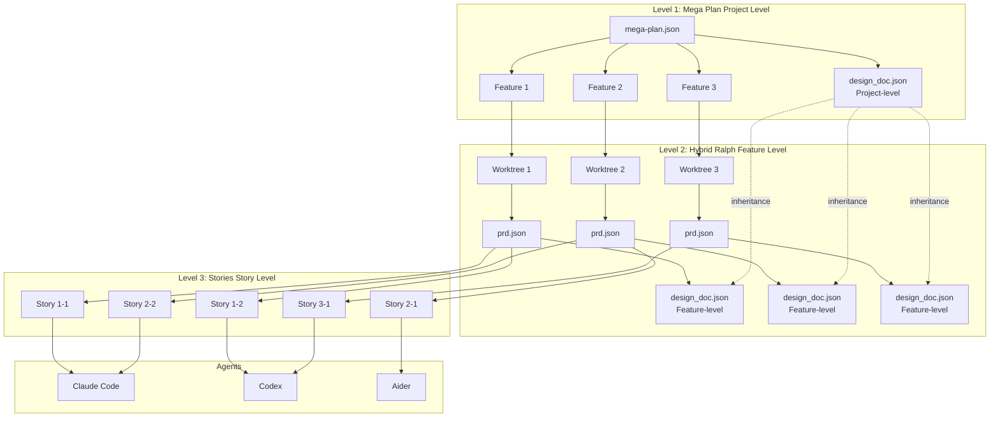

### Tier Details

| Tier | Name | Responsibility | Artifact |
|------|------|----------------|----------|
| **Level 1** | Mega Plan | Project-level orchestration, manages dependencies and execution order of multiple Features | `mega-plan.json`, `design_doc.json` (project-level) |
| **Level 2** | Hybrid Ralph | Feature-level development, executes in isolated Worktree, auto-generates PRD and design doc | `prd.json`, `design_doc.json` (feature-level), `findings.md` |
| **Level 3** | Stories | Story-level execution, processed in parallel by Agents, supports quality gates and retries | Code changes, `progress.txt` |

---

## 2. Core Components

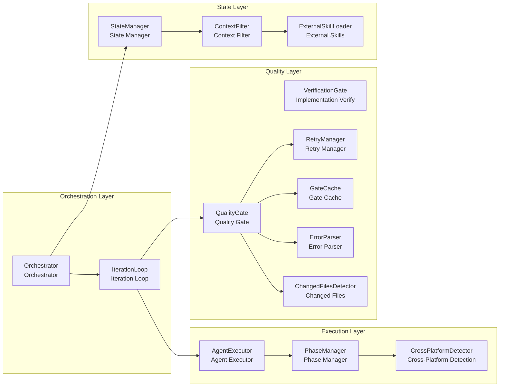

### Component Descriptions

| Component | Responsibility |
|-----------|----------------|
| **Orchestrator** | Core orchestrator, coordinates all components |
| **IterationLoop** | Auto-iteration loop, manages batch execution |
| **AgentExecutor** | Agent execution abstraction, supports multiple Agents |
| **PhaseManager** | Phase management, selects Agent based on phase |
| **QualityGate** | Quality gates with parallel async execution, fail-fast, incremental checking, and caching support |
| **VerificationGate** | AI-powered implementation verification, detects skeleton code and validates acceptance criteria |
| **RetryManager** | Retry management, handles failure retries with structured error context |
| **GateCache** | Gate result caching based on git commit + working tree hash, avoids redundant checks |
| **ErrorParser** | Structured error parsing for mypy, ruff, pytest, eslint, tsc with ErrorInfo extraction |
| **ChangedFilesDetector** | Git-based change detection for incremental gate execution |
| **StateManager** | State management, persists execution state |
| **ContextFilter** | Context filter, optimizes Agent input |
| **ExternalSkillLoader** | Three-tier skill loading (builtin/external/user), auto-detects and injects best practices with priority-based override. Supports phase-based injection (planning, implementation, retry) |

---

## 3. Complete Workflow

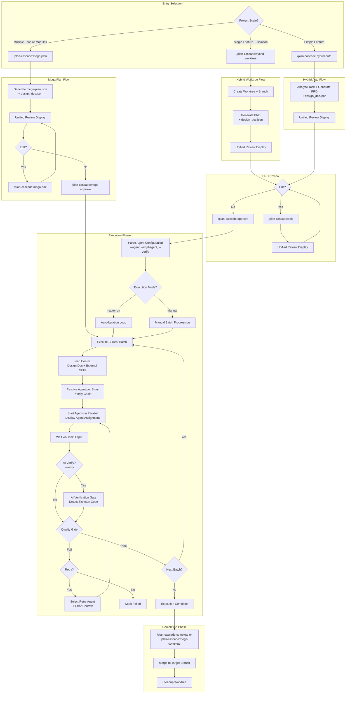

### Key Changes from Previous Version

| Aspect | Previous | Current |
|--------|----------|---------|
| **Design Doc** | Not shown | Auto-generated at each level |
| **Review Display** | "Display PRD Preview" | "Unified Review Display" (PRD + Design Doc) |
| **Agent Config** | Not shown | Explicit `--agent`, `--impl-agent`, `--verify` parsing |
| **Agent Assignment** | Implicit | "Resolve Agent per Story" with priority chain |
| **Verification** | Not shown | Optional "AI Verification Gate" |
| **Retry** | Simple retry | "Select Retry Agent + Error Context" |
| **Wait Mechanism** | Implicit | "Wait via TaskOutput" |

---

## 4. Auto Strategy Workflow

The `/plan-cascade:auto` command provides AI-driven automatic strategy selection based on structured task analysis.

### Strategy Selection Flowchart

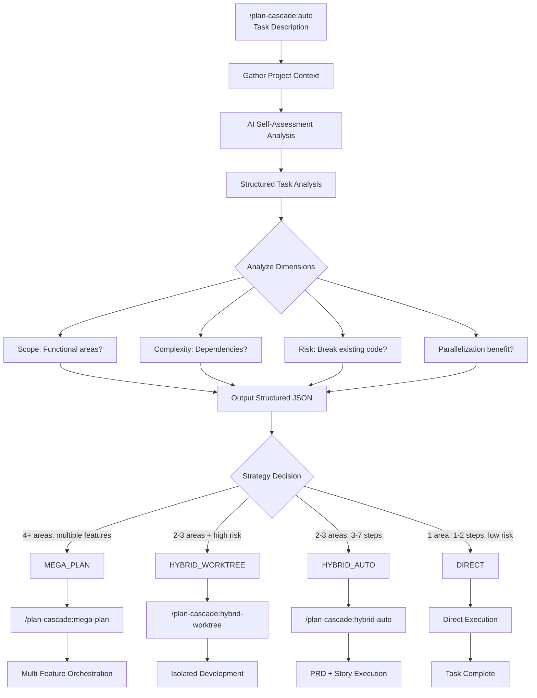

### AI Self-Assessment Output

The AI outputs structured analysis in JSON format:

```json
{
  "task_analysis": {
    "functional_areas": ["auth", "api", "frontend"],
    "estimated_stories": 5,
    "has_dependencies": true,
    "requires_architecture_decisions": true,
    "risk_level": "medium",
    "parallelization_benefit": "significant"
  },
  "strategy_decision": {
    "strategy": "HYBRID_AUTO",
    "confidence": 0.85,
    "reasoning": "Task involves 3 functional areas with dependencies..."
  }
}
```

### Strategy Selection Guidelines

| Analysis Result | Strategy | Example |
|----------------|----------|---------|
| 1 functional area, 1-2 steps, low risk | **DIRECT** | "Fix the typo in README" |
| 2-3 functional areas, 3-7 steps, has dependencies | **HYBRID_AUTO** | "Implement user authentication with OAuth" |
| HYBRID_AUTO + high risk or experimental | **HYBRID_WORKTREE** | "Experimental refactoring of payment module" |
| 4+ functional areas, multiple independent features | **MEGA_PLAN** | "Build e-commerce platform with users, products, cart, orders" |

---

## 5. Design Document System

Plan Cascade automatically generates technical design documents (`design_doc.json`) alongside PRDs to provide architectural context during story execution.

### Two-Level Architecture

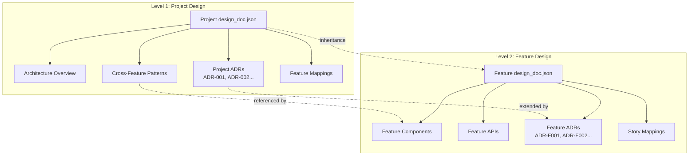

### Design Document Schema

```json
{
  "metadata": {
    "created_at": "ISO-8601",
    "version": "1.0.0",
    "source": "ai-generated|user-provided|converted",
    "prd_reference": "prd.json",
    "parent_design_doc": "path/to/project/design_doc.json"
  },
  "overview": {
    "title": "Project/Feature Title",
    "summary": "Summary description",
    "goals": ["Goal 1", "Goal 2"],
    "non_goals": ["Non-goal 1"]
  },
  "architecture": {
    "components": [{
      "name": "ComponentName",
      "description": "Description",
      "responsibilities": ["Responsibility 1"],
      "dependencies": ["DependencyComponent"],
      "files": ["src/file.py"]
    }],
    "data_flow": "Data flow description",
    "patterns": [{
      "name": "PatternName",
      "description": "Description",
      "rationale": "Why this pattern"
    }]
  },
  "interfaces": {
    "apis": [...],
    "data_models": [...]
  },
  "decisions": [{
    "id": "ADR-001",
    "title": "Decision Title",
    "context": "Background context",
    "decision": "The decision made",
    "rationale": "Why this decision",
    "alternatives_considered": ["Alternative 1"],
    "status": "accepted"
  }],
  "story_mappings": {
    "story-001": {
      "components": ["ComponentA"],
      "decisions": ["ADR-001"],
      "interfaces": ["API-1"]
    }
  },
  "feature_mappings": {
    "feature-001": {
      "patterns": ["PatternA"],
      "decisions": ["ADR-001"]
    }
  }
}
```

### Auto-Generation Flow

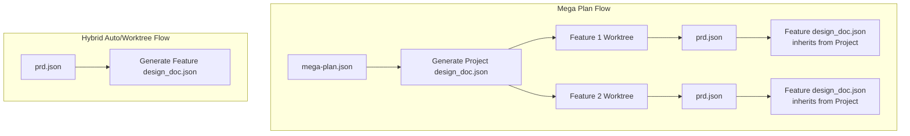

### External Design Document Import

All three main commands support importing external design documents:

```bash
# mega-plan: 2nd argument
/plan-cascade:mega-plan "Build e-commerce" ./architecture.md

# hybrid-auto: 2nd argument
/plan-cascade:hybrid-auto "Implement auth" ./auth-design.md

# hybrid-worktree: 4th argument
/plan-cascade:hybrid-worktree fix-auth main "Fix auth" ./design.md
```

Supported formats: Markdown (.md), JSON (.json), HTML (.html)

### Context Injection Flow

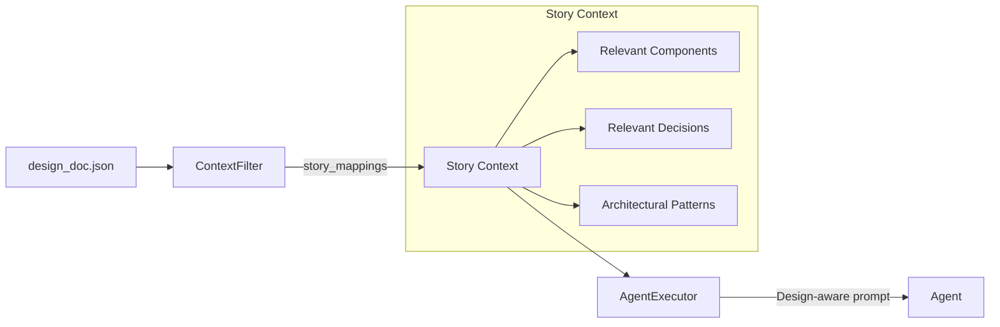

### Three-Tier External Skills System

Plan Cascade uses a three-tier skill priority system to provide framework-specific best practices:

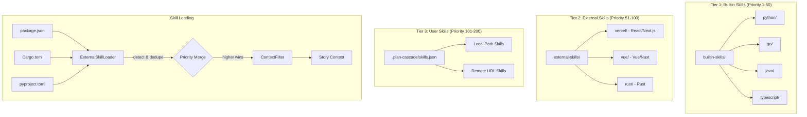

**Priority Tiers:**

| Tier | Priority Range | Source | Description |
|------|----------------|--------|-------------|
| Builtin | 1-50 | `builtin-skills/` | Python, Go, Java, TypeScript best practices bundled with Plan Cascade |
| External | 51-100 | `external-skills/` | Framework skills from Git submodules (React, Vue, Rust) |
| User | 101-200 | `.plan-cascade/skills.json` | Custom skills from local paths or remote URLs |

**Same-name Override:** When skills share the same name, higher priority wins.

---

## 6. Mega Plan Workflow

Suitable for large project development containing multiple related feature modules.

### Use Cases

| Type | Scenario | Example |
|------|----------|---------|
| ✅ Suitable | Multi-module new project development | Build SaaS platform (user + subscription + billing + admin) |
| ✅ Suitable | Large-scale refactoring involving multiple subsystems | Monolith to microservices architecture |
| ✅ Suitable | Feature group development | E-commerce platform (users, products, cart, orders) |
| ❌ Not suitable | Single feature development | Only implement user authentication (use Hybrid Ralph) |
| ❌ Not suitable | Bug fixes | Fix login page form validation issue |

### Command Parameters

```bash
/plan-cascade:mega-plan <project-description> [design-doc-path]

# Examples:
/plan-cascade:mega-plan "Build e-commerce platform"
/plan-cascade:mega-plan "Build e-commerce platform" ./architecture.md
```

| Parameter | Description |
|-----------|-------------|
| `project-description` | Required. Project description for feature decomposition |
| `design-doc-path` | Optional. External design document to import (.md/.json/.html) |

### Detailed Flowchart

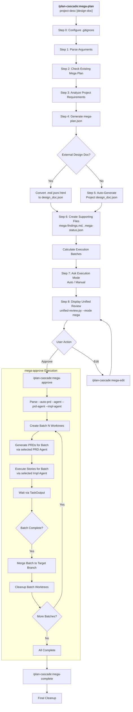

### Files Created

| File | Location | Description |
|------|----------|-------------|
| `mega-plan.json` | User data dir or project root | Project plan with features |
| `design_doc.json` | Project root | Project-level technical design |
| `mega-findings.md` | Project root | Shared findings across features |
| `.mega-status.json` | State dir or project root | Execution status |

### Recovery

If interrupted:
```bash
/plan-cascade:mega-resume --auto-prd
```

---

## 7. Hybrid Worktree Workflow

Suitable for single complex feature development requiring branch isolation.

**Important**: This command only handles worktree creation and PRD/design doc generation. Story execution is handled by `/plan-cascade:approve`.

### Use Cases

| Type | Scenario | Example |
|------|----------|---------|
| ✅ Suitable | Complete feature with multiple subtasks | User authentication (registration + login + password reset) |
| ✅ Suitable | Experimental feature requiring branch isolation | New payment channel integration test |
| ✅ Suitable | Medium-scale refactoring (5-20 files) | API layer unified error handling |
| ❌ Not suitable | Simple single-file modification | Modify a component's style |
| ❌ Not suitable | Quick prototype validation | Verify if a library is usable |

### Command Parameters

```bash
/plan-cascade:hybrid-worktree <task-name> <target-branch> <prd-or-description> [design-doc-path]

# Examples:
/plan-cascade:hybrid-worktree fix-auth main "Fix authentication bug"
/plan-cascade:hybrid-worktree fix-auth main ./existing-prd.json
/plan-cascade:hybrid-worktree fix-auth main "Fix auth" ./design-spec.md
```

| Parameter | Description |
|-----------|-------------|
| `task-name` | Required. Name for worktree and branch |
| `target-branch` | Required. Branch to merge into when complete |
| `prd-or-description` | Required. Existing PRD file path OR task description |
| `design-doc-path` | Optional. External design document to import |

### Detailed Flowchart

```mermaid
flowchart TD
    A["<b>/plan-cascade:hybrid-worktree</b><br/>task-name target-branch prd-or-desc [design-doc]"] --> A0[Step 0: Configure .gitignore]
    A0 --> B[Step 1: Parse Parameters]
    B --> C[Step 2: Detect OS and Shell<br/>Cross-platform support]
    C --> D[Step 3: Verify Git Repository]
    D --> E[Step 4: Detect Default Branch]
    E --> F[Step 5: Set Variables via PathResolver]

    F --> G[Step 6: Check for Project design_doc.json]
    G --> H{Worktree Exists?}
    H -->|Yes| I[Navigate to Existing Worktree]
    H -->|No| J[Create Git Worktree + Branch]

    J --> K[Initialize Planning Files<br/>findings.md, progress.txt]
    K --> L{Copy Project design_doc.json?}
    L -->|Yes| L1[Copy to Worktree]
    L -->|No| M
    L1 --> M
    I --> M

    M[Step 7: Determine PRD Mode]
    M --> N{PRD_ARG is file?}
    N -->|Yes| O[Load PRD from File]
    N -->|No| P[Generate PRD via Task Agent]

    O --> Q
    P --> Q[Wait via TaskOutput]
    Q --> R[Validate PRD]

    R --> S{External Design Doc?}
    S -->|Yes| S1[Convert External Doc]
    S -->|No| S2[Auto-Generate Feature design_doc.json]
    S1 --> T
    S2 --> T

    T[Create story_mappings<br/>Link stories to components/decisions]
    T --> U[Update .hybrid-execution-context.md]
    U --> V[Display Unified Review<br/>unified-review.py --mode hybrid]
    V --> W[Show Worktree Summary]

    W --> X{User Action}
    X -->|Edit| Y["/plan-cascade:edit"]
    Y --> V
    X -->|Approve| Z["/plan-cascade:approve"]

    Z --> EXEC[Execute Stories<br/>See Section 9]
    EXEC --> AA["/plan-cascade:hybrid-complete"]
    AA --> AB[Merge to Target Branch]
    AB --> AC[Delete Worktree]
```

### Design Document Inheritance

When a project-level `design_doc.json` exists:

```json
{
  "metadata": {
    "parent_design_doc": "../design_doc.json",
    "level": "feature"
  },
  "inherited_context": {
    "patterns": ["PatternName"],
    "decisions": ["ADR-001"],
    "shared_models": ["SharedModel"]
  },
  "story_mappings": {
    "story-001": {
      "components": ["ComponentA"],
      "decisions": ["ADR-F001"]
    }
  }
}
```

### Recovery

If interrupted:
```bash
/plan-cascade:hybrid-resume --auto
```

---

## 8. Hybrid Auto Workflow

Suitable for quick development of simple features without Worktree isolation.

**Important**: This command only handles PRD and design doc generation. Story execution is handled by `/plan-cascade:approve`.

### Command Parameters

```bash
/plan-cascade:hybrid-auto <task-description> [design-doc-path] [--agent <name>]

# Examples:
/plan-cascade:hybrid-auto "Add password reset functionality"
/plan-cascade:hybrid-auto "Implement auth" ./auth-design.md
/plan-cascade:hybrid-auto "Fix bug" --agent=codex
```

| Parameter | Description |
|-----------|-------------|
| `task-description` | Required. Task description for PRD generation |
| `design-doc-path` | Optional. External design document to import |
| `--agent` | Optional. Agent for PRD generation (default: claude-code) |

### Detailed Flowchart

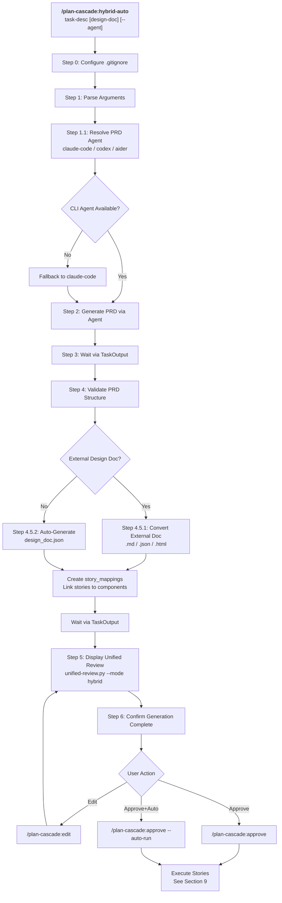

### Generated Files

| File | Description |
|------|-------------|
| `prd.json` | Product requirements with stories |
| `design_doc.json` | Technical design with story_mappings |

### Recovery

If interrupted:
```bash
/plan-cascade:hybrid-resume --auto
```

---

## 9. Approve and Execute Workflow

The `/plan-cascade:approve` command handles story execution with multi-agent support.

### Command Parameters

```bash
/plan-cascade:approve [options]

Options:
  --agent <name>        Global agent override (all stories)
  --impl-agent <name>   Agent for implementation phase
  --retry-agent <name>  Agent for retry phase
  --verify              Enable AI verification gate
  --verify-agent <name> Agent for verification (default: claude-code)
  --no-fallback         Disable automatic fallback to claude-code
  --auto-run            Start execution immediately
```

### Agent Priority Chain

```
1. --agent parameter           (Highest - global override)
2. --impl-agent parameter      (Phase-specific override)
3. story.agent in PRD          (Story-level specification)
4. Story type inference:
   - bugfix, fix → codex
   - refactor, cleanup → aider
   - test, spec → claude-code
   - feature, add → claude-code
5. phase_defaults in agents.json
6. fallback_chain in agents.json
7. claude-code                 (Always available fallback)
```

### Detailed Flowchart

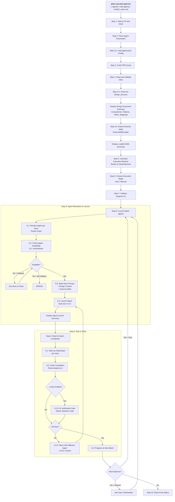

### AI Verification Gate

When `--verify` is enabled, each completed story is verified:

```
[VERIFIED] story-001 - All acceptance criteria implemented
[VERIFY_FAILED] story-002 - Skeleton code detected: function has only 'pass'
```

Detection rules:
- Functions with only `pass`, `...`, or `raise NotImplementedError`
- TODO/FIXME comments in new code
- Placeholder return values without logic
- Empty function/method bodies

### Agent Display in Progress

```
=== Batch 1 Launched ===

Stories and assigned agents:
  - story-001: claude-code (task-tool)
  - story-002: aider (cli) [refactor detected]
  - story-003: codex (cli) [bugfix detected]

⚠️ Agent fallbacks:
  - story-004: aider → claude-code (aider CLI not found)

Waiting for completion...
```

### Progress Log Format

```
[2026-01-28 10:30:00] story-001: [START] via codex (pid:12345)
[2026-01-28 10:30:05] story-001: Progress update...
[2026-01-28 10:35:00] story-001: [COMPLETE] via codex
[2026-01-28 10:35:01] story-001: [VERIFIED] All criteria met
```

---

## 10. Auto-Iteration Workflow

Auto-iteration loop started by `/plan-cascade:approve --auto-run` or `/plan-cascade:auto-run` command:

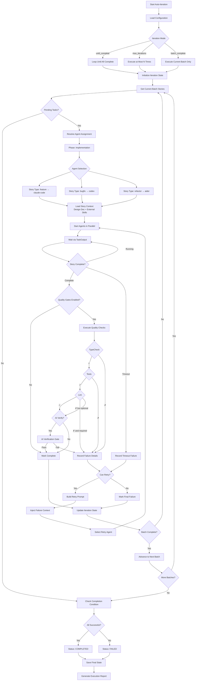

### Iteration Modes

| Mode | Description |
|------|-------------|
| `until_complete` | Continue execution until all Stories complete (default) |
| `max_iterations` | Stop after executing at most N iterations |
| `batch_complete` | Stop after executing current batch only |

---

## 11. Path Storage Modes

Plan Cascade supports two path storage modes for runtime files:

### New Mode (Default)

Runtime files are stored in a user-specific directory, keeping the project root clean:

| Platform | User Data Directory |
|----------|---------------------|
| **Windows** | `%APPDATA%/plan-cascade/<project-id>/` |
| **Unix/macOS** | `~/.plan-cascade/<project-id>/` |

Where `<project-id>` is a unique identifier based on project name and path hash (e.g., `my-project-a1b2c3d4`).

**File Locations in New Mode:**

| File Type | Location |
|-----------|----------|
| `prd.json` | `<user-dir>/prd.json` (or worktree if in worktree mode) |
| `mega-plan.json` | `<user-dir>/mega-plan.json` |
| `.mega-status.json` | `<user-dir>/.state/.mega-status.json` |
| `.iteration-state.json` | `<user-dir>/.state/` |
| Worktrees | `<user-dir>/.worktree/<task-name>/` |
| `design_doc.json` | **Project root** (user-visible) |
| `progress.txt` | **Working directory** (user-visible) |
| `findings.md` | **Working directory** (user-visible) |

### Legacy Mode

All files are stored in the project root (backward compatible):

| File | Location |
|------|----------|
| `prd.json` | `<project-root>/prd.json` |
| `mega-plan.json` | `<project-root>/mega-plan.json` |
| `.mega-status.json` | `<project-root>/.mega-status.json` |
| Worktrees | `<project-root>/.worktree/<task-name>/` |

### Checking Current Mode

```bash
python3 -c "from plan_cascade.state.path_resolver import PathResolver; from pathlib import Path; r=PathResolver(Path.cwd()); print('Mode:', 'legacy' if r.is_legacy_mode() else 'new'); print('PRD path:', r.get_prd_path())"
```

---

## 12. Data Flow and State Files

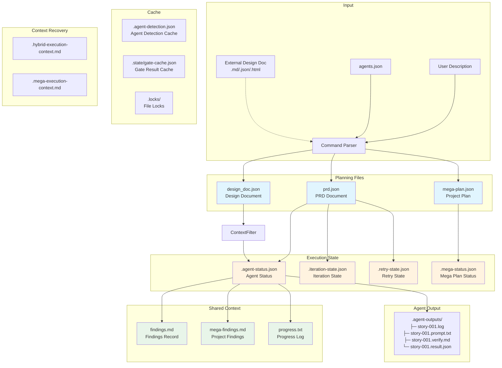

### File Descriptions

| File | Type | Description |
|------|------|-------------|
| `prd.json` | Planning | PRD document, contains goals, stories, dependencies |
| `mega-plan.json` | Planning | Project-level plan, manages multiple Features |
| `design_doc.json` | Planning | Technical design document, architecture and decisions |
| `agents.json` | Configuration | Agent configuration, includes phase defaults and fallback chains |
| `findings.md` | Shared | Agent findings record, supports tag filtering |
| `mega-findings.md` | Shared | Project-level findings (mega-plan mode) |
| `progress.txt` | Shared | Progress timeline, includes Agent execution info |
| `.agent-status.json` | State | Agent running/completed/failed status |
| `.iteration-state.json` | State | Auto-iteration progress and batch results |
| `.retry-state.json` | State | Retry history and failure records |
| `.mega-status.json` | State | Mega-plan execution status |
| `.agent-detection.json` | Cache | Cross-platform Agent detection results (1-hour TTL) |
| `.state/gate-cache.json` | Cache | Gate execution results cache (keyed by git commit + tree hash) |
| `.hybrid-execution-context.md` | Context | Hybrid task context for AI recovery after session interruption |
| `.mega-execution-context.md` | Context | Mega-plan context for AI recovery after session interruption |
| `.agent-outputs/` | Output | Agent logs, prompts, verification reports, and result files |

---

## 13. Dual-Mode Architecture

### Mode Switching Design

```
┌─────────────────────────────────────────────────────────────────────────┐
│                         Plan Cascade                                     │
├─────────────────────────────────────────────────────────────────────────┤
│                                                                          │
│   ┌─────────────────────────┐     ┌─────────────────────────┐           │
│   │      Simple Mode         │     │      Expert Mode         │           │
│   │                         │     │                         │           │
│   │  User enters description │     │  User enters description │           │
│   │       ↓                 │     │       ↓                 │           │
│   │  AI auto-determines      │     │  Generate PRD (editable) │           │
│   │  strategy               │     │       ↓                 │           │
│   │       ↓                 │     │  User Review/Modify      │           │
│   │  Auto-generate PRD      │     │       ↓                 │           │
│   │       ↓                 │     │  Select Strategy/Agent   │           │
│   │  Auto-execute           │     │       ↓                 │           │
│   │       ↓                 │     │  Execute                │           │
│   │  Complete               │     │                         │           │
│   └─────────────────────────┘     └─────────────────────────┘           │
│                                                                          │
│                              Shared Core                                 │
│   ┌─────────────────────────────────────────────────────────────────┐   │
│   │  Orchestrator │ PRDGenerator │ QualityGate │ AgentExecutor      │   │
│   └─────────────────────────────────────────────────────────────────┘   │
│                                                                          │
└─────────────────────────────────────────────────────────────────────────┘
```

### Dual Working Mode Architecture

**Core Philosophy: Plan Cascade = Brain (Orchestration), Execution Layer = Hands (Tool Execution)**

```
┌─────────────────────────────────────────────────────────────────────────┐
│                           Plan Cascade                                   │
│                    (Orchestration Layer - Shared by Both Modes)          │
├─────────────────────────────────────────────────────────────────────────┤
│                                                                          │
│   ┌─────────────────────────────────────────────────────────────────┐   │
│   │                    Orchestration Engine (Shared)                  │   │
│   │  ┌─────────────┐  ┌─────────────┐  ┌─────────────┐              │   │
│   │  │ PRD Generator│  │ Dependency  │  │  Batch     │              │   │
│   │  │             │  │ Analyzer    │  │  Scheduler │              │   │
│   │  └─────────────┘  └─────────────┘  └─────────────┘              │   │
│   │  ┌─────────────┐  ┌─────────────┐  ┌─────────────┐              │   │
│   │  │ State       │  │ Quality    │  │  Retry     │              │   │
│   │  │ Manager     │  │ Gates      │  │  Manager   │              │   │
│   │  └─────────────┘  └─────────────┘  └─────────────┘              │   │
│   └─────────────────────────────────────────────────────────────────┘   │
│                              │                                           │
│                    ┌─────────┴─────────┐                                │
│                    │  Execution Layer   │                                │
│                    │  Selection         │                                │
│                    └─────────┬─────────┘                                │
│              ┌───────────────┴───────────────┐                          │
│              ▼                               ▼                          │
│   ┌─────────────────────────┐    ┌─────────────────────────┐           │
│   │  Standalone Orchestration│    │  Claude Code GUI Mode   │           │
│   │  Mode                    │    │                         │           │
│   ├─────────────────────────┤    ├─────────────────────────┤           │
│   │                         │    │                         │           │
│   │   Built-in Tool Engine  │    │   Claude Code CLI       │           │
│   │   ┌───────────────┐     │    │   ┌───────────────┐     │           │
│   │   │ Read/Write    │     │    │   │ Claude Code   │     │           │
│   │   │ Edit/Bash     │     │    │   │ Executes Tools│     │           │
│   │   │ Glob/Grep     │     │    │   │ (stream-json) │     │           │
│   │   └───────────────┘     │    │   └───────────────┘     │           │
│   │          │              │    │          │              │           │
│   │          ▼              │    │          ▼              │           │
│   │   ┌───────────────┐     │    │   ┌───────────────┐     │           │
│   │   │ LLM Abstraction│    │    │   │ Plan Cascade  │     │           │
│   │   │ Layer          │    │    │   │ Visual UI     │     │           │
│   │   │ (Multiple)    │     │    │   └───────────────┘     │           │
│   │   └───────────────┘     │    │                         │           │
│   │          │              │    │                         │           │
│   │   ┌──────┴──────┐       │    │                         │           │
│   │   ▼      ▼      ▼       │    │                         │           │
│   │ Claude Claude OpenAI    │    │                         │           │
│   │ Max    API    etc.      │    │                         │           │
│   │                         │    │                         │           │
│   └─────────────────────────┘    └─────────────────────────┘           │
│                                                                          │
└─────────────────────────────────────────────────────────────────────────┘

Both modes support: PRD-driven development, batch execution, quality gates, state tracking
```

---

## 14. Multi-Agent Collaboration Architecture

```
┌─────────────────────────────────────────────────────────────────────────┐
│                       Multi-Agent Collaboration Architecture             │
├─────────────────────────────────────────────────────────────────────────┤
│                                                                          │
│   Plan Cascade Orchestration Layer                                       │
│   ┌─────────────────────────────────────────────────────────────────┐   │
│   │  Orchestrator → AgentExecutor → PhaseAgentManager               │   │
│   │       │              │               │                           │   │
│   │       │              │               └─ Phase/Type → Agent Map   │   │
│   │       │              └─ Resolve Best Agent                       │   │
│   │       └─ Schedule Story Execution                                │   │
│   └─────────────────────────────────────────────────────────────────┘   │
│                              │                                           │
│              ┌───────────────┴───────────────┐                          │
│              ▼                               ▼                          │
│   ┌─────────────────────────┐    ┌─────────────────────────┐           │
│   │  Standalone Orchestration│    │  Claude Code GUI Mode   │           │
│   │  Mode                    │    │                         │           │
│   │                         │    │                         │           │
│   │   Default Agent:         │    │   Default Agent:         │           │
│   │   Built-in ReAct Engine │    │   Claude Code CLI       │           │
│   │                         │    │                         │           │
│   │   Optional CLI Agents:   │    │   Optional CLI Agents:   │           │
│   │   codex, aider, amp...  │    │   codex, aider, amp...  │           │
│   │                         │    │                         │           │
│   └─────────────────────────┘    └─────────────────────────┘           │
│                                                                          │
└─────────────────────────────────────────────────────────────────────────┘
```

### Supported Agents

| Agent | Type | Best For |
|-------|------|----------|
| `claude-code` | task-tool | General purpose (default, always available) |
| `codex` | cli | Bug fixes, quick implementations |
| `aider` | cli | Refactoring, code improvements |
| `amp-code` | cli | Alternative implementations |
| `cursor-cli` | cli | Cursor editor integration |

### Command Parameters

**For `/plan-cascade:approve` (story execution):**

| Parameter | Description | Example |
|-----------|-------------|---------|
| `--agent` | Global agent override (all stories) | `--agent=codex` |
| `--impl-agent` | Implementation phase agent | `--impl-agent=claude-code` |
| `--retry-agent` | Retry phase agent | `--retry-agent=aider` |
| `--verify` | Enable AI verification gate | `--verify` |
| `--verify-agent` | Verification agent | `--verify-agent=claude-code` |
| `--no-fallback` | Disable auto-fallback on failure | `--no-fallback` |

**For `/plan-cascade:mega-approve` (feature execution):**

| Parameter | Description | Example |
|-----------|-------------|---------|
| `--agent` | Global agent override | `--agent=claude-code` |
| `--prd-agent` | PRD generation agent | `--prd-agent=codex` |
| `--impl-agent` | Implementation phase agent | `--impl-agent=aider` |
| `--auto-prd` | Auto-generate PRDs and execute | `--auto-prd` |

**For `/plan-cascade:hybrid-auto` (PRD generation):**

| Parameter | Description | Example |
|-----------|-------------|---------|
| `--agent` | Agent for PRD generation | `--agent=codex` |

### Phase-Based Agent Assignment

| Phase | Default Agent | Fallback Chain | Story Type Override |
|-------|--------------|----------------|---------------------|
| `planning` | codex | claude-code | - |
| `implementation` | claude-code | codex, aider | bugfix→codex, refactor→aider |
| `retry` | claude-code | aider | - |
| `refactor` | aider | claude-code | - |
| `review` | claude-code | codex | - |

### Agent Priority Resolution

```
1. --agent command parameter              # Highest priority (global override)
2. Phase override --impl-agent etc.       # Phase-specific override
3. Agent specified in Story               # story.agent field
4. Story type override                    # bugfix → codex, refactor → aider
5. Phase default Agent                    # phase_defaults configuration
6. Fallback chain                         # fallback_chain
7. claude-code                            # Ultimate fallback (always available)
```

### Agent Configuration File (agents.json)

```json
{
  "default_agent": "claude-code",
  "agents": {
    "claude-code": {"type": "task-tool"},
    "codex": {"type": "cli", "command": "codex"},
    "aider": {"type": "cli", "command": "aider"}
  },
  "phase_defaults": {
    "implementation": {
      "default_agent": "claude-code",
      "fallback_chain": ["codex", "aider"],
      "story_type_overrides": {
        "refactor": "aider",
        "bugfix": "codex"
      }
    }
  }
}
```

---

## Appendix: Two Working Modes Comparison

| Feature | Standalone Orchestration Mode | Claude Code GUI Mode |
|---------|------------------------------|----------------------|
| Orchestration Layer | Plan Cascade | Plan Cascade |
| Tool Execution | Plan Cascade executes itself | Claude Code CLI executes |
| LLM Source | Claude Max/API, OpenAI, DeepSeek, Ollama | Claude Code |
| PRD-Driven | ✅ Full support | ✅ Full support |
| Batch Execution | ✅ Full support | ✅ Full support |
| Offline Available | ✅ (using Ollama) | ❌ |
| Use Case | Need other LLMs or offline use | Have Claude Max/Code subscription |

| Component | Standalone Orchestration Mode | Claude Code GUI Mode |
|-----------|------------------------------|----------------------|
| PRD Generation | Plan Cascade (LLM) | Plan Cascade (Claude Code) |
| Dependency Analysis | Plan Cascade | Plan Cascade |
| Batch Scheduling | Plan Cascade | Plan Cascade |
| Story Execution | Plan Cascade (ReAct) | Claude Code CLI |
| Tool Calls | Built-in Tool Engine | Claude Code |
| State Tracking | Plan Cascade | Plan Cascade |
| Quality Gates | Plan Cascade | Plan Cascade |
