[中文版](System-Architecture_zh.md)

# Plan Cascade - System Architecture and Workflow Design

**Version**: 4.4.0
**Last Updated**: 2026-02-05

This document contains detailed architecture diagrams, flowcharts, and system design for Plan Cascade.

**Scope (Plugin Only):** This document describes the Claude Code plugin workflows (the `/plan-cascade:*` commands, `commands/`, and `skills/`).
Standalone CLI and Desktop app workflows are intentionally out of scope here.

---

## Table of Contents

1. [Three-Tier Architecture](#1-three-tier-architecture)
2. [Core Components](#2-core-components)
3. [Complete Workflow](#3-complete-workflow)
4. [Auto Strategy Workflow](#4-auto-strategy-workflow)
5. [Design Document System](#5-design-document-system)
6. [Mega Plan Workflow](#6-mega-plan-workflow)
7. [Hybrid Worktree Workflow](#7-hybrid-worktree-workflow)
8. [Hybrid Auto Workflow](#8-hybrid-auto-workflow)
9. [Approve and Execute Workflow](#9-approve-and-execute-workflow)
10. [Auto-Iteration Workflow](#10-auto-iteration-workflow)
11. [Path Storage Modes](#11-path-storage-modes)
12. [Data Flow and State Files](#12-data-flow-and-state-files)
13. [Dual-Mode Architecture](#13-dual-mode-architecture)
14. [Multi-Agent Collaboration Architecture](#14-multi-agent-collaboration-architecture)

---

## 1. Three-Tier Architecture

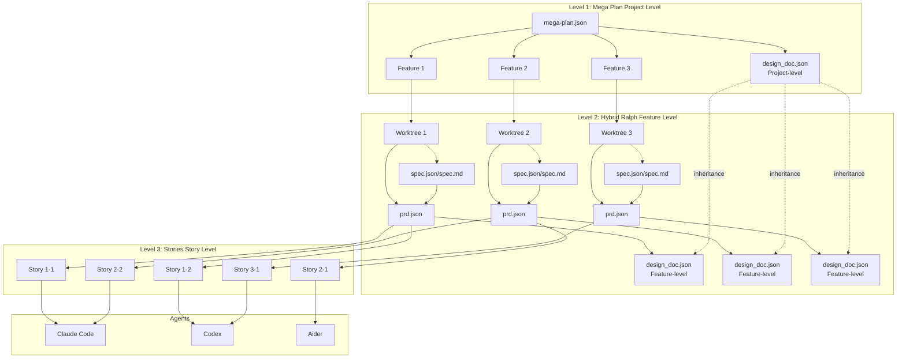

### Tier Details

| Tier | Name | Responsibility | Artifact |
|------|------|----------------|----------|
| **Level 1** | Mega Plan | Project-level orchestration, manages dependencies and execution order of multiple Features | `mega-plan.json`, `design_doc.json` (project-level) |
| **Level 2** | Hybrid Ralph | Feature-level development in isolated Worktrees. Optionally runs a planning-time spec interview, then finalizes PRD and design context | `spec.json`/`spec.md` (optional), `prd.json`, `design_doc.json` (feature-level), `findings.md` |
| **Level 3** | Stories | Story-level execution, processed in parallel by Agents, supports quality gates and retries | Code changes, `progress.txt` |

---

## 2. Core Components

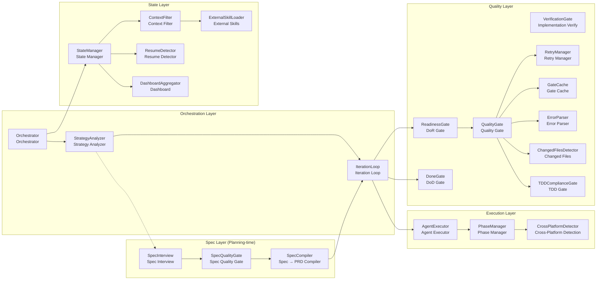

### Component Descriptions

| Component | Responsibility |
|-----------|----------------|
| **Orchestrator** | Core orchestrator, coordinates all components |
| **StrategyAnalyzer** | Analyzes task and selects strategy (DIRECT, HYBRID_AUTO, HYBRID_WORKTREE, MEGA_PLAN) and ExecutionFlow (QUICK, STANDARD, FULL) |
| **SpecInterview** | Planning-time interview to produce `spec.json` (source of truth) and `spec.md` (rendered), resumable via `.state/spec-interview.json`. Runs in the orchestrator only |
| **SpecQualityGate** | Planning-time quality checks for `spec.json`. FULL flow enforces verifiable acceptance criteria, verification commands, and right-sized stories |
| **SpecCompiler** | Compiles `spec.json` into Plan Cascade `prd.json` and embeds `flow_config` / `tdd_config` / `execution_config` as needed |
| **IterationLoop** | Auto-iteration loop, manages batch execution |
| **AgentExecutor** | Agent execution abstraction, supports multiple Agents |
| **PhaseManager** | Phase management, selects Agent based on phase |
| **QualityGate** | Quality gates with three-phase execution: PRE_VALIDATION (FORMAT), VALIDATION (TYPECHECK, TEST, LINT in parallel), POST_VALIDATION (CODE_REVIEW, IMPLEMENTATION_VERIFY). Supports fail-fast, incremental checking, and caching |
| **FormatGate** | Code formatting gate (PRE_VALIDATION), auto-formats code using ruff/prettier/cargo fmt/gofmt based on project type. Supports check-only mode |
| **CodeReviewGate** | AI-powered code review (POST_VALIDATION), evaluates 5 dimensions: Code Quality (25pts), Naming & Clarity (20pts), Complexity (20pts), Pattern Adherence (20pts), Security (15pts). Blocks on critical findings |
| **VerificationGate** | AI-powered implementation verification, detects skeleton code and validates acceptance criteria |
| **ReadinessGate** | Definition of Ready (DoR) gate, validates prerequisites before execution. Supports SOFT (warnings) and HARD (blocking) modes |
| **DoneGate** | Definition of Done (DoD) gate, validates completion after execution. Supports STANDARD and FULL levels |
| **TDDComplianceGate** | TDD compliance checking, verifies test files modified alongside code changes |
| **RetryManager** | Retry management, handles failure retries with structured error context |
| **GateCache** | Gate result caching based on git commit + working tree hash, avoids redundant checks |
| **ErrorParser** | Structured error parsing for mypy, ruff, pytest, eslint, tsc with ErrorInfo extraction |
| **ChangedFilesDetector** | Git-based change detection for incremental gate execution |
| **StateManager** | State management, persists execution state |
| **ContextFilter** | Context filter, optimizes Agent input |
| **ExternalSkillLoader** | Three-tier skill loading (builtin/external/user), auto-detects and injects best practices with priority-based override. Supports phase-based injection (planning, implementation, retry) |
| **ResumeDetector** | Detects incomplete execution state and generates resume suggestions |
| **DashboardAggregator** | Aggregates status from multiple state files for unified dashboard view |

---

## 3. Complete Workflow

Plan Cascade’s plugin workflows optionally include a **planning-time Spec Interview** (enabled by `--spec on|auto`).
When enabled, the interview produces `spec.json`/`spec.md` and compiles them into the final `prd.json` before execution begins.
Related commands: `/plan-cascade:spec-plan`, `/plan-cascade:spec-resume`, `/plan-cascade:spec-cleanup`.

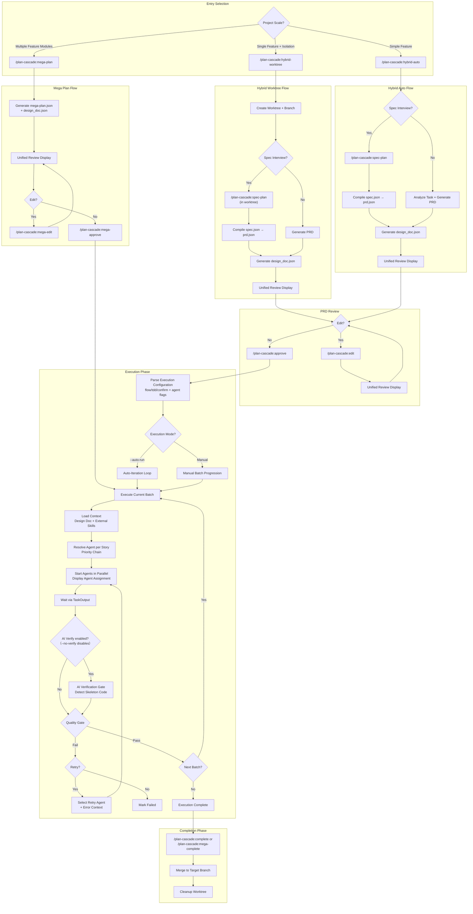

### Key Changes from Previous Version

| Aspect | Previous | Current |
|--------|----------|---------|
| **Design Doc** | Not shown | Auto-generated at each level |
| **Spec Interview** | Not present | Optional planning-time spec interview (`spec.json`/`spec.md`) compiled into `prd.json` |
| **Review Display** | "Display PRD Preview" | "Unified Review Display" (PRD + Design Doc) |
| **Agent Config** | Not shown | Explicit flow/tdd/confirm handling + agent overrides (e.g. `--agent`, `--impl-agent`, `--no-verify`) |
| **Agent Assignment** | Implicit | "Resolve Agent per Story" with priority chain |
| **Verification** | Not shown | Optional "AI Verification Gate" |
| **Retry** | Simple retry | "Select Retry Agent + Error Context" |
| **Wait Mechanism** | Implicit | "Wait via TaskOutput" |

---

## 4. Auto Strategy Workflow

The `/plan-cascade:auto` command provides AI-driven automatic strategy selection based on structured task analysis.
It accepts flow-control flags (e.g. `--flow`, `--tdd`, `--confirm`/`--no-confirm`, `--spec`) and propagates them into the selected workflow.
By default, `/plan-cascade:auto` runs in **FULL** flow with `--tdd on` and batch confirmation enabled (disable with `--no-confirm`). Use `--flow quick` or `--flow standard` to opt out.

### Strategy Selection Flowchart

```mermaid
flowchart TD
    A["/plan-cascade:auto<br/>Task Description"] --> B[Gather Project Context]
    B --> C[AI Self-Assessment Analysis]

    C --> D[Structured Task Analysis]

    D --> E{Analyze Dimensions}
    E --> E1[Scope: Functional areas?]
    E --> E2[Complexity: Dependencies?]
    E --> E3[Risk: Break existing code?]
    E --> E4[Parallelization benefit?]

    E1 --> F[Output Structured JSON]
    E2 --> F
    E3 --> F
    E4 --> F

    F --> G{Strategy Decision}

    G -->|"4+ areas, multiple features"| H[MEGA_PLAN]
    G -->|"2-3 areas + high risk"| I[HYBRID_WORKTREE]
    G -->|"2-3 areas, 3-7 steps"| J[HYBRID_AUTO]
    G -->|"1 area, 1-2 steps, low risk"| K[DIRECT (candidate)]

    H --> L["/plan-cascade:mega-plan"]
    I --> M["/plan-cascade:hybrid-worktree"]
    J --> N["/plan-cascade:hybrid-auto"]
    K --> X{Flow == full?}
    X -->|"Yes (default)"| N
    X -->|"No (quick/standard)"| O[Direct Execution]

    L --> P[Multi-Feature Orchestration]
    M --> Q[Isolated Development]
    N --> R[PRD + Story Execution]
    O --> S[Task Complete]
```

### AI Self-Assessment Output

The AI outputs structured analysis in JSON format:

```json
{
  "task_analysis": {
    "functional_areas": ["auth", "api", "frontend"],
    "estimated_stories": 5,
    "has_dependencies": true,
    "requires_architecture_decisions": true,
    "risk_level": "medium",
    "parallelization_benefit": "significant"
  },
  "strategy_decision": {
    "strategy": "HYBRID_AUTO",
    "confidence": 0.85,
    "reasoning": "Task involves 3 functional areas with dependencies..."
  }
}
```

### Strategy Selection Guidelines

| Analysis Result | Strategy | Example |
|----------------|----------|---------|
| 1 functional area, 1-2 steps, low risk **AND** (`--flow quick` or `--flow standard`) | **DIRECT** | "Fix the typo in README" |
| 2-3 functional areas, 3-7 steps, has dependencies | **HYBRID_AUTO** | "Implement user authentication with OAuth" |
| HYBRID_AUTO + high risk or experimental | **HYBRID_WORKTREE** | "Experimental refactoring of payment module" |
| 4+ functional areas, multiple independent features | **MEGA_PLAN** | "Build e-commerce platform with users, products, cart, orders" |

### ExecutionFlow Depth

The `/plan-cascade:auto` command defaults to **FULL** ExecutionFlow depth unless overridden by `--flow`:

```mermaid
graph TD
    A[Strategy Analysis] --> B{--flow override?}
    B -->|quick| C[QUICK Flow]
    B -->|standard| D[STANDARD Flow]
    B -->|none| E[FULL Flow (default)]

    C --> C1[Soft DoR Gates]
    C --> C2[AI Verify Disabled]
    C --> C3[No Confirmation]

    D --> D1[Soft DoR Gates]
    D --> D2[AI Verify Enabled]
    D --> D3[No Confirmation]

    E --> E1[Hard DoR Gates]
    E --> E2[AI Verify + Review]
    E --> E3[Confirmation Required]
```

**Spec Interview (shift-left):** When `--spec auto` is in effect (default for FULL flow), the planning-time spec interview runs before final PRD finalization.

| Flow | Gate Mode | Spec Interview | AI Verification | Code Review | Confirmation |
|------|-----------|----------------|-----------------|-------------|--------------|
| `quick` | soft | off | disabled | disabled | no |
| `standard` | soft | off | enabled | optional | no |
| `full` | hard | auto (default) | enabled | enabled | yes |

---

## 5. Design Document System

Plan Cascade automatically generates technical design documents (`design_doc.json`) alongside PRDs to provide architectural context during story execution.
When Spec Interview is used, `prd.json` is compiled from `spec.json` first, then `design_doc.json` is generated from the finalized PRD.

### Two-Level Architecture

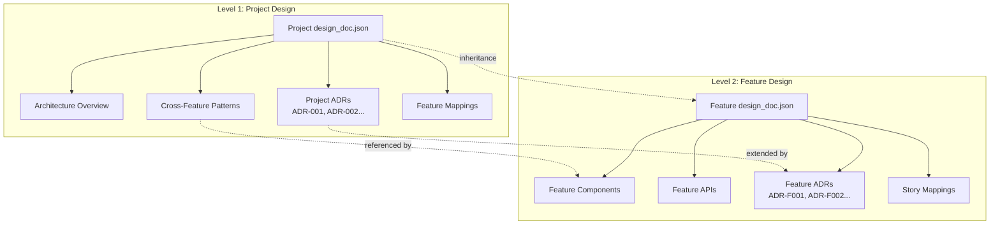

### Design Document Schema

```json
{
  "metadata": {
    "created_at": "ISO-8601",
    "version": "1.0.0",
    "source": "ai-generated|user-provided|converted",
    "prd_reference": "prd.json",
    "parent_design_doc": "path/to/project/design_doc.json"
  },
  "overview": {
    "title": "Project/Feature Title",
    "summary": "Summary description",
    "goals": ["Goal 1", "Goal 2"],
    "non_goals": ["Non-goal 1"]
  },
  "architecture": {
    "components": [{
      "name": "ComponentName",
      "description": "Description",
      "responsibilities": ["Responsibility 1"],
      "dependencies": ["DependencyComponent"],
      "files": ["src/file.py"]
    }],
    "data_flow": "Data flow description",
    "patterns": [{
      "name": "PatternName",
      "description": "Description",
      "rationale": "Why this pattern"
    }]
  },
  "interfaces": {
    "apis": [...],
    "data_models": [...]
  },
  "decisions": [{
    "id": "ADR-001",
    "title": "Decision Title",
    "context": "Background context",
    "decision": "The decision made",
    "rationale": "Why this decision",
    "alternatives_considered": ["Alternative 1"],
    "status": "accepted"
  }],
  "story_mappings": {
    "story-001": {
      "components": ["ComponentA"],
      "decisions": ["ADR-001"],
      "interfaces": ["API-1"]
    }
  },
  "feature_mappings": {
    "feature-001": {
      "patterns": ["PatternA"],
      "decisions": ["ADR-001"]
    }
  }
}
```

### Auto-Generation Flow

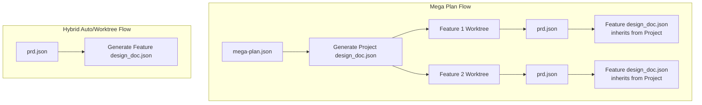

### External Design Document Import

All three main commands support importing external design documents:

```bash
# mega-plan: 2nd argument
/plan-cascade:mega-plan "Build e-commerce" ./architecture.md

# hybrid-auto: 2nd argument
/plan-cascade:hybrid-auto "Implement auth" ./auth-design.md

# hybrid-worktree: 4th argument
/plan-cascade:hybrid-worktree fix-auth main "Fix auth" ./design.md
```

Supported formats: Markdown (.md), JSON (.json), HTML (.html)

### Context Injection Flow

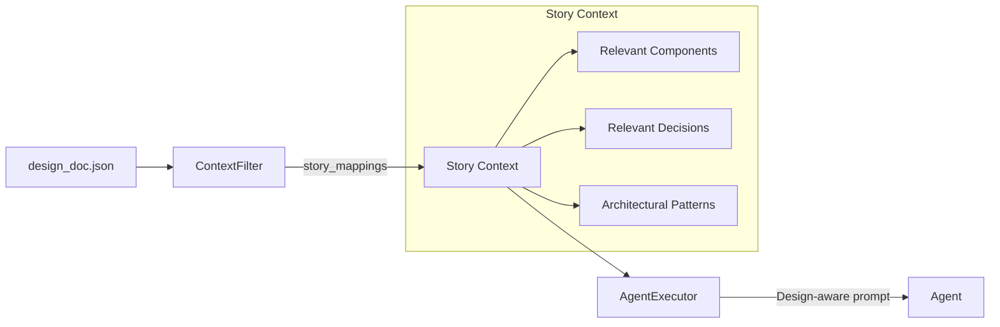

### Three-Tier External Skills System

Plan Cascade uses a three-tier skill priority system to provide framework-specific best practices:

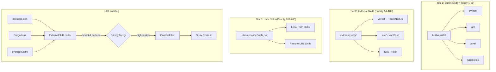

**Priority Tiers:**

| Tier | Priority Range | Source | Description |
|------|----------------|--------|-------------|
| Builtin | 1-50 | `builtin-skills/` | Python, Go, Java, TypeScript best practices bundled with Plan Cascade |
| External | 51-100 | `external-skills/` | Framework skills from Git submodules (React, Vue, Rust) |
| User | 101-200 | `.plan-cascade/skills.json` | Custom skills from local paths or remote URLs |

**Same-name Override:** When skills share the same name, higher priority wins.

---

## 6. Mega Plan Workflow

Suitable for large project development containing multiple related feature modules.

### Use Cases

| Type | Scenario | Example |
|------|----------|---------|
| ✅ Suitable | Multi-module new project development | Build SaaS platform (user + subscription + billing + admin) |
| ✅ Suitable | Large-scale refactoring involving multiple subsystems | Monolith to microservices architecture |
| ✅ Suitable | Feature group development | E-commerce platform (users, products, cart, orders) |
| ❌ Not suitable | Single feature development | Only implement user authentication (use Hybrid Ralph) |
| ❌ Not suitable | Bug fixes | Fix login page form validation issue |

### Command Parameters

```bash
/plan-cascade:mega-plan [--flow <quick|standard|full>] [--tdd <off|on|auto>] [--confirm] [--no-confirm] \
  [--spec <off|auto|on>] [--first-principles] [--max-questions N] \
  <project-description> [design-doc-path]

# Examples:
/plan-cascade:mega-plan "Build e-commerce platform"
/plan-cascade:mega-plan "Build e-commerce platform" ./architecture.md
/plan-cascade:mega-plan --flow full --spec on --first-principles "Build e-commerce platform"
```

| Parameter | Description |
|-----------|-------------|
| `project-description` | Required. Project description for feature decomposition |
| `design-doc-path` | Optional. External design document to import (.md/.json/.html) |
| `--flow` | Optional. Execution flow depth propagated to later execution |
| `--tdd` | Optional. TDD mode propagated to story execution |
| `--confirm` | Optional. Require batch confirmation (orchestrator/batch boundary) |
| `--no-confirm` | Optional. Disable batch confirmation (overrides `--confirm` and FULL defaults) |
| `--spec` | Optional. Record spec interview config for later orchestrator-only execution in `mega-approve` |
| `--first-principles` | Optional. Ask first-principles questions first (only when spec interview runs) |
| `--max-questions` | Optional. Soft cap for interview length (recorded in interview state) |

### Detailed Flowchart

```mermaid
flowchart TD
    A["<b>/plan-cascade:mega-plan</b><br/>project-desc [design-doc]"] --> A0[Step 0: Configure .gitignore]
    A0 --> B[Step 1: Parse Arguments]
    B --> C[Step 2: Check Existing Mega Plan]
    C --> D[Step 3: Analyze Project Requirements]
    D --> E[Step 4: Generate mega-plan.json]

    E --> F{External Design Doc?}
    F -->|Yes| F1[Convert .md/.json/.html<br/>to design_doc.json]
    F -->|No| F2[Step 5: Auto-Generate<br/>Project design_doc.json]
    F1 --> G
    F2 --> G

    G[Step 6: Create Supporting Files<br/>mega-findings.md, .mega-status.json]
    G --> H[Calculate Execution Batches]
    H --> I[Step 7: Ask Execution Mode<br/>Auto / Manual]
    I --> J[Step 8: Display Unified Review<br/>unified-review.py --mode mega]

    J --> K{User Action}
    K -->|Edit| L["/plan-cascade:mega-edit"]
    L --> J
    K -->|Approve| M["/plan-cascade:mega-approve"]

    subgraph "mega-approve Execution"
        M --> N[Parse --auto-prd --agent --prd-agent --impl-agent<br/>+ flow/tdd/confirm/no-confirm/spec flags]
        N --> O[Create Batch N Worktrees]
        O --> PRD_MODE{Spec interview enabled?}
        PRD_MODE -->|Yes| PRD_SPEC[Run per-feature spec interview (orchestrator-only)<br/>spec.json/spec.md → prd.json]
        PRD_MODE -->|No| PRD_GEN[Generate PRDs for Batch<br/>via selected PRD Agent]
        PRD_SPEC --> Q[Execute Stories for Batch<br/>via selected Impl Agent]
        PRD_GEN --> Q
        Q --> R[Wait via TaskOutput]
        R --> S{Batch Complete?}
        S -->|Yes| T[Merge Batch to Target Branch]
        T --> U[Cleanup Batch Worktrees]
        U --> V{More Batches?}
        V -->|Yes| O
        V -->|No| W[All Complete]
    end

    W --> X["/plan-cascade:mega-complete"]
    X --> Y[Final Cleanup]
```

### Files Created

| File | Location | Description |
|------|----------|-------------|
| `mega-plan.json` | User data dir or project root | Project plan with features |
| `design_doc.json` | Project root | Project-level technical design |
| `mega-findings.md` | Project root | Shared findings across features |
| `.mega-status.json` | State dir or project root | Execution status |
| `spec.json` / `spec.md` | Feature worktree (optional) | Planning-time spec interview outputs (source + rendered) |
| `.state/spec-interview.json` | Feature worktree (optional) | Resumable spec interview state |

### Recovery

If interrupted:
```bash
/plan-cascade:mega-resume --auto-prd
```

---

## 7. Hybrid Worktree Workflow

Suitable for single complex feature development requiring branch isolation.

**Important**: This command only handles worktree creation and PRD/design doc generation. Story execution is handled by `/plan-cascade:approve`.

### Use Cases

| Type | Scenario | Example |
|------|----------|---------|
| ✅ Suitable | Complete feature with multiple subtasks | User authentication (registration + login + password reset) |
| ✅ Suitable | Experimental feature requiring branch isolation | New payment channel integration test |
| ✅ Suitable | Medium-scale refactoring (5-20 files) | API layer unified error handling |
| ❌ Not suitable | Simple single-file modification | Modify a component's style |
| ❌ Not suitable | Quick prototype validation | Verify if a library is usable |

### Command Parameters

```bash
/plan-cascade:hybrid-worktree [--flow <quick|standard|full>] [--tdd <off|on|auto>] [--confirm] [--no-confirm] \
  [--spec <off|auto|on>] [--first-principles] [--max-questions N] \
  [--agent <name>] <task-name> <target-branch> <prd-or-description> [design-doc-path]

# Examples:
/plan-cascade:hybrid-worktree fix-auth main "Fix authentication bug"
/plan-cascade:hybrid-worktree fix-auth main ./existing-prd.json
/plan-cascade:hybrid-worktree fix-auth main "Fix auth" ./design-spec.md
/plan-cascade:hybrid-worktree fix-auth main "Fix auth" --agent=codex
/plan-cascade:hybrid-worktree --flow full --spec on --first-principles fix-auth main "Fix auth"
```

| Parameter | Description |
|-----------|-------------|
| `task-name` | Required. Name for worktree and branch |
| `target-branch` | Required. Branch to merge into when complete |
| `prd-or-description` | Required. Existing PRD file path OR task description |
| `design-doc-path` | Optional. External design document to import |
| `--agent` | Optional. Agent for PRD generation (overrides agents.json) |
| `--flow` | Optional. Execution flow depth (propagated into PRD / approve) |
| `--tdd` | Optional. TDD mode (propagated into PRD / approve) |
| `--confirm` | Optional. Require batch confirmation (can be overridden by `--no-confirm`) |
| `--no-confirm` | Optional. Disable batch confirmation (overrides FULL defaults) |
| `--spec` | Optional. Enable planning-time spec interview before finalizing PRD |
| `--first-principles` | Optional. Ask first-principles questions first (only when spec interview runs) |
| `--max-questions` | Optional. Soft cap for interview length (recorded in `.state/spec-interview.json`) |

### Detailed Flowchart

```mermaid
flowchart TD
    A["<b>/plan-cascade:hybrid-worktree</b><br/>task-name target-branch prd-or-desc [design-doc] [flags]"] --> A0[Step 0: Configure .gitignore]
    A0 --> B[Step 1: Parse Parameters<br/>flow/tdd/confirm/spec + agent flags]
    B --> C[Step 2: Detect OS and Shell<br/>Cross-platform support]
    C --> D[Step 3: Verify Git Repository]
    D --> E[Step 4: Detect Default Branch]
    E --> F[Step 5: Set Variables via PathResolver]

    F --> G[Step 6: Check for Project design_doc.json]
    G --> H{Worktree Exists?}
    H -->|Yes| I[Navigate to Existing Worktree]
    H -->|No| J[Create Git Worktree + Branch]

    J --> K[Initialize Planning Files<br/>findings.md, progress.txt]
    K --> L{Copy Project design_doc.json?}
    L -->|Yes| L1[Copy to Worktree]
    L -->|No| M
    L1 --> M
    I --> M

    M[Step 7: Determine PRD Mode]
    M --> N{PRD_ARG is file?}
    N -->|Yes| O[Load PRD from File]
    N -->|No| SPEC_ON{Spec Interview enabled?}
    SPEC_ON -->|Yes| SPEC_RUN["/plan-cascade:spec-plan --compile"]
    SPEC_ON -->|No| P0[Resolve PRD Agent<br/>--agent > agents.json > default]
    P0 --> P[Generate PRD via Selected Agent]

    O --> R
    P --> Q[Wait via TaskOutput]
    Q --> R[Validate PRD]
    SPEC_RUN --> R

    R --> S{External Design Doc?}
    S -->|Yes| S1[Convert External Doc]
    S -->|No| S2[Auto-Generate Feature design_doc.json]
    S1 --> T
    S2 --> T

    T[Create story_mappings<br/>Link stories to components/decisions]
    T --> U[Update .hybrid-execution-context.md]
    U --> V[Display Unified Review<br/>unified-review.py --mode hybrid]
    V --> W[Show Worktree Summary]

    W --> X{User Action}
    X -->|Edit| Y["/plan-cascade:edit"]
    Y --> V
    X -->|Approve| Z["/plan-cascade:approve"]

    Z --> EXEC[Execute Stories<br/>See Section 9]
    EXEC --> AA["/plan-cascade:hybrid-complete"]
    AA --> AB[Merge to Target Branch]
    AB --> AC[Delete Worktree]
```

### Design Document Inheritance

When a project-level `design_doc.json` exists:

```json
{
  "metadata": {
    "parent_design_doc": "../design_doc.json",
    "level": "feature"
  },
  "inherited_context": {
    "patterns": ["PatternName"],
    "decisions": ["ADR-001"],
    "shared_models": ["SharedModel"]
  },
  "story_mappings": {
    "story-001": {
      "components": ["ComponentA"],
      "decisions": ["ADR-F001"]
    }
  }
}
```

### Recovery

If interrupted:
```bash
/plan-cascade:hybrid-resume --auto
```

---

## 8. Hybrid Auto Workflow

Suitable for quick development of simple features without Worktree isolation.

**Important**: This command only handles PRD and design doc generation. Story execution is handled by `/plan-cascade:approve`.

### Command Parameters

```bash
/plan-cascade:hybrid-auto [--flow <quick|standard|full>] [--tdd <off|on|auto>] [--confirm] [--no-confirm] \
  [--spec <off|auto|on>] [--first-principles] [--max-questions N] \
  <task-description> [design-doc-path] [--agent <name>]

# Examples:
/plan-cascade:hybrid-auto "Add password reset functionality"
/plan-cascade:hybrid-auto "Implement auth" ./auth-design.md
/plan-cascade:hybrid-auto "Fix bug" --agent=codex
/plan-cascade:hybrid-auto --flow full --spec on --first-principles "Implement auth"
```

| Parameter | Description |
|-----------|-------------|
| `task-description` | Required. Task description for PRD generation |
| `design-doc-path` | Optional. External design document to import |
| `--agent` | Optional. Agent for PRD generation (default: claude-code) |
| `--flow` | Optional. Execution flow depth (propagated into PRD / approve) |
| `--tdd` | Optional. TDD mode (propagated into PRD / approve) |
| `--confirm` | Optional. Require batch confirmation (can be overridden by `--no-confirm`) |
| `--no-confirm` | Optional. Disable batch confirmation (overrides FULL defaults) |
| `--spec` | Optional. Enable planning-time spec interview before finalizing PRD |
| `--first-principles` | Optional. Ask first-principles questions first (only when spec interview runs) |
| `--max-questions` | Optional. Soft cap for interview length (recorded in `.state/spec-interview.json`) |

### Detailed Flowchart

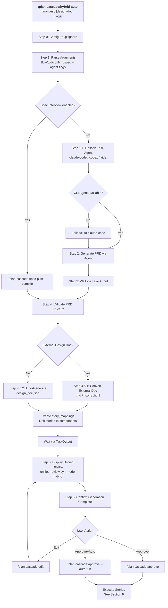

### Generated Files

| File | Description |
|------|-------------|
| `prd.json` | Product requirements with stories |
| `design_doc.json` | Technical design with story_mappings |
| `spec.json` / `spec.md` | Optional. Planning-time spec interview outputs (source + rendered) |
| `.state/spec-interview.json` | Optional. Resumable interview state |

### Recovery

If interrupted:
```bash
/plan-cascade:hybrid-resume --auto
```

---

## 9. Approve and Execute Workflow

The `/plan-cascade:approve` command handles story execution with multi-agent support.

### Command Parameters

```bash
/plan-cascade:approve [options]

Options:
  --flow <quick|standard|full>  Execution flow depth (default: standard)
  --tdd <off|on|auto>           TDD mode (default: auto)
  --confirm                     Require batch confirmation
  --no-confirm                  Disable batch confirmation (overrides --confirm and FULL defaults)
  --agent <name>        Global agent override (all stories)
  --impl-agent <name>   Agent for implementation phase
  --retry-agent <name>  Agent for retry phase
  --no-verify           Disable AI verification gate (enabled by default)
  --verify-agent <name> Agent for verification (default: claude-code)
  --no-review           Disable AI code review (enabled by default)
  --review-agent <name> Agent for code review (default: claude-code)
  --no-fallback         Disable automatic fallback to claude-code
  --auto-run            Start execution immediately
```

### Agent Priority Chain

```
1. --agent parameter           (Highest - global override)
2. --impl-agent parameter      (Phase-specific override)
3. story.agent in PRD          (Story-level specification)
4. Story type inference:
   - bugfix, fix → codex
   - refactor, cleanup → aider
   - test, spec → claude-code
   - feature, add → claude-code
5. phase_defaults in agents.json
6. fallback_chain in agents.json
7. claude-code                 (Always available fallback)
```

### Detailed Flowchart

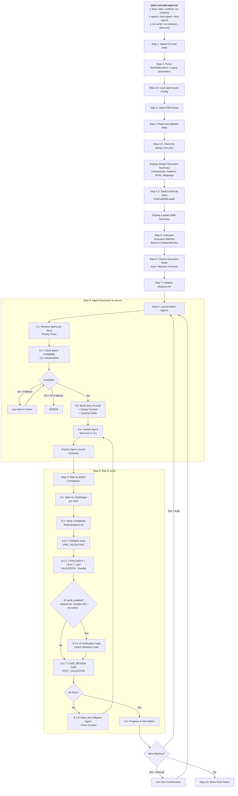

### Quality Gate Execution Order

Quality gates execute in three phases:

```
┌─────────────────────────────────────────────────────────────────┐
│ PRE_VALIDATION (sequential)                                      │
│   └── FORMAT: Auto-format code (ruff/prettier/cargo fmt/gofmt)  │
│       └── Invalidate cache after formatting                      │
├─────────────────────────────────────────────────────────────────┤
│ VALIDATION (parallel)                                            │
│   ├── TYPECHECK: mypy/tsc/cargo check                           │
│   ├── TEST: pytest/jest/cargo test                              │
│   └── LINT: ruff/eslint/clippy                                  │
├─────────────────────────────────────────────────────────────────┤
│ POST_VALIDATION (parallel)                                       │
│   ├── IMPLEMENTATION_VERIFY: AI skeleton code detection         │
│   └── CODE_REVIEW: AI 5-dimension code review                   │
└─────────────────────────────────────────────────────────────────┘
```

### AI Verification Gate

When AI verification is enabled (default; disable with `--no-verify`), each completed story is verified:

```
[VERIFIED] story-001 - All acceptance criteria implemented
[VERIFY_FAILED] story-002 - Skeleton code detected: function has only 'pass'
```

Detection rules:
- Functions with only `pass`, `...`, or `raise NotImplementedError`
- TODO/FIXME comments in new code
- Placeholder return values without logic
- Empty function/method bodies

### AI Code Review Gate

By default, AI code review runs for each completed story. Use `--no-review` to disable.

**Review Dimensions (100 points total):**

| Dimension | Points | Focus |
|-----------|--------|-------|
| Code Quality | 25 | Error handling, resource management, edge cases |
| Naming & Clarity | 20 | Variable/function names, code readability |
| Complexity | 20 | Cyclomatic complexity, nesting depth |
| Pattern Adherence | 20 | Architecture patterns, design doc compliance |
| Security | 15 | OWASP vulnerabilities, input validation |

**Progress markers:**
```
[REVIEW_PASSED] story-001 - Score: 85/100
[REVIEW_ISSUES] story-002 - Score: 60/100 - 2 critical findings
```

**Blocking conditions:**
- Score below threshold (default: 70)
- Critical severity findings (when `block_on_critical=true`)
- Confidence below 0.7

### Agent Display in Progress

```
=== Batch 1 Launched ===

Stories and assigned agents:
  - story-001: claude-code (task-tool)
  - story-002: aider (cli) [refactor detected]
  - story-003: codex (cli) [bugfix detected]

⚠️ Agent fallbacks:
  - story-004: aider → claude-code (aider CLI not found)

Waiting for completion...
```

### Progress Log Format

```
[2026-01-28 10:30:00] story-001: [START] via codex (pid:12345)
[2026-01-28 10:30:05] story-001: Progress update...
[2026-01-28 10:35:00] story-001: [COMPLETE] via codex
[2026-01-28 10:35:01] story-001: [VERIFIED] All criteria met
```

---

## 10. Auto-Iteration Workflow

Auto-iteration is the non-interactive, Python-based execution loop used in Full Auto mode (implemented by `scripts/auto-execute.py`).
It can be started via `/plan-cascade:approve --auto-run` (or by selecting Full Auto inside `/plan-cascade:approve`).

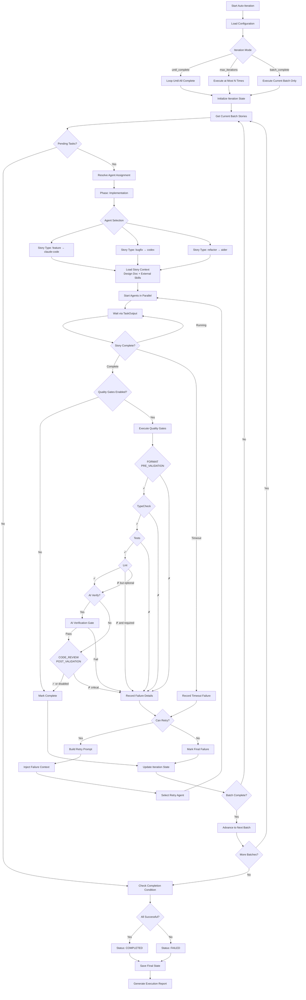

### Iteration Modes

| Mode | Description |
|------|-------------|
| `until_complete` | Continue execution until all Stories complete (default) |
| `max_iterations` | Stop after executing at most N iterations |
| `batch_complete` | Stop after executing current batch only |

---

## 10.5 DoR/DoD Gates Architecture

Plan Cascade uses Definition of Ready (DoR) and Definition of Done (DoD) gates to ensure quality at execution boundaries.

### Gate Flow

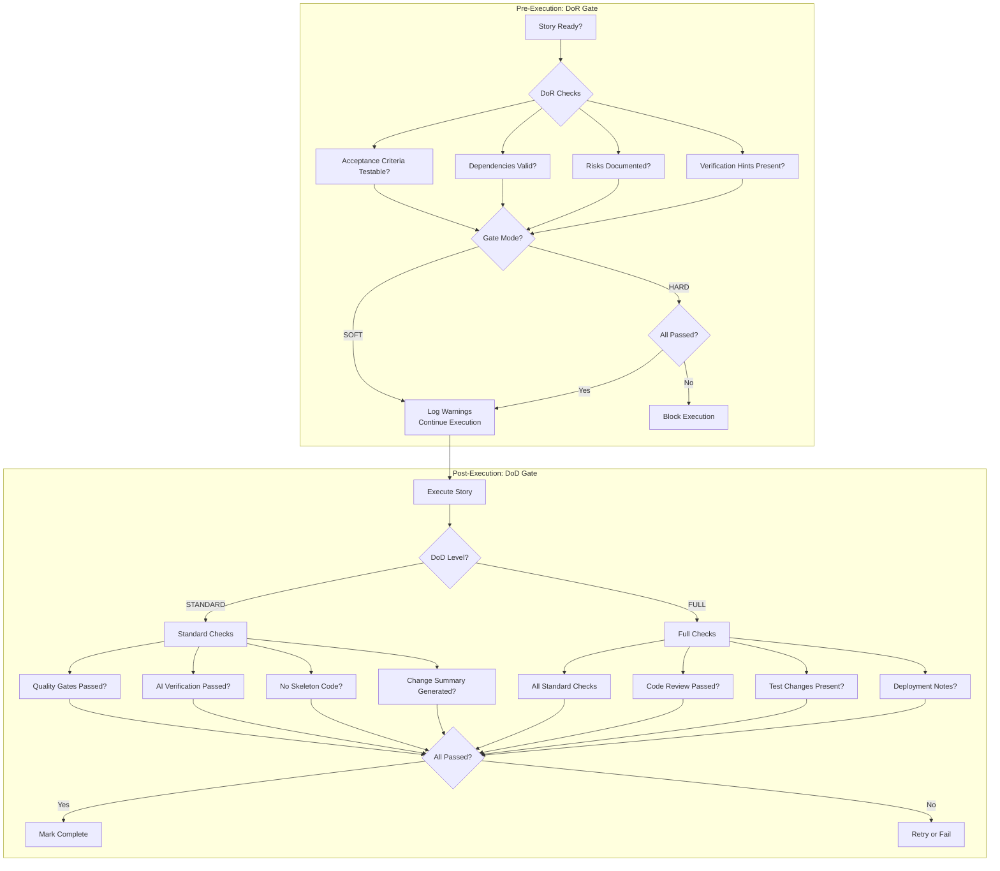

### DoR Check Types

| Check | Description | Default Mode |
|-------|-------------|--------------|
| `acceptance_criteria` | Verifies criteria are testable and measurable | SOFT |
| `dependencies_valid` | All story dependencies are resolved | SOFT |
| `risks_explicit` | Risk assessment is documented | SOFT |
| `verification_hints` | AI verification hints are present | SOFT |

### DoD Check Types

| Level | Checks | Description |
|-------|--------|-------------|
| **STANDARD** | quality_gates | TypeCheck, Test, Lint passed |
| | ai_verification | No skeleton code detected |
| | change_summary | Summary of changes generated |
| **FULL** | (all standard) | Plus additional checks below |
| | code_review | AI code review passed (score >= 70) |
| | test_changes | Test files modified with code changes |
| | deployment_notes | Deployment considerations documented |

---

## 10.6 TDD Support Architecture

Plan Cascade supports optional Test-Driven Development (TDD) at the story level.

### TDD Flow

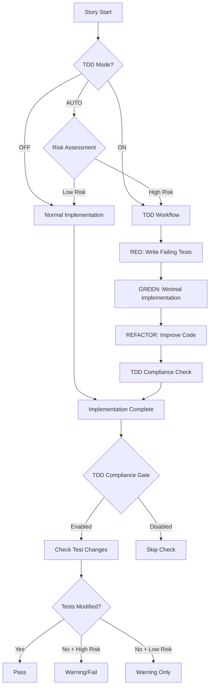

### TDD Modes

| Mode | Description | When Enabled |
|------|-------------|--------------|
| `off` | TDD disabled | Documentation, config changes |
| `on` | TDD always enabled | Security features, critical code |
| `auto` | Risk-based enablement | Default for most tasks |

### TDD Compliance Checking

When TDD is enabled, the compliance gate verifies:
- Test files were modified alongside code changes
- High-risk stories (security, auth, database) have corresponding tests
- Test file patterns: `test_`, `_test.`, `.test.`, `tests/`, `test/`, `spec/`

---

## 10.7 Dashboard Architecture

The `/plan-cascade:dashboard` command provides an aggregated status view.

### Data Aggregation Flow

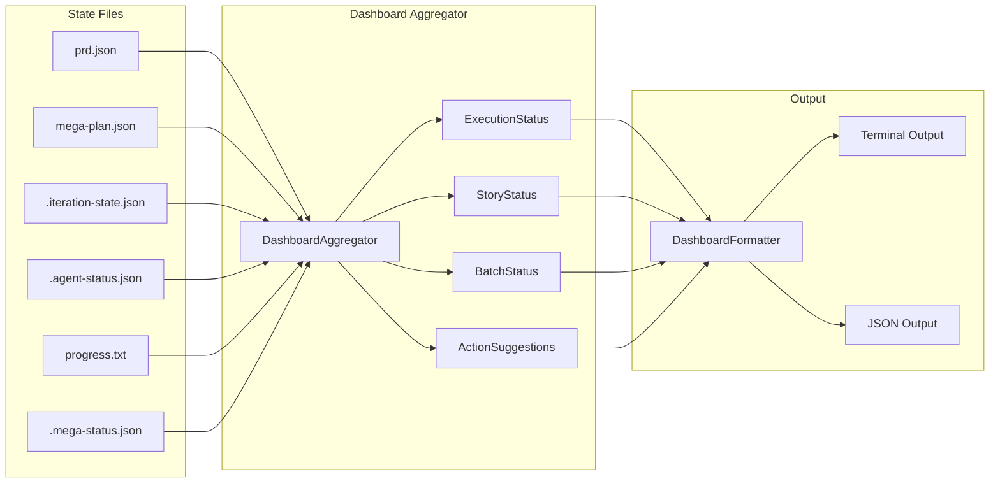

### Dashboard Data Model

| Component | Description |
|-----------|-------------|
| `ExecutionStatus` | Overall execution state (NOT_STARTED, IN_PROGRESS, COMPLETED, FAILED, PAUSED) |
| `StoryStatus` | Per-story state (PENDING, IN_PROGRESS, COMPLETE, FAILED, SKIPPED) |
| `BatchStatus` | Batch-level progress with story list and timestamps |
| `ActionType` | Suggested actions (RETRY, SWITCH_AGENT, MANUAL_FIX, CONTINUE, RESUME) |

---

## 10.8 Resume Detection Architecture

The `/plan-cascade:resume` command uses unified detection to find incomplete executions.

### Resume Detection Flow

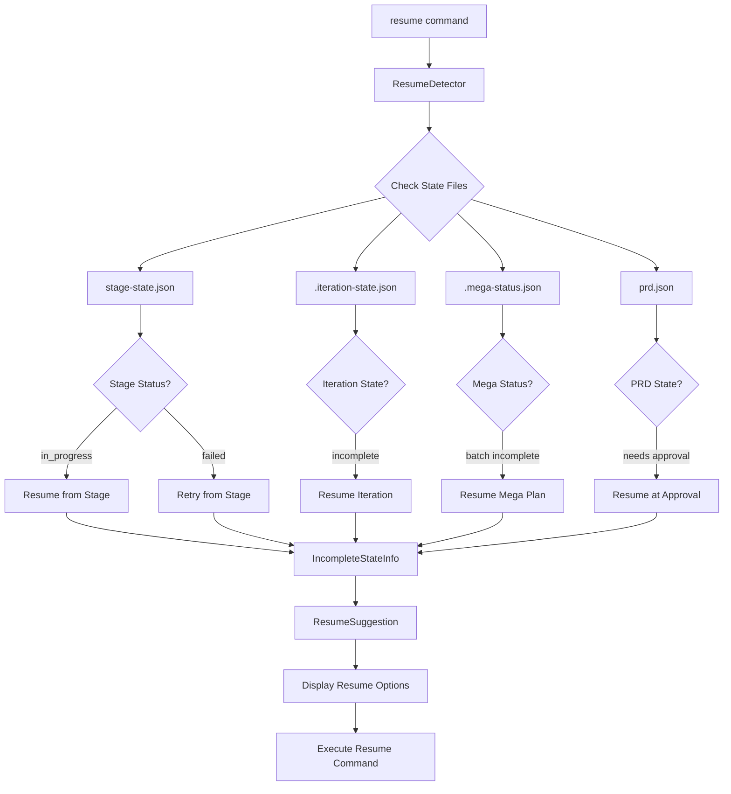

### Resume Reason Types

| Reason | Description | Suggested Action |
|--------|-------------|------------------|
| `STAGE_IN_PROGRESS` | Execution interrupted mid-stage | Resume from current stage |
| `STAGE_FAILED` | Stage failed, needs retry | Retry from failed stage |
| `EXECUTION_INCOMPLETE` | Stories incomplete | Resume iteration |
| `PRD_NEEDS_APPROVAL` | PRD generated, not approved | Run /plan-cascade:approve |
| `MEGA_PLAN_INCOMPLETE` | Features incomplete | Run /plan-cascade:mega-resume |

---

## 11. Path Storage Modes

Plan Cascade supports two path storage modes for runtime files:

### New Mode (Default)

Runtime files are stored in a user-specific directory, keeping the project root clean:

| Platform | User Data Directory |
|----------|---------------------|
| **Windows** | `%APPDATA%/plan-cascade/<project-id>/` |
| **Unix/macOS** | `~/.plan-cascade/<project-id>/` |

Where `<project-id>` is a unique identifier based on project name and path hash (e.g., `my-project-a1b2c3d4`).

**File Locations in New Mode:**

| File Type | Location |
|-----------|----------|
| `prd.json` | `<user-dir>/prd.json` (or worktree if in worktree mode) |
| `mega-plan.json` | `<user-dir>/mega-plan.json` |
| `.mega-status.json` | `<user-dir>/.state/.mega-status.json` |
| `agent-status.json` | `<user-dir>/.state/agent-status.json` |
| `iteration-state.json` | `<user-dir>/.state/iteration-state.json` |
| `retry-state.json` | `<user-dir>/.state/retry-state.json` |
| Worktrees | `<user-dir>/.worktree/<task-name>/` |
| `design_doc.json` | **Project root** (user-visible) |
| `spec.json` / `spec.md` | **Working directory / worktree** (user-visible, optional) |
| `.state/spec-interview.json` | **Working directory / worktree** (`.state/`, optional) |
| `progress.txt` | **Working directory** (user-visible) |
| `findings.md` | **Working directory** (user-visible) |

### Legacy Mode

All files are stored in the project root (backward compatible):

| File | Location |
|------|----------|
| `prd.json` | `<project-root>/prd.json` |
| `mega-plan.json` | `<project-root>/mega-plan.json` |
| `.mega-status.json` | `<project-root>/.mega-status.json` |
| `spec.json` / `spec.md` | `<project-root>/spec.json`, `<project-root>/spec.md` (optional) |
| `.state/spec-interview.json` | `<project-root>/.state/spec-interview.json` (optional) |
| Worktrees | `<project-root>/.worktree/<task-name>/` |

### Checking Current Mode

```bash
uv run python -c "from plan_cascade.state.path_resolver import PathResolver; from pathlib import Path; r=PathResolver(Path.cwd()); print('Mode:', 'legacy' if r.is_legacy_mode() else 'new'); print('PRD path:', r.get_prd_path())"
```

---

## 12. Data Flow and State Files

```mermaid
graph TB
    subgraph "Input"
        U[User Description] --> CMD[Command Parser]
        CFG[agents.json] --> CMD
        EXT[External Design Doc<br/>.md/.json/.html] -.-> CMD
    end

    subgraph "Claude Code Logs"
        CL[~/.claude/projects/PROJECT/*.jsonl<br/>Session Logs]
    end

    subgraph "Planning Files"
        CMD --> PRD[prd.json<br/>PRD Document]
        CMD -.-> SPEC[spec.json/spec.md<br/>Spec (optional)]
        SPEC -.-> PRD
        CMD --> MP[mega-plan.json<br/>Project Plan]
        CMD --> DD[design_doc.json<br/>Design Document]
    end

    subgraph "Execution State"
        PRD --> AS[.agent-status.json<br/>Agent Status]
        PRD --> IS[.iteration-state.json<br/>Iteration State]
        PRD --> RS[.retry-state.json<br/>Retry State]
        MP --> MS[.mega-status.json<br/>Mega Plan Status]
    end

    subgraph "Shared Context"
        AS --> FD[findings.md<br/>Findings Record]
        AS --> MF[mega-findings.md<br/>Project Findings]
        AS --> PG[progress.txt<br/>Progress Log]
    end

    subgraph "Agent Output"
        AS --> AO[.agent-outputs/<br/>├─ story-001.log<br/>├─ story-001.prompt.txt<br/>├─ story-001.verify.md<br/>└─ story-001.result.json]
    end

    subgraph "Cache"
        AD[.agent-detection.json<br/>Agent Detection Cache]
        GCF[.state/gate-cache.json<br/>Gate Result Cache]
        LK[.locks/<br/>File Locks]
    end

    subgraph "Spec State"
        SIS[.state/spec-interview.json<br/>Interview State]
    end

    subgraph "Context Recovery"
        CSJ[.state/claude-session/<br/>Tool Journal]
        HEC[.hybrid-execution-context.md]
        MEC[.mega-execution-context.md]
    end

    DD --> CF[ContextFilter]
    SPEC --> SIS
    CF --> AS
    CL -.-> CSJ
    CSJ -.-> HEC
    CSJ -.-> MEC

    style PRD fill:#e1f5fe
    style SPEC fill:#e1f5fe
    style MP fill:#e1f5fe
    style DD fill:#e1f5fe
    style AS fill:#fff3e0
    style IS fill:#fff3e0
    style RS fill:#fff3e0
    style MS fill:#fff3e0
    style FD fill:#e8f5e9
    style MF fill:#e8f5e9
    style PG fill:#e8f5e9
```

### File Descriptions

| File | Type | Description |
|------|------|-------------|
| `prd.json` | Planning | PRD document, contains goals, stories, dependencies |
| `mega-plan.json` | Planning | Project-level plan, manages multiple Features |
| `design_doc.json` | Planning | Technical design document, architecture and decisions |
| `spec.json` | Planning | Structured planning spec (optional; source of truth when spec interview is used) |
| `spec.md` | Planning | Rendered spec generated from `spec.json` (optional) |
| `agents.json` | Configuration | Agent configuration, includes phase defaults and fallback chains |
| `findings.md` | Shared | Agent findings record, supports tag filtering |
| `mega-findings.md` | Shared | Project-level findings (mega-plan mode) |
| `progress.txt` | Shared | Progress timeline, includes Agent execution info |
| `.agent-status.json` / `.state/agent-status.json` | State | Agent running/completed/failed status |
| `.iteration-state.json` / `.state/iteration-state.json` | State | Auto-iteration progress and batch results |
| `.retry-state.json` / `.state/retry-state.json` | State | Retry history and failure records |
| `.mega-status.json` / `.state/.mega-status.json` | State | Mega-plan execution status |
| `.state/spec-interview.json` | State | Resumable spec interview state (optional) |
| `.state/stage-state.json` | State | Stage state machine state (v4.4.0+) |
| `.agent-detection.json` | Cache | Cross-platform Agent detection results (1-hour TTL) |
| `.state/gate-cache.json` | Cache | Gate execution results cache (keyed by git commit + tree hash) |
| `.state/claude-session/` | Context | Compaction-safe tool I/O journal (tails Claude session logs); referenced from execution context files |
| `.hybrid-execution-context.md` | Context | Hybrid task context for AI recovery after session interruption |
| `.mega-execution-context.md` | Context | Mega-plan context for AI recovery after session interruption |
| `.agent-outputs/` | Output | Agent logs, prompts, verification reports, and result files |

---

## 13. Dual-Mode Architecture

### Mode Switching Design

```
┌─────────────────────────────────────────────────────────────────────────┐
│                         Plan Cascade                                     │
├─────────────────────────────────────────────────────────────────────────┤
│                                                                          │
│   ┌─────────────────────────┐     ┌─────────────────────────┐           │
│   │  Auto Strategy Mode      │     │  Explicit Workflow Mode  │           │
│   │                         │     │                         │           │
│   │  User enters description │     │  User enters description │           │
│   │       ↓                 │     │       ↓                 │           │
│   │  AI auto-determines      │     │  Generate PRD (editable) │           │
│   │  strategy               │     │       ↓                 │           │
│   │       ↓                 │     │  User Review/Modify      │           │
│   │  Auto-generate PRD      │     │       ↓                 │           │
│   │       ↓                 │     │  Select Strategy/Agent   │           │
│   │  Auto-execute           │     │       ↓                 │           │
│   │       ↓                 │     │  Execute                │           │
│   │  Complete               │     │                         │           │
│   └─────────────────────────┘     └─────────────────────────┘           │
│                                                                          │
│                              Shared Core                                 │
│   ┌─────────────────────────────────────────────────────────────────┐   │
│   │  Orchestrator │ PRDGenerator │ QualityGate │ AgentExecutor      │   │
│   └─────────────────────────────────────────────────────────────────┘   │
│                                                                          │
└─────────────────────────────────────────────────────────────────────────┘
```

### Dual Working Mode Architecture

**Core Philosophy: Plan Cascade = Brain (Orchestration), Execution Layer = Hands (Tool Execution)**

```
┌─────────────────────────────────────────────────────────────────────────┐
│                           Plan Cascade                                   │
│                    (Orchestration Layer - Shared by Both Modes)          │
├─────────────────────────────────────────────────────────────────────────┤
│                                                                          │
│   ┌─────────────────────────────────────────────────────────────────┐   │
│   │                    Orchestration Engine (Shared)                  │   │
│   │  ┌─────────────┐  ┌─────────────┐  ┌─────────────┐              │   │
│   │  │ PRD Generator│  │ Dependency  │  │  Batch     │              │   │
│   │  │             │  │ Analyzer    │  │  Scheduler │              │   │
│   │  └─────────────┘  └─────────────┘  └─────────────┘              │   │
│   │  ┌─────────────┐  ┌─────────────┐  ┌─────────────┐              │   │
│   │  │ State       │  │ Quality    │  │  Retry     │              │   │
│   │  │ Manager     │  │ Gates      │  │  Manager   │              │   │
│   │  └─────────────┘  └─────────────┘  └─────────────┘              │   │
│   └─────────────────────────────────────────────────────────────────┘   │
│                              │                                           │
│                    ┌─────────┴─────────┐                                │
│                    │  Execution Layer   │                                │
│                    │  Selection         │                                │
│                    └─────────┬─────────┘                                │
│              ┌───────────────┴───────────────┐                          │
│              ▼                               ▼                          │
│   ┌─────────────────────────┐    ┌─────────────────────────┐           │
│   │  Task-tool Execution     │    │  External CLI Agents    │           │
│   │  Mode                    │    │                         │           │
│   ├─────────────────────────┤    ├─────────────────────────┤           │
│   │                         │    │                         │           │
│   │   Task tool (built-in)  │    │   codex/aider/amp/etc   │           │
│   │   ┌───────────────┐     │    │   ┌───────────────┐     │           │
│   │   │ Read/Write    │     │    │   │ Claude Code   │     │           │
│   │   │ Edit/Bash     │     │    │   │ Executes Tools│     │           │
│   │   │ Glob/Grep     │     │    │   │ (stream-json) │     │           │
│   │   └───────────────┘     │    │   └───────────────┘     │           │
│   │          │              │    │          │              │           │
│   │          ▼              │    │          ▼              │           │
│   │   ┌───────────────┐     │    │   ┌───────────────┐     │           │
│   │   │ Agent:        │     │    │   │ Agent:        │     │           │
│   │   │ claude-code   │     │    │   │ codex/aider   │     │           │
│   │   │ (task-tool)   │     │    │   │ (cli)         │     │           │
│   │   └───────────────┘     │    │   └───────────────┘     │           │
│   │                         │    │                         │           │
│   └─────────────────────────┘    └─────────────────────────┘           │
│                                                                          │
└─────────────────────────────────────────────────────────────────────────┘

Both execution backends support: PRD-driven development, batch execution, quality gates, state tracking
```

---

## 14. Multi-Agent Collaboration Architecture

```
┌─────────────────────────────────────────────────────────────────────────┐
│                       Multi-Agent Collaboration Architecture             │
├─────────────────────────────────────────────────────────────────────────┤
│                                                                          │
│   Plan Cascade Orchestration Layer                                       │
│   ┌─────────────────────────────────────────────────────────────────┐   │
│   │  Orchestrator → AgentExecutor → PhaseAgentManager               │   │
│   │       │              │               │                           │   │
│   │       │              │               └─ Phase/Type → Agent Map   │   │
│   │       │              └─ Resolve Best Agent                       │   │
│   │       └─ Schedule Story Execution                                │   │
│   └─────────────────────────────────────────────────────────────────┘   │
│                              │                                           │
│              ┌───────────────┴───────────────┐                          │
│              ▼                               ▼                          │
│   ┌─────────────────────────┐    ┌─────────────────────────┐           │
│   │  Task-tool Execution     │    │  External CLI Agents    │           │
│   │  Mode                    │    │                         │           │
│   │                         │    │                         │           │
│   │   Default Agent:         │    │   Default Agent:         │           │
│   │   Task tool (built-in)  │    │   codex/aider/amp/etc   │           │
│   │                         │    │                         │           │
│   │   Optional CLI Agents:   │    │   Optional CLI Agents:   │           │
│   │   codex, aider, amp...  │    │   codex, aider, amp...  │           │
│   │                         │    │                         │           │
│   └─────────────────────────┘    └─────────────────────────┘           │
│                                                                          │
└─────────────────────────────────────────────────────────────────────────┘
```

### Supported Agents

| Agent | Type | Best For |
|-------|------|----------|
| `claude-code` | task-tool | General purpose (default, always available) |
| `codex` | cli | Bug fixes, quick implementations |
| `aider` | cli | Refactoring, code improvements |
| `amp-code` | cli | Alternative implementations |
| `cursor-cli` | cli | Cursor editor integration |

### Command Parameters

**For `/plan-cascade:approve` (story execution):**

| Parameter | Description | Example |
|-----------|-------------|---------|
| `--agent` | Global agent override (all stories) | `--agent=codex` |
| `--impl-agent` | Implementation phase agent | `--impl-agent=claude-code` |
| `--retry-agent` | Retry phase agent | `--retry-agent=aider` |
| `--no-verify` | Disable AI verification gate (enabled by default) | `--no-verify` |
| `--verify-agent` | Verification agent | `--verify-agent=claude-code` |
| `--no-review` | Disable AI code review (enabled by default) | `--no-review` |
| `--review-agent` | Code review agent | `--review-agent=claude-code` |
| `--no-fallback` | Disable auto-fallback on failure | `--no-fallback` |

**For `/plan-cascade:mega-approve` (feature execution):**

| Parameter | Description | Example |
|-----------|-------------|---------|
| `--agent` | Global agent override | `--agent=claude-code` |
| `--prd-agent` | PRD generation agent | `--prd-agent=codex` |
| `--impl-agent` | Implementation phase agent | `--impl-agent=aider` |
| `--auto-prd` | Auto-generate PRDs and execute | `--auto-prd` |

**For `/plan-cascade:hybrid-auto` (PRD generation):**

| Parameter | Description | Example |
|-----------|-------------|---------|
| `--agent` | Agent for PRD generation | `--agent=codex` |

**For `/plan-cascade:hybrid-worktree` (worktree + PRD generation):**

| Parameter | Description | Example |
|-----------|-------------|---------|
| `--agent` | Agent for PRD generation (overrides agents.json) | `--agent=codex` |

### Phase-Based Agent Assignment

| Phase | Default Agent | Fallback Chain | Story Type Override |
|-------|--------------|----------------|---------------------|
| `planning` | codex | claude-code | - |
| `implementation` | claude-code | codex, aider | bugfix→codex, refactor→aider |
| `retry` | claude-code | aider | - |
| `refactor` | aider | claude-code | - |
| `review` | claude-code | codex | - |

### Agent Priority Resolution

```
1. --agent command parameter              # Highest priority (global override)
2. Phase override --impl-agent etc.       # Phase-specific override
3. Agent specified in Story               # story.agent field
4. Story type override                    # bugfix → codex, refactor → aider
5. Phase default Agent                    # phase_defaults configuration
6. Fallback chain                         # fallback_chain
7. claude-code                            # Ultimate fallback (always available)
```

### Agent Configuration File (agents.json)

```json
{
  "default_agent": "claude-code",
  "agents": {
    "claude-code": {"type": "task-tool"},
    "codex": {"type": "cli", "command": "codex"},
    "aider": {"type": "cli", "command": "aider"}
  },
  "phase_defaults": {
    "implementation": {
      "default_agent": "claude-code",
      "fallback_chain": ["codex", "aider"],
      "story_type_overrides": {
        "refactor": "aider",
        "bugfix": "codex"
      }
    }
  }
}
```
