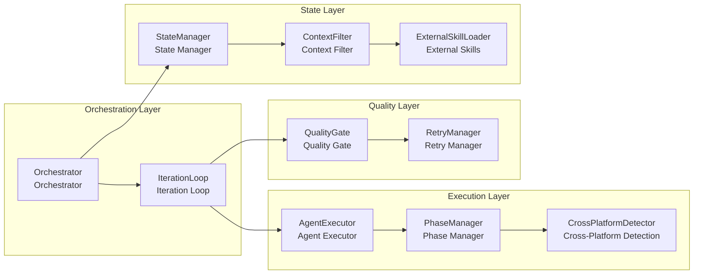
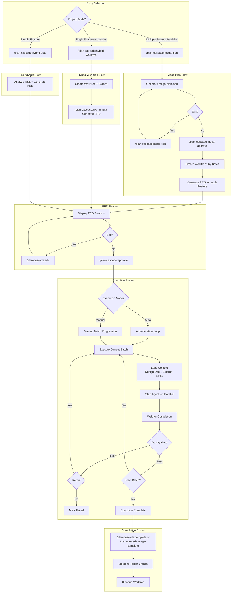
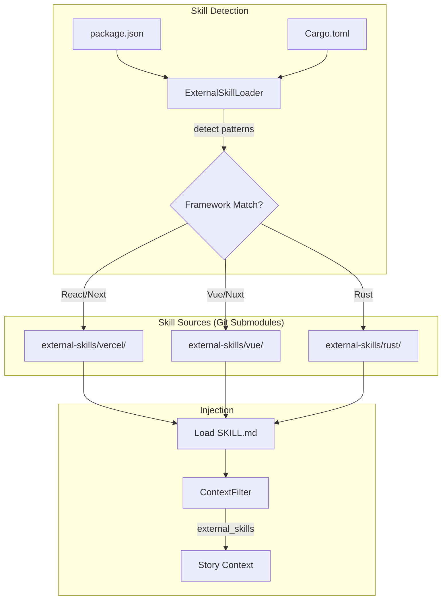
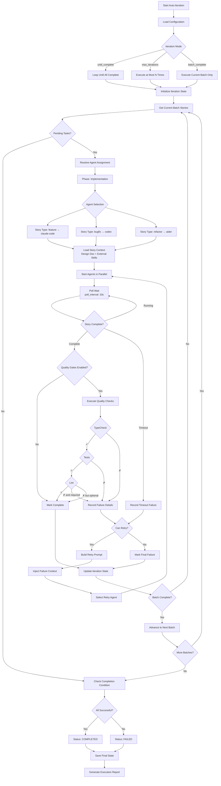
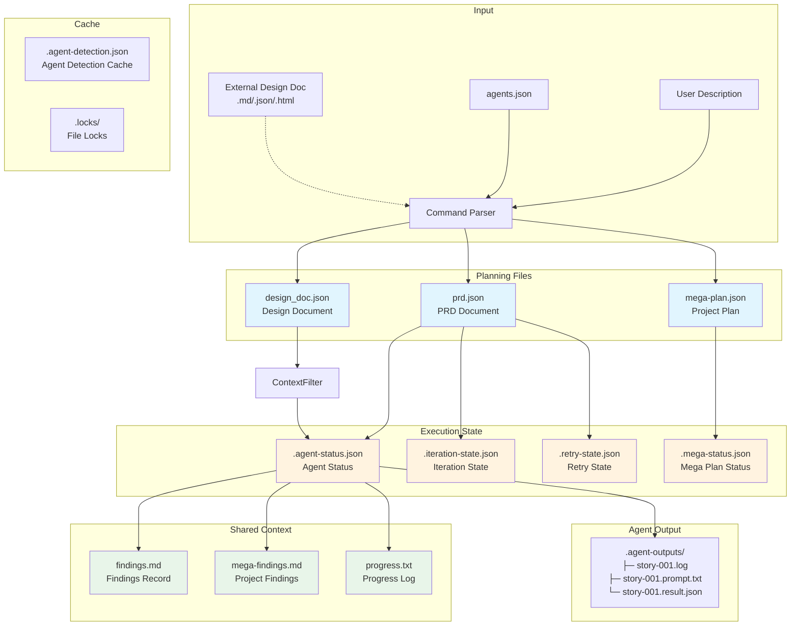

[中文版](System-Architecture_zh.md)

# Plan Cascade - System Architecture and Workflow Design

**Version**: 4.2.0
**Last Updated**: 2026-01-31

This document contains detailed architecture diagrams, flowcharts, and system design for Plan Cascade.

---

## Table of Contents

1. [Three-Tier Architecture](#1-three-tier-architecture)
2. [Core Components](#2-core-components)
3. [Complete Workflow](#3-complete-workflow)
4. [Auto Strategy Workflow](#4-auto-strategy-workflow)
5. [Design Document System](#5-design-document-system)
6. [Mega Plan Workflow](#6-mega-plan-workflow)
7. [Hybrid Worktree Workflow](#7-hybrid-worktree-workflow)
8. [Hybrid Auto Workflow](#8-hybrid-auto-workflow)
9. [Auto-Iteration Workflow](#9-auto-iteration-workflow)
10. [Data Flow and State Files](#10-data-flow-and-state-files)
11. [Dual-Mode Architecture](#11-dual-mode-architecture)
12. [Multi-Agent Collaboration Architecture](#12-multi-agent-collaboration-architecture)

---

## 1. Three-Tier Architecture


### Tier Details

| Tier | Name | Responsibility | Artifact |
|------|------|----------------|----------|
| **Level 1** | Mega Plan | Project-level orchestration, manages dependencies and execution order of multiple Features | `mega-plan.json`, `design_doc.json` (project-level) |
| **Level 2** | Hybrid Ralph | Feature-level development, executes in isolated Worktree, auto-generates PRD and design doc | `prd.json`, `design_doc.json` (feature-level), `findings.md` |
| **Level 3** | Stories | Story-level execution, processed in parallel by Agents, supports quality gates and retries | Code changes, `progress.txt` |

---

## 2. Core Components



### Component Descriptions

| Component | Responsibility |
|-----------|----------------|
| **Orchestrator** | Core orchestrator, coordinates all components |
| **IterationLoop** | Auto-iteration loop, manages batch execution |
| **AgentExecutor** | Agent execution abstraction, supports multiple Agents |
| **PhaseManager** | Phase management, selects Agent based on phase |
| **QualityGate** | Quality gates, validates code quality |
| **RetryManager** | Retry management, handles failure retries |
| **StateManager** | State management, persists execution state |
| **ContextFilter** | Context filter, optimizes Agent input |
| **ExternalSkillLoader** | Framework skill loading, auto-detects and injects best practices |

---

## 3. Complete Workflow



---

## 4. Auto Strategy Workflow

The `/plan-cascade:auto` command provides AI-driven automatic strategy selection based on structured task analysis.

### Strategy Selection Flowchart


### AI Self-Assessment Output

The AI outputs structured analysis in JSON format:

```json
{
  "task_analysis": {
    "functional_areas": ["auth", "api", "frontend"],
    "estimated_stories": 5,
    "has_dependencies": true,
    "requires_architecture_decisions": true,
    "risk_level": "medium",
    "parallelization_benefit": "significant"
  },
  "strategy_decision": {
    "strategy": "HYBRID_AUTO",
    "confidence": 0.85,
    "reasoning": "Task involves 3 functional areas with dependencies..."
  }
}
```

### Strategy Selection Guidelines

| Analysis Result | Strategy | Example |
|----------------|----------|---------|
| 1 functional area, 1-2 steps, low risk | **DIRECT** | "Fix the typo in README" |
| 2-3 functional areas, 3-7 steps, has dependencies | **HYBRID_AUTO** | "Implement user authentication with OAuth" |
| HYBRID_AUTO + high risk or experimental | **HYBRID_WORKTREE** | "Experimental refactoring of payment module" |
| 4+ functional areas, multiple independent features | **MEGA_PLAN** | "Build e-commerce platform with users, products, cart, orders" |

### Example Strategy Mappings

| Task Description | Analysis Result | Selected Strategy |
|-----------------|-----------------|-------------------|
| "Fix the typo in README" | 1 area, low risk | DIRECT |
| "Implement user authentication with OAuth" | 3 areas, has dependencies | HYBRID_AUTO |
| "Experimental refactoring of payment module" | medium risk + experimental | HYBRID_WORKTREE |
| "Build e-commerce platform with users, products, cart, orders" | 4+ functional areas | MEGA_PLAN |

---

## 5. Design Document System

Plan Cascade automatically generates technical design documents (`design_doc.json`) alongside PRDs to provide architectural context during story execution.

### Two-Level Architecture


### Design Document Schema

```json
{
  "metadata": {
    "created_at": "ISO-8601",
    "version": "1.0.0",
    "source": "ai-generated|user-provided|converted",
    "prd_reference": "prd.json",
    "parent_design_doc": "path/to/project/design_doc.json"
  },
  "overview": {
    "title": "Project/Feature Title",
    "summary": "Summary description",
    "goals": ["Goal 1", "Goal 2"],
    "non_goals": ["Non-goal 1"]
  },
  "architecture": {
    "components": [{
      "name": "ComponentName",
      "description": "Description",
      "responsibilities": ["Responsibility 1"],
      "dependencies": ["DependencyComponent"],
      "files": ["src/file.py"]
    }],
    "data_flow": "Data flow description",
    "patterns": [{
      "name": "PatternName",
      "description": "Description",
      "rationale": "Why this pattern"
    }]
  },
  "interfaces": {
    "apis": [...],
    "data_models": [...]
  },
  "decisions": [{
    "id": "ADR-001",
    "title": "Decision Title",
    "context": "Background context",
    "decision": "The decision made",
    "rationale": "Why this decision",
    "alternatives_considered": ["Alternative 1"],
    "status": "accepted"
  }],
  "story_mappings": {
    "story-001": {
      "components": ["ComponentA"],
      "decisions": ["ADR-001"],
      "interfaces": ["API-1"]
    }
  },
  "feature_mappings": {
    "feature-001": {
      "patterns": ["PatternA"],
      "decisions": ["ADR-001"]
    }
  }
}
```

### Auto-Generation Flow


### External Design Document Import

All three main commands support importing external design documents:

```bash
# mega-plan: 2nd argument
/plan-cascade:mega-plan "Build e-commerce" ./architecture.md

# hybrid-auto: 2nd argument
/plan-cascade:hybrid-auto "Implement auth" ./auth-design.md

# hybrid-worktree: 4th argument
/plan-cascade:hybrid-worktree fix-auth main "Fix auth" ./design.md
```

Supported formats: Markdown (.md), JSON (.json), HTML (.html)

### Context Injection Flow


### External Framework Skills

Plan Cascade includes built-in framework-specific skills loaded from Git submodules:



| Framework | Detection | Skills Injected |
|-----------|-----------|-----------------|
| React/Next.js | `package.json` contains `react`, `next` | `react-best-practices`, `web-design-guidelines` |
| Vue/Nuxt | `package.json` contains `vue`, `nuxt` | `vue-best-practices`, `vue-router-best-practices`, `vue-pinia-best-practices` |
| Rust | `Cargo.toml` exists | `rust-coding-guidelines`, `rust-ownership`, `rust-error-handling`, `rust-concurrency` |

---

## 6. Mega Plan Workflow

Suitable for large project development containing multiple related feature modules.

### Use Cases

| Type | Scenario | Example |
|------|----------|---------|
| ✅ Suitable | Multi-module new project development | Build SaaS platform (user + subscription + billing + admin) |
| ✅ Suitable | Large-scale refactoring involving multiple subsystems | Monolith to microservices architecture |
| ✅ Suitable | Feature group development | E-commerce platform (users, products, cart, orders) |
| ❌ Not suitable | Single feature development | Only implement user authentication (use Hybrid Ralph) |
| ❌ Not suitable | Bug fixes | Fix login page form validation issue |

### Sequential Execution Between Batches

```
mega-approve (1st time) → Start Batch 1
    ↓ Batch 1 complete
mega-approve (2nd time) → Merge Batch 1 → Create Batch 2 from updated branch
    ↓ Batch 2 complete
mega-approve (3rd time) → Merge Batch 2 → ...
    ↓ All batches complete
mega-complete → Clean up planning files
```

### Detailed Flowchart


---

## 7. Hybrid Worktree Workflow

Suitable for single complex feature development requiring branch isolation.

### Use Cases

| Type | Scenario | Example |
|------|----------|---------|
| ✅ Suitable | Complete feature with multiple subtasks | User authentication (registration + login + password reset) |
| ✅ Suitable | Experimental feature requiring branch isolation | New payment channel integration test |
| ✅ Suitable | Medium-scale refactoring (5-20 files) | API layer unified error handling |
| ❌ Not suitable | Simple single-file modification | Modify a component's style |
| ❌ Not suitable | Quick prototype validation | Verify if a library is usable |

### Detailed Flowchart


---

## 8. Hybrid Auto Workflow

Suitable for quick development of simple features without Worktree isolation.

### Detailed Flowchart


---

## 9. Auto-Iteration Workflow

Auto-iteration loop started by `/plan-cascade:approve --auto-run` or `/plan-cascade:auto-run` command:



### Iteration Modes

| Mode | Description |
|------|-------------|
| `until_complete` | Continue execution until all Stories complete (default) |
| `max_iterations` | Stop after executing at most N iterations |
| `batch_complete` | Stop after executing current batch only |

---

## 10. Data Flow and State Files



### File Descriptions

| File | Type | Description |
|------|------|-------------|
| `prd.json` | Planning | PRD document, contains goals, stories, dependencies |
| `mega-plan.json` | Planning | Project-level plan, manages multiple Features |
| `design_doc.json` | Planning | Technical design document, architecture and decisions |
| `agents.json` | Configuration | Agent configuration, includes phase defaults and fallback chains |
| `findings.md` | Shared | Agent findings record, supports tag filtering |
| `mega-findings.md` | Shared | Project-level findings (mega-plan mode) |
| `progress.txt` | Shared | Progress timeline, includes Agent execution info |
| `.agent-status.json` | State | Agent running/completed/failed status |
| `.iteration-state.json` | State | Auto-iteration progress and batch results |
| `.retry-state.json` | State | Retry history and failure records |
| `.mega-status.json` | State | Mega-plan execution status |
| `.agent-detection.json` | Cache | Cross-platform Agent detection results (1-hour TTL) |
| `.agent-outputs/` | Output | Agent logs, prompts, and result files |

---

## 11. Dual-Mode Architecture

### Mode Switching Design

```
┌─────────────────────────────────────────────────────────────────────────┐
│                         Plan Cascade                                     │
├─────────────────────────────────────────────────────────────────────────┤
│                                                                          │
│   ┌─────────────────────────┐     ┌─────────────────────────┐           │
│   │      Simple Mode         │     │      Expert Mode         │           │
│   │                         │     │                         │           │
│   │  User enters description │     │  User enters description │           │
│   │       ↓                 │     │       ↓                 │           │
│   │  AI auto-determines      │     │  Generate PRD (editable) │           │
│   │  strategy               │     │       ↓                 │           │
│   │       ↓                 │     │  User Review/Modify      │           │
│   │  Auto-generate PRD      │     │       ↓                 │           │
│   │       ↓                 │     │  Select Strategy/Agent   │           │
│   │  Auto-execute           │     │       ↓                 │           │
│   │       ↓                 │     │  Execute                │           │
│   │  Complete               │     │                         │           │
│   └─────────────────────────┘     └─────────────────────────┘           │
│                                                                          │
│                              Shared Core                                 │
│   ┌─────────────────────────────────────────────────────────────────┐   │
│   │  Orchestrator │ PRDGenerator │ QualityGate │ AgentExecutor      │   │
│   └─────────────────────────────────────────────────────────────────┘   │
│                                                                          │
└─────────────────────────────────────────────────────────────────────────┘
```

### Dual Working Mode Architecture

**Core Philosophy: Plan Cascade = Brain (Orchestration), Execution Layer = Hands (Tool Execution)**

```
┌─────────────────────────────────────────────────────────────────────────┐
│                           Plan Cascade                                   │
│                    (Orchestration Layer - Shared by Both Modes)          │
├─────────────────────────────────────────────────────────────────────────┤
│                                                                          │
│   ┌─────────────────────────────────────────────────────────────────┐   │
│   │                    Orchestration Engine (Shared)                  │   │
│   │  ┌─────────────┐  ┌─────────────┐  ┌─────────────┐              │   │
│   │  │ PRD Generator│  │ Dependency  │  │  Batch     │              │   │
│   │  │             │  │ Analyzer    │  │  Scheduler │              │   │
│   │  └─────────────┘  └─────────────┘  └─────────────┘              │   │
│   │  ┌─────────────┐  ┌─────────────┐  ┌─────────────┐              │   │
│   │  │ State       │  │ Quality    │  │  Retry     │              │   │
│   │  │ Manager     │  │ Gates      │  │  Manager   │              │   │
│   │  └─────────────┘  └─────────────┘  └─────────────┘              │   │
│   └─────────────────────────────────────────────────────────────────┘   │
│                              │                                           │
│                    ┌─────────┴─────────┐                                │
│                    │  Execution Layer   │                                │
│                    │  Selection         │                                │
│                    └─────────┬─────────┘                                │
│              ┌───────────────┴───────────────┐                          │
│              ▼                               ▼                          │
│   ┌─────────────────────────┐    ┌─────────────────────────┐           │
│   │  Standalone Orchestration│    │  Claude Code GUI Mode   │           │
│   │  Mode                    │    │                         │           │
│   ├─────────────────────────┤    ├─────────────────────────┤           │
│   │                         │    │                         │           │
│   │   Built-in Tool Engine  │    │   Claude Code CLI       │           │
│   │   ┌───────────────┐     │    │   ┌───────────────┐     │           │
│   │   │ Read/Write    │     │    │   │ Claude Code   │     │           │
│   │   │ Edit/Bash     │     │    │   │ Executes Tools│     │           │
│   │   │ Glob/Grep     │     │    │   │ (stream-json) │     │           │
│   │   └───────────────┘     │    │   └───────────────┘     │           │
│   │          │              │    │          │              │           │
│   │          ▼              │    │          ▼              │           │
│   │   ┌───────────────┐     │    │   ┌───────────────┐     │           │
│   │   │ LLM Abstraction│    │    │   │ Plan Cascade  │     │           │
│   │   │ Layer          │    │    │   │ Visual UI     │     │           │
│   │   │ (Multiple)    │     │    │   └───────────────┘     │           │
│   │   └───────────────┘     │    │                         │           │
│   │          │              │    │                         │           │
│   │   ┌──────┴──────┐       │    │                         │           │
│   │   ▼      ▼      ▼       │    │                         │           │
│   │ Claude Claude OpenAI    │    │                         │           │
│   │ Max    API    etc.      │    │                         │           │
│   │                         │    │                         │           │
│   └─────────────────────────┘    └─────────────────────────┘           │
│                                                                          │
└─────────────────────────────────────────────────────────────────────────┘

Both modes support: PRD-driven development, batch execution, quality gates, state tracking
```

### Standalone Orchestration Mode Architecture Details

```
┌─────────────────────────────────────────────────────────────────────────┐
│                       Standalone Orchestration Mode                       │
├─────────────────────────────────────────────────────────────────────────┤
│                                                                          │
│  ┌─ Orchestration Layer ─────────────────────────────────────────────┐  │
│  │                                                                    │  │
│  │  ┌─────────────┐  ┌─────────────┐  ┌─────────────┐                │  │
│  │  │ Intent      │  │ Strategy    │  │  PRD        │                │  │
│  │  │ Classifier  │  │ Analyzer    │  │  Generator  │                │  │
│  │  └─────────────┘  └─────────────┘  └─────────────┘                │  │
│  │         │               │               │                          │  │
│  │         └───────────────┴───────────────┘                          │  │
│  │                         │                                          │  │
│  │                         ▼                                          │  │
│  │  ┌─────────────────────────────────────────────────────────────┐  │  │
│  │  │                   Orchestrator                               │  │  │
│  │  │  • Batch dependency analysis                                 │  │  │
│  │  │  • Parallel execution coordination                           │  │  │
│  │  │  • Quality gate checks                                       │  │  │
│  │  │  • Retry management                                          │  │  │
│  │  └─────────────────────────────────────────────────────────────┘  │  │
│  │                         │                                          │  │
│  └─────────────────────────┼──────────────────────────────────────────┘  │
│                            ▼                                              │
│  ┌─ Execution Layer ─────────────────────────────────────────────────┐  │
│  │                                                                    │  │
│  │  ┌─────────────────────────────────────────────────────────────┐  │  │
│  │  │                   ReAct Execution Engine                     │  │  │
│  │  │                                                              │  │  │
│  │  │   ┌─────────┐     ┌─────────┐     ┌─────────┐               │  │  │
│  │  │   │  Think  │ ──→ │   Act   │ ──→ │ Observe │ ──→ (loop)    │  │  │
│  │  │   │  (LLM)  │     │ (Tool)  │     │ (Result)│               │  │  │
│  │  │   └─────────┘     └─────────┘     └─────────┘               │  │  │
│  │  │                                                              │  │  │
│  │  └─────────────────────────────────────────────────────────────┘  │  │
│  │                         │                                          │  │
│  │                         ▼                                          │  │
│  │  ┌─────────────────────────────────────────────────────────────┐  │  │
│  │  │                   Tool Execution Engine                      │  │  │
│  │  │                                                              │  │  │
│  │  │   ┌────────┐ ┌────────┐ ┌────────┐ ┌────────┐ ┌────────┐   │  │  │
│  │  │   │  Read  │ │ Write  │ │  Edit  │ │  Bash  │ │  Glob  │   │  │  │
│  │  │   └────────┘ └────────┘ └────────┘ └────────┘ └────────┘   │  │  │
│  │  │   ┌────────┐ ┌────────┐                                     │  │  │
│  │  │   │  Grep  │ │   LS   │                                     │  │  │
│  │  │   └────────┘ └────────┘                                     │  │  │
│  │  │                                                              │  │  │
│  │  └─────────────────────────────────────────────────────────────┘  │  │
│  │                                                                    │  │
│  └────────────────────────────────────────────────────────────────────┘  │
│                            │                                              │
│                            ▼                                              │
│  ┌─ LLM Layer ───────────────────────────────────────────────────────┐  │
│  │                                                                    │  │
│  │  ┌─────────────────────────────────────────────────────────────┐  │  │
│  │  │                   LLM Abstraction Layer                      │  │  │
│  │  │              (Only provides thinking, no tool execution)     │  │  │
│  │  └─────────────────────────────────────────────────────────────┘  │  │
│  │                         │                                          │  │
│  │       ┌─────────────────┼─────────────────┐                       │  │
│  │       ▼                 ▼                 ▼                       │  │
│  │  ┌─────────┐       ┌─────────┐       ┌─────────┐                 │  │
│  │  │ Claude  │       │ Claude  │       │ OpenAI  │                 │  │
│  │  │   Max   │       │   API   │       │ DeepSeek│                 │  │
│  │  │(via CC) │       │         │       │ Ollama  │                 │  │
│  │  └─────────┘       └─────────┘       └─────────┘                 │  │
│  │                                                                    │  │
│  └────────────────────────────────────────────────────────────────────┘  │
│                                                                          │
└─────────────────────────────────────────────────────────────────────────┘
```

---

## 12. Multi-Agent Collaboration Architecture

```
┌─────────────────────────────────────────────────────────────────────────┐
│                       Multi-Agent Collaboration Architecture             │
├─────────────────────────────────────────────────────────────────────────┤
│                                                                          │
│   Plan Cascade Orchestration Layer                                       │
│   ┌─────────────────────────────────────────────────────────────────┐   │
│   │  Orchestrator → AgentExecutor → PhaseAgentManager               │   │
│   │       │              │               │                           │   │
│   │       │              │               └─ Phase/Type → Agent Map   │   │
│   │       │              └─ Resolve Best Agent                       │   │
│   │       └─ Schedule Story Execution                                │   │
│   └─────────────────────────────────────────────────────────────────┘   │
│                              │                                           │
│              ┌───────────────┴───────────────┐                          │
│              ▼                               ▼                          │
│   ┌─────────────────────────┐    ┌─────────────────────────┐           │
│   │  Standalone Orchestration│    │  Claude Code GUI Mode   │           │
│   │  Mode                    │    │                         │           │
│   │                         │    │                         │           │
│   │   Default Agent:         │    │   Default Agent:         │           │
│   │   Built-in ReAct Engine │    │   Claude Code CLI       │           │
│   │                         │    │                         │           │
│   │   Optional CLI Agents:   │    │   Optional CLI Agents:   │           │
│   │   codex, aider, amp...  │    │   codex, aider, amp...  │           │
│   │                         │    │                         │           │
│   └─────────────────────────┘    └─────────────────────────┘           │
│                                                                          │
└─────────────────────────────────────────────────────────────────────────┘
```

### Supported Agents

| Agent | Type | Best For |
|-------|------|----------|
| `claude-code` | task-tool | General purpose (default, always available) |
| `codex` | cli | Bug fixes, quick implementations |
| `aider` | cli | Refactoring, code improvements |
| `amp-code` | cli | Alternative implementations |
| `cursor-cli` | cli | Cursor editor integration |

### Command Parameters

**For `/plan-cascade:approve` (story execution):**

| Parameter | Description | Example |
|-----------|-------------|---------|
| `--agent` | Global agent override (all stories) | `--agent=codex` |
| `--impl-agent` | Implementation phase agent | `--impl-agent=claude-code` |
| `--retry-agent` | Retry phase agent | `--retry-agent=aider` |
| `--no-fallback` | Disable auto-fallback on failure | `--no-fallback` |

**For `/plan-cascade:mega-approve` (feature execution):**

| Parameter | Description | Example |
|-----------|-------------|---------|
| `--agent` | Global agent override | `--agent=claude-code` |
| `--prd-agent` | PRD generation agent | `--prd-agent=codex` |
| `--impl-agent` | Implementation phase agent | `--impl-agent=aider` |
| `--auto-prd` | Auto-generate PRDs and execute | `--auto-prd` |

**For `/plan-cascade:hybrid-auto` (PRD generation):**

| Parameter | Description | Example |
|-----------|-------------|---------|
| `--agent` | Agent for PRD generation | `--agent=codex` |

### Phase-Based Agent Assignment

| Phase | Default Agent | Fallback Chain | Story Type Override |
|-------|--------------|----------------|---------------------|
| `planning` | codex | claude-code | - |
| `implementation` | claude-code | codex, aider | bugfix→codex, refactor→aider |
| `retry` | claude-code | aider | - |
| `refactor` | aider | claude-code | - |
| `review` | claude-code | codex | - |

### Agent Priority Resolution

```
1. --agent command parameter              # Highest priority (global override)
2. Phase override --impl-agent etc.       # Phase-specific override
3. Agent specified in Story               # story.agent field
4. Story type override                    # bugfix → codex, refactor → aider
5. Phase default Agent                    # phase_defaults configuration
6. Fallback chain                         # fallback_chain
7. claude-code                            # Ultimate fallback (always available)
```

### Agent Configuration File (agents.json)

```json
{
  "default_agent": "claude-code",
  "agents": {
    "claude-code": {"type": "task-tool"},
    "codex": {"type": "cli", "command": "codex"},
    "aider": {"type": "cli", "command": "aider"}
  },
  "phase_defaults": {
    "implementation": {
      "default_agent": "claude-code",
      "fallback_chain": ["codex", "aider"],
      "story_type_overrides": {
        "refactor": "aider",
        "bugfix": "codex"
      }
    }
  }
}
```

---

## Appendix: Two Working Modes Comparison

| Feature | Standalone Orchestration Mode | Claude Code GUI Mode |
|---------|------------------------------|----------------------|
| Orchestration Layer | Plan Cascade | Plan Cascade |
| Tool Execution | Plan Cascade executes itself | Claude Code CLI executes |
| LLM Source | Claude Max/API, OpenAI, DeepSeek, Ollama | Claude Code |
| PRD-Driven | ✅ Full support | ✅ Full support |
| Batch Execution | ✅ Full support | ✅ Full support |
| Offline Available | ✅ (using Ollama) | ❌ |
| Use Case | Need other LLMs or offline use | Have Claude Max/Code subscription |

| Component | Standalone Orchestration Mode | Claude Code GUI Mode |
|-----------|------------------------------|----------------------|
| PRD Generation | Plan Cascade (LLM) | Plan Cascade (Claude Code) |
| Dependency Analysis | Plan Cascade | Plan Cascade |
| Batch Scheduling | Plan Cascade | Plan Cascade |
| Story Execution | Plan Cascade (ReAct) | Claude Code CLI |
| Tool Calls | Built-in Tool Engine | Claude Code |
| State Tracking | Plan Cascade | Plan Cascade |
| Quality Gates | Plan Cascade | Plan Cascade |
