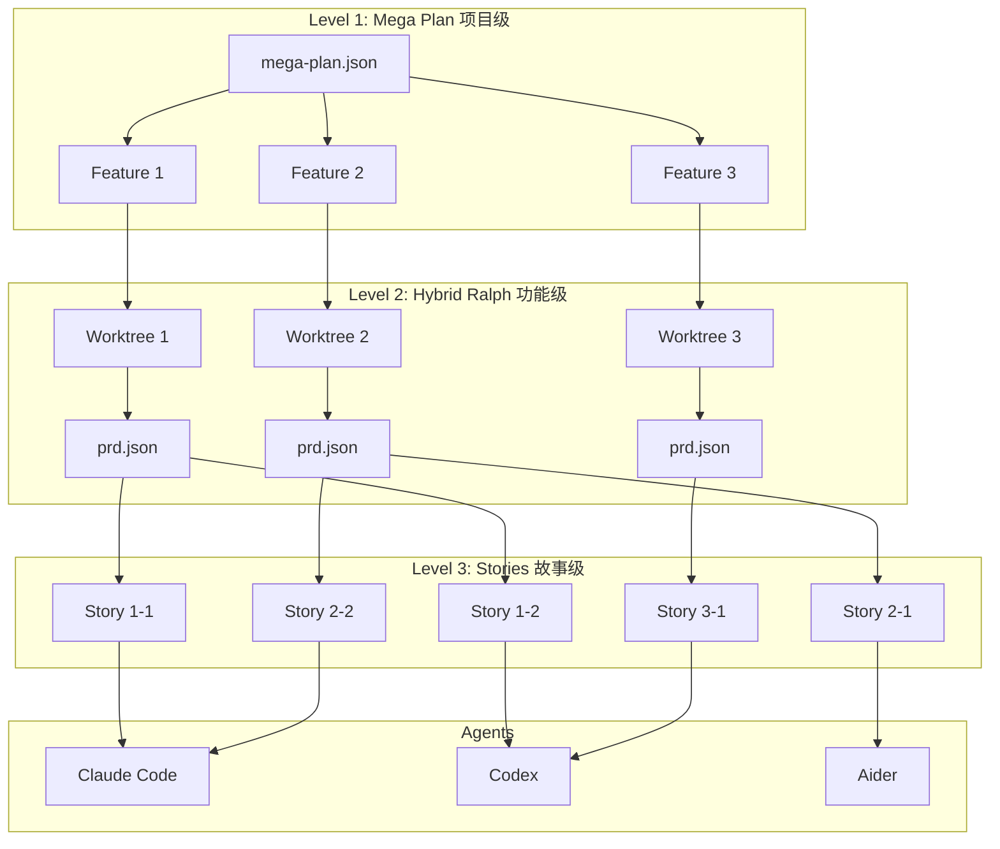
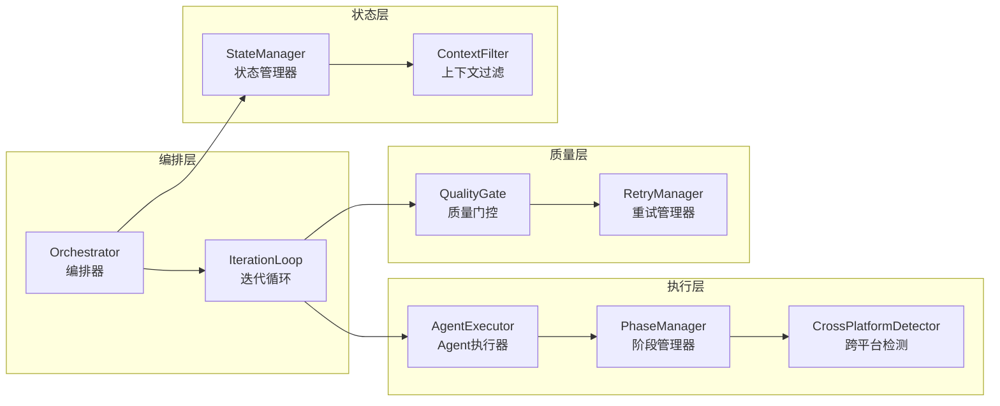
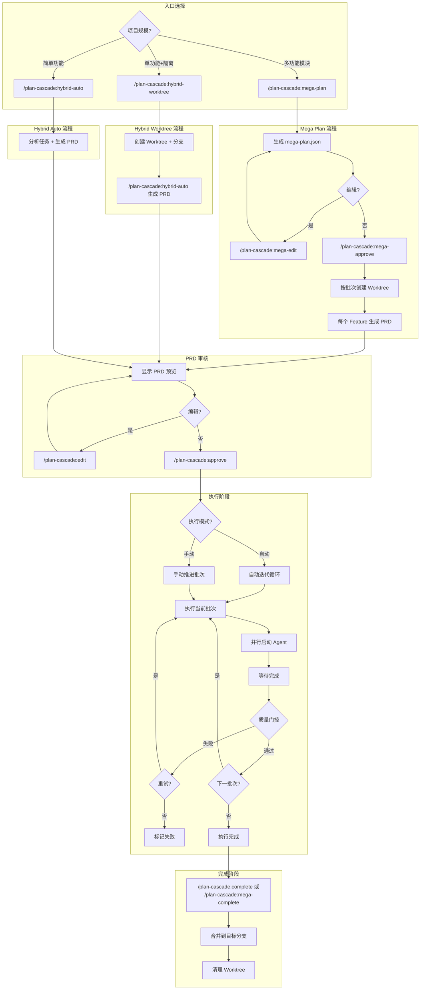
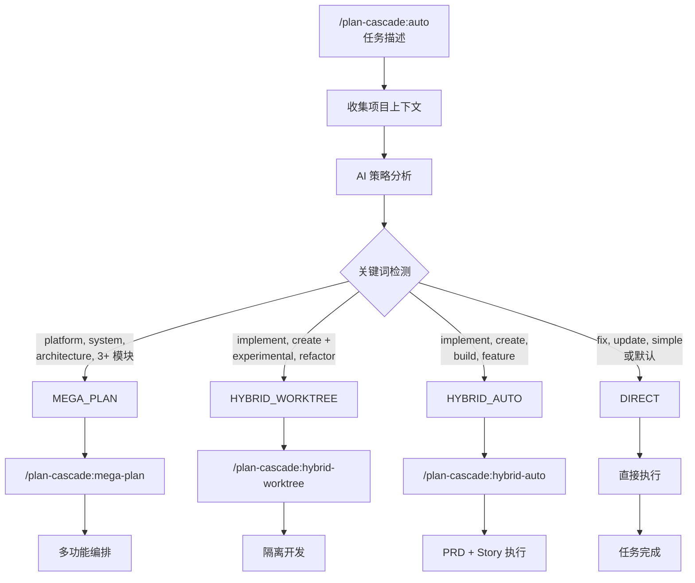
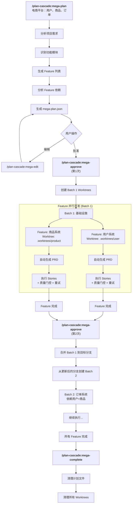
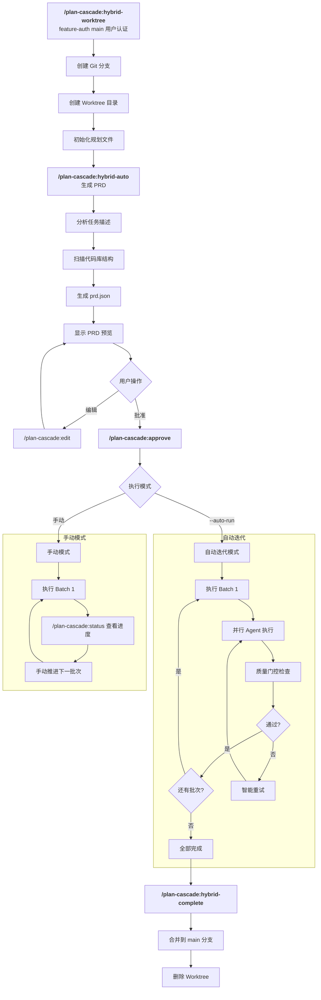
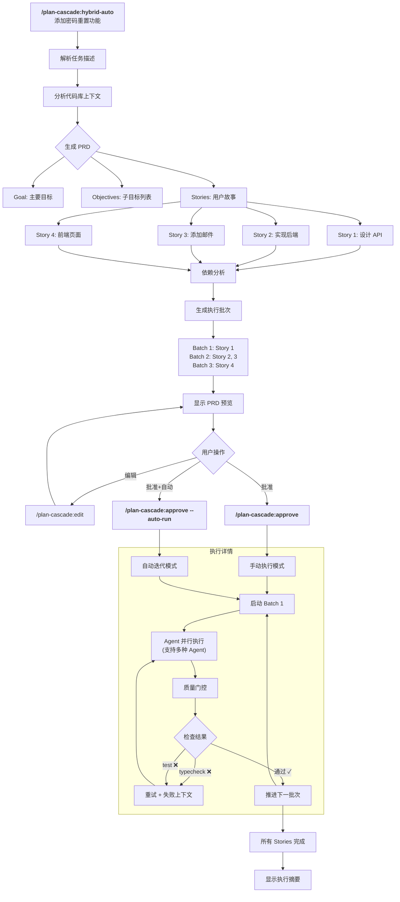
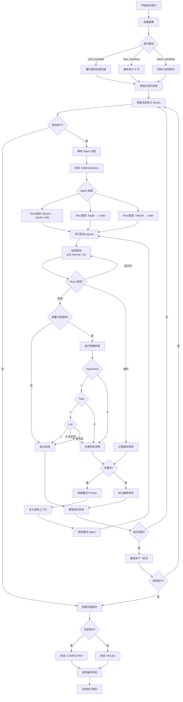
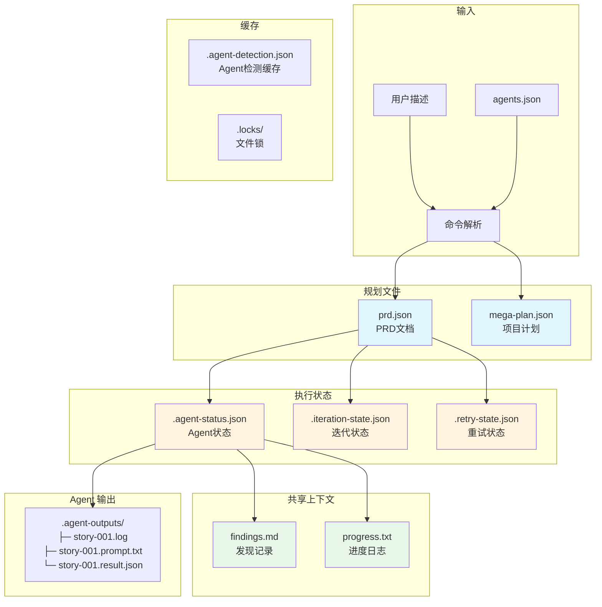

[English](System-Architecture.md)

# Plan Cascade - 系统架构与流程设计

**版本**: 4.1.0
**最后更新**: 2026-01-29

本文档包含 Plan Cascade 的详细架构图、流程图和系统设计。

---

## 目录

1. [三层架构](#1-三层架构)
2. [核心组件](#2-核心组件)
3. [完整工作流](#3-完整工作流)
4. [Auto 自动策略流程](#4-auto-自动策略流程)
5. [Mega Plan 流程](#5-mega-plan-流程)
6. [Hybrid Worktree 流程](#6-hybrid-worktree-流程)
7. [Hybrid Auto 流程](#7-hybrid-auto-流程)
8. [自动迭代流程](#8-自动迭代流程)
9. [数据流与状态文件](#9-数据流与状态文件)
10. [双模式架构](#10-双模式架构)
11. [多 Agent 协同架构](#11-多-agent-协同架构)

---

## 1. 三层架构



### 层级详解

| 层级 | 名称 | 职责 | 产物 |
|------|------|------|------|
| **Level 1** | Mega Plan | 项目级编排，管理多个 Feature 的依赖和执行顺序 | `mega-plan.json` |
| **Level 2** | Hybrid Ralph | 功能级开发，在独立 Worktree 中执行，自动生成 PRD | `prd.json`, `findings.md` |
| **Level 3** | Stories | 故事级执行，由 Agent 并行处理，支持质量门控和重试 | 代码变更, `progress.txt` |

---

## 2. 核心组件



### 组件说明

| 组件 | 职责 |
|------|------|
| **Orchestrator** | 核心编排器，协调所有组件 |
| **IterationLoop** | 自动迭代循环，管理批次执行 |
| **AgentExecutor** | Agent 执行抽象，支持多种 Agent |
| **PhaseManager** | 阶段管理，根据阶段选择 Agent |
| **QualityGate** | 质量门控，验证代码质量 |
| **RetryManager** | 重试管理，处理失败重试 |
| **StateManager** | 状态管理，持久化执行状态 |
| **ContextFilter** | 上下文过滤，优化 Agent 输入 |

---

## 3. 完整工作流



---

## 4. Auto 自动策略流程

`/plan-cascade:auto` 命令提供基于任务分析的 AI 驱动自动策略选择。

### 策略选择流程图



### 策略检测规则

| 优先级 | 策略 | 关键词 | 条件 |
|--------|------|--------|------|
| 1 | **MEGA_PLAN** | platform, system, architecture, microservices | 或列举 3+ 个独立模块 |
| 2 | **HYBRID_WORKTREE** | (功能关键词) + experimental, refactor, isolated | 两个条件同时满足 |
| 3 | **HYBRID_AUTO** | implement, create, build, feature, api | 无隔离关键词 |
| 4 | **DIRECT** | fix, typo, update, simple, single | 默认回退 |

### 策略映射示例

| 任务描述 | 检测到的关键词 | 选择的策略 |
|----------|----------------|------------|
| "修复 README 中的拼写错误" | fix, typo | DIRECT |
| "实现 OAuth 用户认证" | implement, authentication | HYBRID_AUTO |
| "实验性重构支付模块" | refactoring + experimental | HYBRID_WORKTREE |
| "构建电商平台：用户、商品、购物车、订单" | platform + 4 个模块 | MEGA_PLAN |

---

## 5. Mega Plan 流程

适用于包含多个相关功能模块的大型项目开发。

### 适用场景

| 类型 | 场景 | 示例 |
|------|------|------|
| ✅ 适用 | 多功能模块的新项目开发 | 构建 SaaS 平台（用户 + 订阅 + 计费 + 后台） |
| ✅ 适用 | 涉及多子系统的大规模重构 | 单体应用重构为微服务架构 |
| ✅ 适用 | 功能群开发 | 电商平台（用户、商品、购物车、订单） |
| ❌ 不适用 | 单个功能开发 | 仅实现用户认证（用 Hybrid Ralph） |
| ❌ 不适用 | Bug 修复 | 修复登录页表单验证问题 |

### 批次间顺序执行

```
mega-approve (第1次) → 启动 Batch 1
    ↓ Batch 1 完成
mega-approve (第2次) → 合并 Batch 1 → 从更新后的分支创建 Batch 2
    ↓ Batch 2 完成
mega-approve (第3次) → 合并 Batch 2 → ...
    ↓ 所有批次完成
mega-complete → 清理计划文件
```

### 详细流程图



---

## 6. Hybrid Worktree 流程

适用于需要分支隔离的单个复杂功能开发。

### 适用场景

| 类型 | 场景 | 示例 |
|------|------|------|
| ✅ 适用 | 包含多子任务的完整功能 | 用户认证（注册 + 登录 + 密码重置） |
| ✅ 适用 | 需要分支隔离的实验功能 | 新支付渠道集成测试 |
| ✅ 适用 | 中等规模重构（5-20 文件） | API 层统一错误处理改造 |
| ❌ 不适用 | 简单单文件修改 | 修改一个组件的样式 |
| ❌ 不适用 | 快速原型验证 | 验证某个库是否可用 |

### 详细流程图



---

## 7. Hybrid Auto 流程

适用于简单功能的快速开发，无需 Worktree 隔离。

### 详细流程图



---

## 8. 自动迭代流程

`/plan-cascade:approve --auto-run` 或 `/plan-cascade:auto-run` 命令启动的自动迭代循环：



### 迭代模式

| 模式 | 说明 |
|------|------|
| `until_complete` | 持续执行直到所有 Story 完成（默认） |
| `max_iterations` | 执行最多 N 次迭代后停止 |
| `batch_complete` | 仅执行当前批次后停止 |

---

## 9. 数据流与状态文件



### 文件说明

| 文件 | 类型 | 说明 |
|------|------|------|
| `prd.json` | 规划 | PRD 文档，包含目标、故事、依赖关系 |
| `mega-plan.json` | 规划 | 项目级计划，管理多个 Feature |
| `agents.json` | 配置 | Agent 配置，包含阶段默认和降级链 |
| `findings.md` | 共享 | Agent 发现记录，支持标签过滤 |
| `progress.txt` | 共享 | 进度时间线，包含 Agent 执行信息 |
| `.agent-status.json` | 状态 | Agent 运行/完成/失败状态 |
| `.iteration-state.json` | 状态 | 自动迭代进度和批次结果 |
| `.retry-state.json` | 状态 | 重试历史和失败记录 |
| `.agent-detection.json` | 缓存 | 跨平台 Agent 检测结果（1小时TTL） |
| `.agent-outputs/` | 输出 | Agent 日志、Prompt 和结果文件 |

---

## 10. 双模式架构

### 模式切换设计

```
┌─────────────────────────────────────────────────────────────────────────┐
│                         Plan Cascade                                     │
├─────────────────────────────────────────────────────────────────────────┤
│                                                                          │
│   ┌─────────────────────────┐     ┌─────────────────────────┐           │
│   │      简单模式            │     │      专家模式            │           │
│   │                         │     │                         │           │
│   │  用户输入描述            │     │  用户输入描述            │           │
│   │       ↓                 │     │       ↓                 │           │
│   │  AI 自动判断策略         │     │  生成 PRD (可编辑)       │           │
│   │       ↓                 │     │       ↓                 │           │
│   │  自动生成 PRD           │     │  用户 Review/修改        │           │
│   │       ↓                 │     │       ↓                 │           │
│   │  自动执行               │     │  选择策略/Agent          │           │
│   │       ↓                 │     │       ↓                 │           │
│   │  完成                   │     │  执行                   │           │
│   └─────────────────────────┘     └─────────────────────────┘           │
│                                                                          │
│                              共享核心                                    │
│   ┌─────────────────────────────────────────────────────────────────┐   │
│   │  Orchestrator │ PRDGenerator │ QualityGate │ AgentExecutor      │   │
│   └─────────────────────────────────────────────────────────────────┘   │
│                                                                          │
└─────────────────────────────────────────────────────────────────────────┘
```

### 双工作模式架构

**核心理念：Plan Cascade = 大脑（编排），执行层 = 手（工具执行）**

```
┌─────────────────────────────────────────────────────────────────────────┐
│                           Plan Cascade                                   │
│                    (编排层 - 两种模式共享)                                │
├─────────────────────────────────────────────────────────────────────────┤
│                                                                          │
│   ┌─────────────────────────────────────────────────────────────────┐   │
│   │                    编排引擎 (共享)                                │   │
│   │  ┌─────────────┐  ┌─────────────┐  ┌─────────────┐              │   │
│   │  │ PRD 生成器  │  │ 依赖分析器  │  │  批次调度器 │              │   │
│   │  └─────────────┘  └─────────────┘  └─────────────┘              │   │
│   │  ┌─────────────┐  ┌─────────────┐  ┌─────────────┐              │   │
│   │  │ 状态管理器  │  │ 质量门控    │  │  重试管理   │              │   │
│   │  └─────────────┘  └─────────────┘  └─────────────┘              │   │
│   └─────────────────────────────────────────────────────────────────┘   │
│                              │                                           │
│                    ┌─────────┴─────────┐                                │
│                    │  执行层选择        │                                │
│                    └─────────┬─────────┘                                │
│              ┌───────────────┴───────────────┐                          │
│              ▼                               ▼                          │
│   ┌─────────────────────────┐    ┌─────────────────────────┐           │
│   │    独立编排模式          │    │  Claude Code GUI 模式   │           │
│   ├─────────────────────────┤    ├─────────────────────────┤           │
│   │                         │    │                         │           │
│   │   内置工具执行引擎       │    │   Claude Code CLI       │           │
│   │   ┌───────────────┐     │    │   ┌───────────────┐     │           │
│   │   │ Read/Write    │     │    │   │ Claude Code   │     │           │
│   │   │ Edit/Bash     │     │    │   │ 执行工具      │     │           │
│   │   │ Glob/Grep     │     │    │   │ (stream-json) │     │           │
│   │   └───────────────┘     │    │   └───────────────┘     │           │
│   │          │              │    │          │              │           │
│   │          ▼              │    │          ▼              │           │
│   │   ┌───────────────┐     │    │   ┌───────────────┐     │           │
│   │   │ LLM 抽象层    │     │    │   │ Plan Cascade  │     │           │
│   │   │ (多种选择)    │     │    │   │ 可视化界面    │     │           │
│   │   └───────────────┘     │    │   └───────────────┘     │           │
│   │          │              │    │                         │           │
│   │   ┌──────┴──────┐       │    │                         │           │
│   │   ▼      ▼      ▼       │    │                         │           │
│   │ Claude Claude OpenAI    │    │                         │           │
│   │ Max    API    etc.      │    │                         │           │
│   │                         │    │                         │           │
│   └─────────────────────────┘    └─────────────────────────┘           │
│                                                                          │
└─────────────────────────────────────────────────────────────────────────┘

两种模式都支持：PRD 驱动开发、批次执行、质量门控、状态追踪
```

### 独立编排模式架构详解

```
┌─────────────────────────────────────────────────────────────────────────┐
│                       独立编排模式                                        │
├─────────────────────────────────────────────────────────────────────────┤
│                                                                          │
│  ┌─ 编排层 ─────────────────────────────────────────────────────────┐   │
│  │                                                                    │   │
│  │  ┌─────────────┐  ┌─────────────┐  ┌─────────────┐                │   │
│  │  │ 意图分类器  │  │ 策略分析器  │  │  PRD 生成器 │                │   │
│  │  │ Intent     │  │ Strategy   │  │ PRDGenerator│                │   │
│  │  │ Classifier │  │ Analyzer   │  │             │                │   │
│  │  └─────────────┘  └─────────────┘  └─────────────┘                │   │
│  │         │               │               │                          │   │
│  │         └───────────────┴───────────────┘                          │   │
│  │                         │                                          │   │
│  │                         ▼                                          │   │
│  │  ┌─────────────────────────────────────────────────────────────┐  │   │
│  │  │                   Orchestrator                               │  │   │
│  │  │  • 批次依赖分析                                              │  │   │
│  │  │  • 并行执行协调                                              │  │   │
│  │  │  • 质量门控检查                                              │  │   │
│  │  │  • 重试管理                                                  │  │   │
│  │  └─────────────────────────────────────────────────────────────┘  │   │
│  │                         │                                          │   │
│  └─────────────────────────┼──────────────────────────────────────────┘   │
│                            ▼                                              │
│  ┌─ 执行层 ─────────────────────────────────────────────────────────┐   │
│  │                                                                    │   │
│  │  ┌─────────────────────────────────────────────────────────────┐  │   │
│  │  │                   ReAct 执行引擎                             │  │   │
│  │  │                                                              │  │   │
│  │  │   ┌─────────┐     ┌─────────┐     ┌─────────┐               │  │   │
│  │  │   │  Think  │ ──→ │   Act   │ ──→ │ Observe │ ──→ (循环)    │  │   │
│  │  │   │  (LLM)  │     │ (工具)  │     │ (结果)  │               │  │   │
│  │  │   └─────────┘     └─────────┘     └─────────┘               │  │   │
│  │  │                                                              │  │   │
│  │  └─────────────────────────────────────────────────────────────┘  │   │
│  │                         │                                          │   │
│  │                         ▼                                          │   │
│  │  ┌─────────────────────────────────────────────────────────────┐  │   │
│  │  │                   工具执行引擎                               │  │   │
│  │  │                                                              │  │   │
│  │  │   ┌────────┐ ┌────────┐ ┌────────┐ ┌────────┐ ┌────────┐   │  │   │
│  │  │   │  Read  │ │ Write  │ │  Edit  │ │  Bash  │ │  Glob  │   │  │   │
│  │  │   └────────┘ └────────┘ └────────┘ └────────┘ └────────┘   │  │   │
│  │  │   ┌────────┐ ┌────────┐                                     │  │   │
│  │  │   │  Grep  │ │   LS   │                                     │  │   │
│  │  │   └────────┘ └────────┘                                     │  │   │
│  │  │                                                              │  │   │
│  │  └─────────────────────────────────────────────────────────────┘  │   │
│  │                                                                    │   │
│  └────────────────────────────────────────────────────────────────────┘   │
│                            │                                              │
│                            ▼                                              │
│  ┌─ LLM 层 ─────────────────────────────────────────────────────────┐   │
│  │                                                                    │   │
│  │  ┌─────────────────────────────────────────────────────────────┐  │   │
│  │  │                   LLM 抽象层                                 │  │   │
│  │  │              (只提供思考，不执行工具)                        │  │   │
│  │  └─────────────────────────────────────────────────────────────┘  │   │
│  │                         │                                          │   │
│  │       ┌─────────────────┼─────────────────┐                       │   │
│  │       ▼                 ▼                 ▼                       │   │
│  │  ┌─────────┐       ┌─────────┐       ┌─────────┐                 │   │
│  │  │ Claude  │       │ Claude  │       │ OpenAI  │                 │   │
│  │  │   Max   │       │   API   │       │ DeepSeek│                 │   │
│  │  │(via CC) │       │         │       │ Ollama  │                 │   │
│  │  └─────────┘       └─────────┘       └─────────┘                 │   │
│  │                                                                    │   │
│  └────────────────────────────────────────────────────────────────────┘   │
│                                                                          │
└─────────────────────────────────────────────────────────────────────────┘
```

---

## 11. 多 Agent 协同架构

```
┌─────────────────────────────────────────────────────────────────────────┐
│                       多 Agent 协同架构                                   │
├─────────────────────────────────────────────────────────────────────────┤
│                                                                          │
│   Plan Cascade 编排层                                                    │
│   ┌─────────────────────────────────────────────────────────────────┐   │
│   │  Orchestrator → AgentExecutor → PhaseAgentManager               │   │
│   │       │              │               │                           │   │
│   │       │              │               └─ 阶段/类型 → Agent 映射   │   │
│   │       │              └─ 解析最佳 Agent                           │   │
│   │       └─ 调度 Story 执行                                        │   │
│   └─────────────────────────────────────────────────────────────────┘   │
│                              │                                           │
│              ┌───────────────┴───────────────┐                          │
│              ▼                               ▼                          │
│   ┌─────────────────────────┐    ┌─────────────────────────┐           │
│   │    独立编排模式          │    │  Claude Code GUI 模式   │           │
│   │                         │    │                         │           │
│   │   默认 Agent:            │    │   默认 Agent:            │           │
│   │   内置 ReAct 引擎        │    │   Claude Code CLI       │           │
│   │                         │    │                         │           │
│   │   可选 CLI Agents:       │    │   可选 CLI Agents:       │           │
│   │   codex, aider, amp...  │    │   codex, aider, amp...  │           │
│   │                         │    │                         │           │
│   └─────────────────────────┘    └─────────────────────────┘           │
│                                                                          │
└─────────────────────────────────────────────────────────────────────────┘
```

### 阶段化 Agent 分配

| 阶段 | 默认 Agent | 降级链 | Story 类型覆盖 |
|------|-----------|--------|----------------|
| `planning` | codex | claude-code | - |
| `implementation` | claude-code | codex, aider | bugfix→codex, refactor→aider |
| `retry` | claude-code | aider | - |
| `refactor` | aider | claude-code | - |
| `review` | claude-code | codex | - |

### Agent 优先级解析

```
1. --agent 命令参数              # 最高优先级（全局覆盖）
2. 阶段覆盖 --impl-agent 等      # 阶段特定覆盖
3. Story 中指定的 agent          # story.agent 字段
4. Story 类型覆盖               # bugfix → codex, refactor → aider
5. 阶段默认 Agent               # phase_defaults 配置
6. 降级链                       # fallback_chain
7. claude-code                  # 终极回退（始终可用）
```

---

## 附录：两种工作模式对比

| 特性 | 独立编排模式 | Claude Code GUI 模式 |
|------|--------------|----------------------|
| 编排层 | Plan Cascade | Plan Cascade |
| 工具执行 | Plan Cascade 自己执行 | Claude Code CLI 执行 |
| LLM 来源 | Claude Max/API, OpenAI, DeepSeek, Ollama | Claude Code |
| PRD 驱动 | ✅ 完整支持 | ✅ 完整支持 |
| 批次执行 | ✅ 完整支持 | ✅ 完整支持 |
| 离线可用 | ✅ (使用 Ollama) | ❌ |
| 适用场景 | 需要其他 LLM 或离线使用 | 有 Claude Max/Code 订阅 |

| 组件 | 独立编排模式 | Claude Code GUI 模式 |
|------|--------------|----------------------|
| PRD 生成 | Plan Cascade (LLM) | Plan Cascade (Claude Code) |
| 依赖分析 | Plan Cascade | Plan Cascade |
| 批次调度 | Plan Cascade | Plan Cascade |
| Story 执行 | Plan Cascade (ReAct) | Claude Code CLI |
| 工具调用 | 内置工具引擎 | Claude Code |
| 状态追踪 | Plan Cascade | Plan Cascade |
| 质量门控 | Plan Cascade | Plan Cascade |
