[English](System-Architecture.md)

# Plan Cascade - 系统架构与流程设计

**版本**: 4.3.2
**最后更新**: 2026-02-02

本文档包含 Plan Cascade 的详细架构图、流程图和系统设计。

---

## 目录

1. [三层架构](#1-三层架构)
2. [核心组件](#2-核心组件)
3. [完整工作流](#3-完整工作流)
4. [Auto 自动策略流程](#4-auto-自动策略流程)
5. [设计文档系统](#5-设计文档系统)
6. [Mega Plan 流程](#6-mega-plan-流程)
7. [Hybrid Worktree 流程](#7-hybrid-worktree-流程)
8. [Hybrid Auto 流程](#8-hybrid-auto-流程)
9. [Approve 执行流程](#9-approve-执行流程)
10. [自动迭代流程](#10-自动迭代流程)
11. [路径存储模式](#11-路径存储模式)
12. [数据流与状态文件](#12-数据流与状态文件)
13. [双模式架构](#13-双模式架构)
14. [多 Agent 协同架构](#14-多-agent-协同架构)

---

## 1. 三层架构

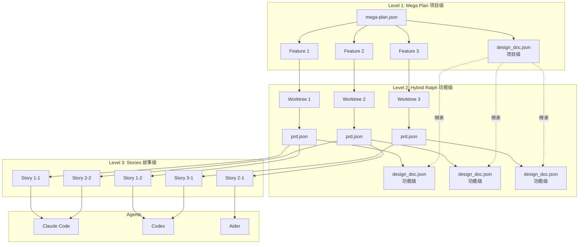

### 层级详解

| 层级 | 名称 | 职责 | 产物 |
|------|------|------|------|
| **Level 1** | Mega Plan | 项目级编排，管理多个 Feature 的依赖和执行顺序 | `mega-plan.json`, `design_doc.json` (项目级) |
| **Level 2** | Hybrid Ralph | 功能级开发，在独立 Worktree 中执行，自动生成 PRD 和设计文档 | `prd.json`, `design_doc.json` (功能级), `findings.md` |
| **Level 3** | Stories | 故事级执行，由 Agent 并行处理，支持质量门控和重试 | 代码变更, `progress.txt` |

---

## 2. 核心组件

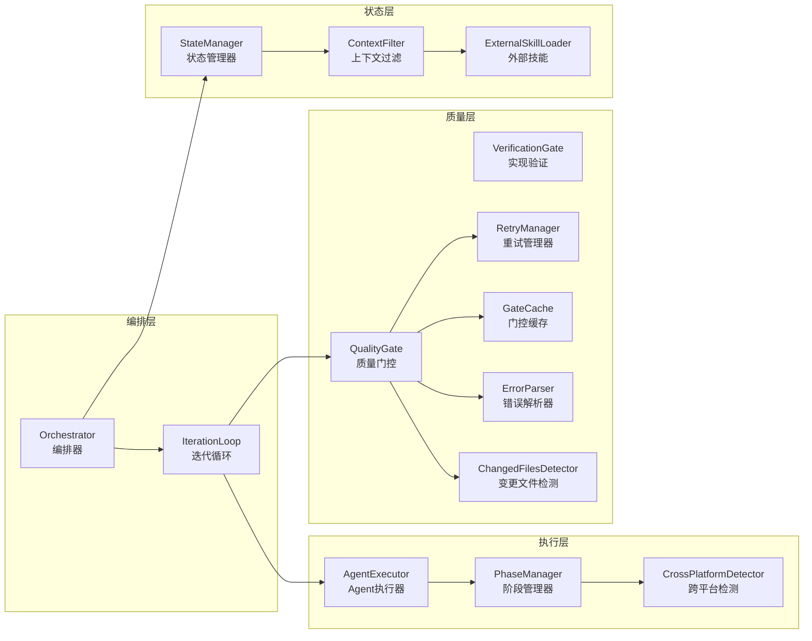

### 组件说明

| 组件 | 职责 |
|------|------|
| **Orchestrator** | 核心编排器，协调所有组件 |
| **IterationLoop** | 自动迭代循环，管理批次执行 |
| **AgentExecutor** | Agent 执行抽象，支持多种 Agent |
| **PhaseManager** | 阶段管理，根据阶段选择 Agent |
| **QualityGate** | 质量门控，支持三阶段执行：PRE_VALIDATION（FORMAT）、VALIDATION（TYPECHECK、TEST、LINT 并行）、POST_VALIDATION（CODE_REVIEW、IMPLEMENTATION_VERIFY）。支持快速失败、增量检查和缓存 |
| **FormatGate** | 代码格式化门控（PRE_VALIDATION），根据项目类型使用 ruff/prettier/cargo fmt/gofmt 自动格式化代码。支持仅检查模式 |
| **CodeReviewGate** | AI 驱动的代码审查（POST_VALIDATION），评估 5 个维度：代码质量（25分）、命名清晰度（20分）、复杂度（20分）、模式遵循（20分）、安全性（15分）。遇到严重问题时阻止通过 |
| **VerificationGate** | AI 驱动的实现验证，检测骨架代码并验证验收标准 |
| **RetryManager** | 重试管理，处理失败重试，传递结构化错误上下文 |
| **GateCache** | 门控结果缓存，基于 git commit + 工作树哈希，避免重复检查 |
| **ErrorParser** | 结构化错误解析，支持 mypy、ruff、pytest、eslint、tsc，提取 ErrorInfo |
| **ChangedFilesDetector** | 基于 Git 的变更检测，用于增量门控执行 |
| **StateManager** | 状态管理，持久化执行状态 |
| **ContextFilter** | 上下文过滤，优化 Agent 输入 |
| **ExternalSkillLoader** | 三层技能加载（内置/外部/用户），自动检测并按优先级覆盖注入最佳实践。支持阶段化注入（planning、implementation、retry） |

---

## 3. 完整工作流

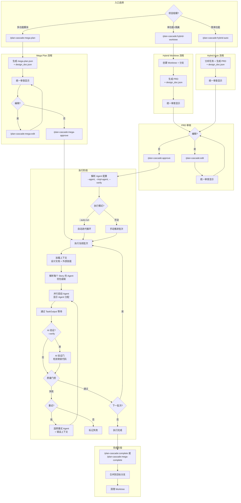

### 与旧版本的主要变化

| 方面 | 旧版本 | 当前版本 |
|------|--------|----------|
| **设计文档** | 未显示 | 每个层级自动生成 |
| **审查显示** | "显示 PRD 预览" | "统一审查显示"（PRD + 设计文档） |
| **Agent 配置** | 未显示 | 显式解析 `--agent`, `--impl-agent`, `--verify` |
| **Agent 分配** | 隐式 | "解析每个 Story 的 Agent" + 优先级链 |
| **验证** | 未显示 | 可选的 "AI 验证门" |
| **重试** | 简单重试 | "选择重试 Agent + 错误上下文" |
| **等待机制** | 隐式 | "通过 TaskOutput 等待" |

---

## 4. Auto 自动策略流程

`/plan-cascade:auto` 命令提供基于结构化任务分析的 AI 驱动自动策略选择。

### 策略选择流程图

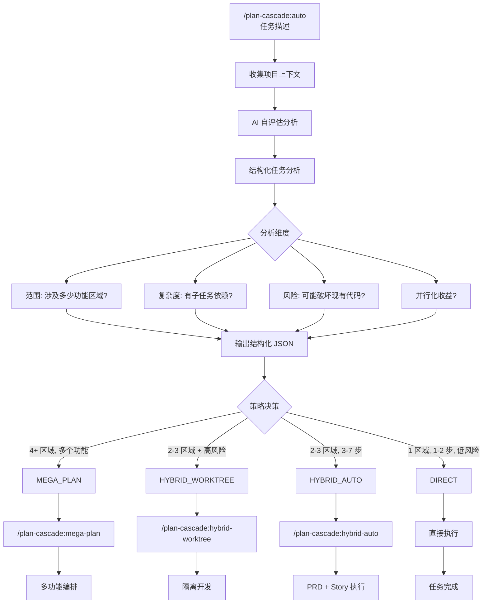

### AI 自评估输出

AI 输出结构化 JSON 格式的分析结果：

```json
{
  "task_analysis": {
    "functional_areas": ["auth", "api", "frontend"],
    "estimated_stories": 5,
    "has_dependencies": true,
    "requires_architecture_decisions": true,
    "risk_level": "medium",
    "parallelization_benefit": "significant"
  },
  "strategy_decision": {
    "strategy": "HYBRID_AUTO",
    "confidence": 0.85,
    "reasoning": "任务涉及 3 个功能区域，有依赖关系..."
  }
}
```

### 策略选择指南

| 分析结果 | 策略 | 示例 |
|----------|------|------|
| 1 个功能区域, 1-2 步, 低风险 | **DIRECT** | "修复 README 中的拼写错误" |
| 2-3 个功能区域, 3-7 步, 有依赖 | **HYBRID_AUTO** | "实现 OAuth 用户认证" |
| HYBRID_AUTO + 高风险或实验性 | **HYBRID_WORKTREE** | "实验性重构支付模块" |
| 4+ 功能区域, 多个独立功能 | **MEGA_PLAN** | "构建电商平台：用户、商品、购物车、订单" |

---

## 5. 设计文档系统

Plan Cascade 自动生成技术设计文档 (`design_doc.json`)，与 PRD 并行，在故事执行时提供架构上下文。

### 两级架构

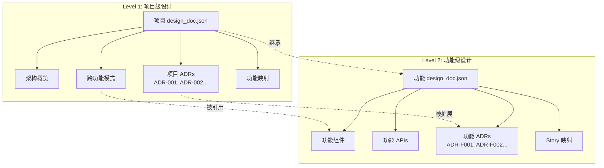

### 设计文档 Schema

```json
{
  "metadata": {
    "created_at": "ISO-8601",
    "version": "1.0.0",
    "source": "ai-generated|user-provided|converted",
    "prd_reference": "prd.json",
    "parent_design_doc": "path/to/project/design_doc.json"
  },
  "overview": {
    "title": "项目/功能标题",
    "summary": "摘要描述",
    "goals": ["目标1", "目标2"],
    "non_goals": ["非目标1"]
  },
  "architecture": {
    "components": [{
      "name": "组件名称",
      "description": "描述",
      "responsibilities": ["职责1"],
      "dependencies": ["依赖组件"],
      "files": ["src/file.py"]
    }],
    "data_flow": "数据流描述",
    "patterns": [{
      "name": "模式名称",
      "description": "描述",
      "rationale": "采用理由"
    }]
  },
  "interfaces": {
    "apis": [...],
    "data_models": [...]
  },
  "decisions": [{
    "id": "ADR-001",
    "title": "决策标题",
    "context": "背景上下文",
    "decision": "决策内容",
    "rationale": "决策理由",
    "alternatives_considered": ["备选方案1"],
    "status": "accepted"
  }],
  "story_mappings": {
    "story-001": {
      "components": ["ComponentA"],
      "decisions": ["ADR-001"],
      "interfaces": ["API-1"]
    }
  },
  "feature_mappings": {
    "feature-001": {
      "patterns": ["PatternA"],
      "decisions": ["ADR-001"]
    }
  }
}
```

### 自动生成流程

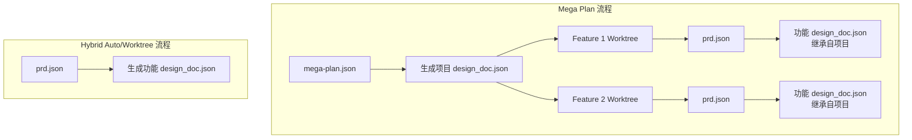

### 外部设计文档导入

三个主要命令都支持导入外部设计文档：

```bash
# mega-plan: 第2个参数
/plan-cascade:mega-plan "构建电商平台" ./architecture.md

# hybrid-auto: 第2个参数
/plan-cascade:hybrid-auto "实现用户认证" ./auth-design.md

# hybrid-worktree: 第4个参数
/plan-cascade:hybrid-worktree fix-auth main "修复认证" ./design.md
```

支持格式: Markdown (.md), JSON (.json), HTML (.html)

### 上下文注入流程

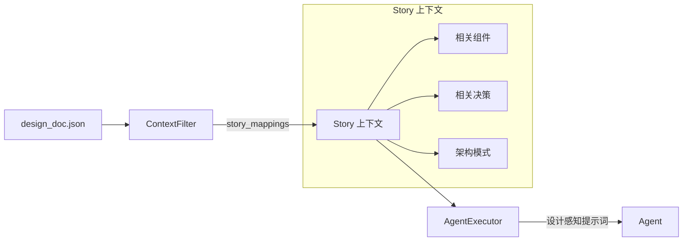

### 三层外部技能系统

Plan Cascade 使用三层技能优先级系统提供框架特定的最佳实践：

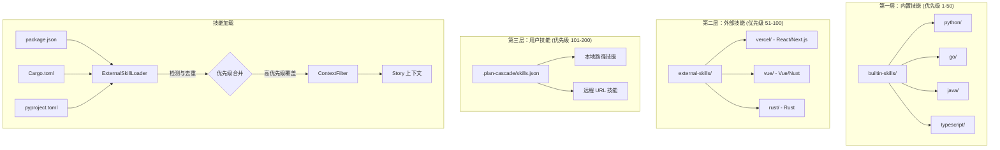

**优先级层次：**

| 层次 | 优先级范围 | 来源 | 描述 |
|------|------------|------|------|
| 内置 | 1-50 | `builtin-skills/` | Python、Go、Java、TypeScript 最佳实践，随 Plan Cascade 分发 |
| 外部 | 51-100 | `external-skills/` | 来自 Git 子模块的框架技能（React、Vue、Rust） |
| 用户 | 101-200 | `.plan-cascade/skills.json` | 来自本地路径或远程 URL 的自定义技能 |

**同名覆盖：** 当技能同名时，高优先级覆盖低优先级。

---

## 6. Mega Plan 流程

适用于包含多个相关功能模块的大型项目开发。

### 适用场景

| 类型 | 场景 | 示例 |
|------|------|------|
| ✅ 适用 | 多功能模块的新项目开发 | 构建 SaaS 平台（用户 + 订阅 + 计费 + 后台） |
| ✅ 适用 | 涉及多子系统的大规模重构 | 单体应用重构为微服务架构 |
| ✅ 适用 | 功能群开发 | 电商平台（用户、商品、购物车、订单） |
| ❌ 不适用 | 单个功能开发 | 仅实现用户认证（用 Hybrid Ralph） |
| ❌ 不适用 | Bug 修复 | 修复登录页表单验证问题 |

### 命令参数

```bash
/plan-cascade:mega-plan <项目描述> [设计文档路径]

# 示例：
/plan-cascade:mega-plan "构建电商平台"
/plan-cascade:mega-plan "构建电商平台" ./architecture.md
```

| 参数 | 说明 |
|------|------|
| `项目描述` | 必填。用于功能分解的项目描述 |
| `设计文档路径` | 可选。要导入的外部设计文档（.md/.json/.html） |

### 详细流程图

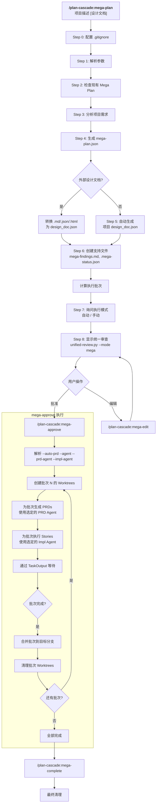

### 创建的文件

| 文件 | 位置 | 说明 |
|------|------|------|
| `mega-plan.json` | 用户数据目录或项目根目录 | 包含 Features 的项目计划 |
| `design_doc.json` | 项目根目录 | 项目级技术设计 |
| `mega-findings.md` | 项目根目录 | 跨 Feature 共享发现 |
| `.mega-status.json` | 状态目录或项目根目录 | 执行状态 |

### 恢复

如果中断：
```bash
/plan-cascade:mega-resume --auto-prd
```

---

## 7. Hybrid Worktree 流程

适用于需要分支隔离的单个复杂功能开发。

**重要**：此命令只处理 Worktree 创建和 PRD/设计文档生成。Story 执行由 `/plan-cascade:approve` 处理。

### 适用场景

| 类型 | 场景 | 示例 |
|------|------|------|
| ✅ 适用 | 包含多子任务的完整功能 | 用户认证（注册 + 登录 + 密码重置） |
| ✅ 适用 | 需要分支隔离的实验功能 | 新支付渠道集成测试 |
| ✅ 适用 | 中等规模重构（5-20 文件） | API 层统一错误处理改造 |
| ❌ 不适用 | 简单单文件修改 | 修改一个组件的样式 |
| ❌ 不适用 | 快速原型验证 | 验证某个库是否可用 |

### 命令参数

```bash
/plan-cascade:hybrid-worktree <任务名> <目标分支> <PRD或描述> [设计文档路径]

# 示例：
/plan-cascade:hybrid-worktree fix-auth main "修复认证 bug"
/plan-cascade:hybrid-worktree fix-auth main ./existing-prd.json
/plan-cascade:hybrid-worktree fix-auth main "修复认证" ./design-spec.md
```

| 参数 | 说明 |
|------|------|
| `任务名` | 必填。Worktree 和分支的名称 |
| `目标分支` | 必填。完成后合并到的分支 |
| `PRD或描述` | 必填。现有 PRD 文件路径或任务描述 |
| `设计文档路径` | 可选。要导入的外部设计文档 |

### 详细流程图

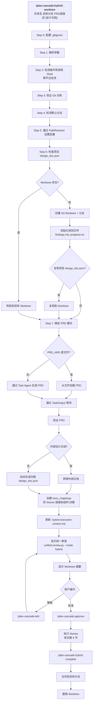

### 设计文档继承

当项目级 `design_doc.json` 存在时：

```json
{
  "metadata": {
    "parent_design_doc": "../design_doc.json",
    "level": "feature"
  },
  "inherited_context": {
    "patterns": ["PatternName"],
    "decisions": ["ADR-001"],
    "shared_models": ["SharedModel"]
  },
  "story_mappings": {
    "story-001": {
      "components": ["ComponentA"],
      "decisions": ["ADR-F001"]
    }
  }
}
```

### 恢复

如果中断：
```bash
/plan-cascade:hybrid-resume --auto
```

---

## 8. Hybrid Auto 流程

适用于简单功能的快速开发，无需 Worktree 隔离。

**重要**：此命令只处理 PRD 和设计文档生成。Story 执行由 `/plan-cascade:approve` 处理。

### 命令参数

```bash
/plan-cascade:hybrid-auto <任务描述> [设计文档路径] [--agent <名称>]

# 示例：
/plan-cascade:hybrid-auto "添加密码重置功能"
/plan-cascade:hybrid-auto "实现认证" ./auth-design.md
/plan-cascade:hybrid-auto "修复 bug" --agent=codex
```

| 参数 | 说明 |
|------|------|
| `任务描述` | 必填。用于 PRD 生成的任务描述 |
| `设计文档路径` | 可选。要导入的外部设计文档 |
| `--agent` | 可选。PRD 生成使用的 Agent（默认：claude-code） |

### 详细流程图

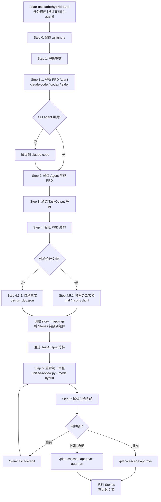

### 生成的文件

| 文件 | 说明 |
|------|------|
| `prd.json` | 包含 Stories 的产品需求 |
| `design_doc.json` | 包含 story_mappings 的技术设计 |

### 恢复

如果中断：
```bash
/plan-cascade:hybrid-resume --auto
```

---

## 9. Approve 执行流程

`/plan-cascade:approve` 命令处理 Story 执行，支持多 Agent 协作。

### 命令参数

```bash
/plan-cascade:approve [选项]

选项：
  --agent <名称>        全局 Agent 覆盖（所有 Stories）
  --impl-agent <名称>   实现阶段 Agent
  --retry-agent <名称>  重试阶段 Agent
  --verify              启用 AI 验证门
  --verify-agent <名称> 验证 Agent（默认：claude-code）
  --no-review           禁用 AI 代码审查（默认启用）
  --review-agent <名称> 代码审查 Agent（默认：claude-code）
  --no-fallback         禁用自动降级到 claude-code
  --auto-run            立即开始执行
```

### Agent 优先级链

```
1. --agent 参数           （最高 - 全局覆盖）
2. --impl-agent 参数      （阶段特定覆盖）
3. PRD 中的 story.agent   （Story 级指定）
4. Story 类型推断：
   - bugfix, fix → codex
   - refactor, cleanup → aider
   - test, spec → claude-code
   - feature, add → claude-code
5. agents.json 中的 phase_defaults
6. agents.json 中的 fallback_chain
7. claude-code            （始终可用的回退）
```

### 详细流程图

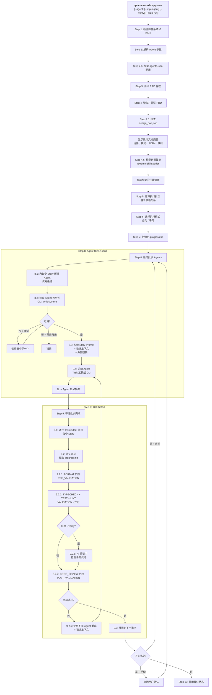

### 质量门控执行顺序

质量门控分三个阶段执行：

```
┌─────────────────────────────────────────────────────────────────┐
│ PRE_VALIDATION (顺序执行)                                        │
│   └── FORMAT: 自动格式化代码 (ruff/prettier/cargo fmt/gofmt)    │
│       └── 格式化后使缓存失效                                     │
├─────────────────────────────────────────────────────────────────┤
│ VALIDATION (并行执行)                                            │
│   ├── TYPECHECK: mypy/tsc/cargo check                           │
│   ├── TEST: pytest/jest/cargo test                              │
│   └── LINT: ruff/eslint/clippy                                  │
├─────────────────────────────────────────────────────────────────┤
│ POST_VALIDATION (并行执行)                                       │
│   ├── IMPLEMENTATION_VERIFY: AI 骨架代码检测                    │
│   └── CODE_REVIEW: AI 5维度代码审查                             │
└─────────────────────────────────────────────────────────────────┘
```

### AI 验证门

当启用 `--verify` 时，验证每个完成的 Story：

```
[VERIFIED] story-001 - 所有验收标准已实现
[VERIFY_FAILED] story-002 - 检测到骨架代码：函数只有 'pass'
```

检测规则：
- 只有 `pass`、`...` 或 `raise NotImplementedError` 的函数
- 新代码中的 TODO/FIXME 注释
- 没有逻辑的占位符返回值
- 空的函数/方法体

### AI 代码审查门控

默认情况下，AI 代码审查会在每个 Story 完成后运行。使用 `--no-review` 禁用。

**审查维度（总计 100 分）：**

| 维度 | 分值 | 关注点 |
|------|------|--------|
| 代码质量 | 25 | 错误处理、资源管理、边界情况 |
| 命名清晰度 | 20 | 变量/函数命名、代码可读性 |
| 复杂度 | 20 | 圈复杂度、嵌套深度 |
| 模式遵循 | 20 | 架构模式、设计文档合规 |
| 安全性 | 15 | OWASP 漏洞、输入验证 |

**进度标记：**
```
[REVIEW_PASSED] story-001 - Score: 85/100
[REVIEW_ISSUES] story-002 - Score: 60/100 - 2 critical findings
```

**阻止条件：**
- 分数低于阈值（默认：70）
- 存在严重级别发现（当 `block_on_critical=true` 时）
- 置信度低于 0.7

### 进度中的 Agent 显示

```
=== 批次 1 已启动 ===

Stories 和分配的 Agents：
  - story-001: claude-code (task-tool)
  - story-002: aider (cli) [检测到 refactor]
  - story-003: codex (cli) [检测到 bugfix]

⚠️ Agent 降级：
  - story-004: aider → claude-code (aider CLI 未找到)

等待完成...
```

### 进度日志格式

```
[2026-01-28 10:30:00] story-001: [START] via codex (pid:12345)
[2026-01-28 10:30:05] story-001: 进度更新...
[2026-01-28 10:35:00] story-001: [COMPLETE] via codex
[2026-01-28 10:35:01] story-001: [VERIFIED] 所有标准满足
```

---

## 10. 自动迭代流程

`/plan-cascade:approve --auto-run` 或 `/plan-cascade:auto-run` 命令启动的自动迭代循环：

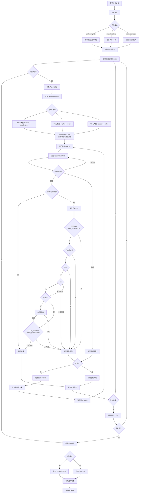

### 迭代模式

| 模式 | 说明 |
|------|------|
| `until_complete` | 持续执行直到所有 Story 完成（默认） |
| `max_iterations` | 执行最多 N 次迭代后停止 |
| `batch_complete` | 仅执行当前批次后停止 |

---

## 11. 路径存储模式

Plan Cascade 支持两种运行时文件的路径存储模式：

### 新模式（默认）

运行时文件存储在用户特定目录，保持项目根目录整洁：

| 平台 | 用户数据目录 |
|------|--------------|
| **Windows** | `%APPDATA%/plan-cascade/<project-id>/` |
| **Unix/macOS** | `~/.plan-cascade/<project-id>/` |

其中 `<project-id>` 是基于项目名称和路径哈希的唯一标识符（例如：`my-project-a1b2c3d4`）。

**新模式下的文件位置：**

| 文件类型 | 位置 |
|----------|------|
| `prd.json` | `<user-dir>/prd.json`（或 worktree 模式下在 worktree 中） |
| `mega-plan.json` | `<user-dir>/mega-plan.json` |
| `.mega-status.json` | `<user-dir>/.state/.mega-status.json` |
| `.iteration-state.json` | `<user-dir>/.state/` |
| Worktrees | `<user-dir>/.worktree/<task-name>/` |
| `design_doc.json` | **项目根目录**（用户可见） |
| `progress.txt` | **工作目录**（用户可见） |
| `findings.md` | **工作目录**（用户可见） |

### 旧模式

所有文件存储在项目根目录（向后兼容）：

| 文件 | 位置 |
|------|------|
| `prd.json` | `<project-root>/prd.json` |
| `mega-plan.json` | `<project-root>/mega-plan.json` |
| `.mega-status.json` | `<project-root>/.mega-status.json` |
| Worktrees | `<project-root>/.worktree/<task-name>/` |

### 检查当前模式

```bash
python3 -c "from plan_cascade.state.path_resolver import PathResolver; from pathlib import Path; r=PathResolver(Path.cwd()); print('模式:', 'legacy' if r.is_legacy_mode() else 'new'); print('PRD 路径:', r.get_prd_path())"
```

---

## 12. 数据流与状态文件

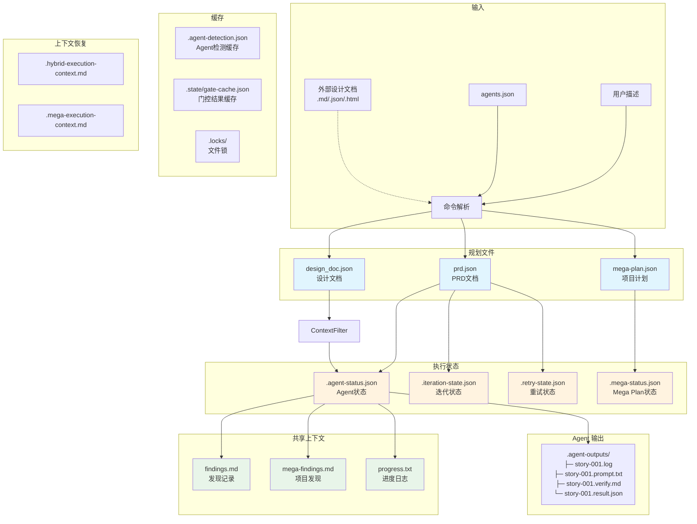

### 文件说明

| 文件 | 类型 | 说明 |
|------|------|------|
| `prd.json` | 规划 | PRD 文档，包含目标、故事、依赖关系 |
| `mega-plan.json` | 规划 | 项目级计划，管理多个 Feature |
| `design_doc.json` | 规划 | 技术设计文档，架构和决策 |
| `agents.json` | 配置 | Agent 配置，包含阶段默认和降级链 |
| `findings.md` | 共享 | Agent 发现记录，支持标签过滤 |
| `mega-findings.md` | 共享 | 项目级发现记录（mega-plan 模式） |
| `progress.txt` | 共享 | 进度时间线，包含 Agent 执行信息 |
| `.agent-status.json` | 状态 | Agent 运行/完成/失败状态 |
| `.iteration-state.json` | 状态 | 自动迭代进度和批次结果 |
| `.retry-state.json` | 状态 | 重试历史和失败记录 |
| `.mega-status.json` | 状态 | Mega-plan 执行状态 |
| `.agent-detection.json` | 缓存 | 跨平台 Agent 检测结果（1小时TTL） |
| `.state/gate-cache.json` | 缓存 | 门控执行结果缓存（基于 git commit + 工作树哈希） |
| `.hybrid-execution-context.md` | 上下文 | Hybrid 任务上下文，用于会话中断后 AI 恢复 |
| `.mega-execution-context.md` | 上下文 | Mega-plan 上下文，用于会话中断后 AI 恢复 |
| `.agent-outputs/` | 输出 | Agent 日志、Prompt、验证报告和结果文件 |

---

## 13. 双模式架构

### 模式切换设计

```
┌─────────────────────────────────────────────────────────────────────────┐
│                         Plan Cascade                                     │
├─────────────────────────────────────────────────────────────────────────┤
│                                                                          │
│   ┌─────────────────────────┐     ┌─────────────────────────┐           │
│   │      简单模式            │     │      专家模式            │           │
│   │                         │     │                         │           │
│   │  用户输入描述            │     │  用户输入描述            │           │
│   │       ↓                 │     │       ↓                 │           │
│   │  AI 自动判断策略         │     │  生成 PRD (可编辑)       │           │
│   │       ↓                 │     │       ↓                 │           │
│   │  自动生成 PRD           │     │  用户 Review/修改        │           │
│   │       ↓                 │     │       ↓                 │           │
│   │  自动执行               │     │  选择策略/Agent          │           │
│   │       ↓                 │     │       ↓                 │           │
│   │  完成                   │     │  执行                   │           │
│   └─────────────────────────┘     └─────────────────────────┘           │
│                                                                          │
│                              共享核心                                    │
│   ┌─────────────────────────────────────────────────────────────────┐   │
│   │  Orchestrator │ PRDGenerator │ QualityGate │ AgentExecutor      │   │
│   └─────────────────────────────────────────────────────────────────┘   │
│                                                                          │
└─────────────────────────────────────────────────────────────────────────┘
```

### 双工作模式架构

**核心理念：Plan Cascade = 大脑（编排），执行层 = 手（工具执行）**

```
┌─────────────────────────────────────────────────────────────────────────┐
│                           Plan Cascade                                   │
│                    (编排层 - 两种模式共享)                                │
├─────────────────────────────────────────────────────────────────────────┤
│                                                                          │
│   ┌─────────────────────────────────────────────────────────────────┐   │
│   │                    编排引擎 (共享)                                │   │
│   │  ┌─────────────┐  ┌─────────────┐  ┌─────────────┐              │   │
│   │  │ PRD 生成器  │  │ 依赖分析器  │  │  批次调度器 │              │   │
│   │  └─────────────┘  └─────────────┘  └─────────────┘              │   │
│   │  ┌─────────────┐  ┌─────────────┐  ┌─────────────┐              │   │
│   │  │ 状态管理器  │  │ 质量门控    │  │  重试管理   │              │   │
│   │  └─────────────┘  └─────────────┘  └─────────────┘              │   │
│   └─────────────────────────────────────────────────────────────────┘   │
│                              │                                           │
│                    ┌─────────┴─────────┐                                │
│                    │  执行层选择        │                                │
│                    └─────────┬─────────┘                                │
│              ┌───────────────┴───────────────┐                          │
│              ▼                               ▼                          │
│   ┌─────────────────────────┐    ┌─────────────────────────┐           │
│   │    独立编排模式          │    │  Claude Code GUI 模式   │           │
│   ├─────────────────────────┤    ├─────────────────────────┤           │
│   │                         │    │                         │           │
│   │   内置工具执行引擎       │    │   Claude Code CLI       │           │
│   │   ┌───────────────┐     │    │   ┌───────────────┐     │           │
│   │   │ Read/Write    │     │    │   │ Claude Code   │     │           │
│   │   │ Edit/Bash     │     │    │   │ 执行工具      │     │           │
│   │   │ Glob/Grep     │     │    │   │ (stream-json) │     │           │
│   │   └───────────────┘     │    │   └───────────────┘     │           │
│   │          │              │    │          │              │           │
│   │          ▼              │    │          ▼              │           │
│   │   ┌───────────────┐     │    │   ┌───────────────┐     │           │
│   │   │ LLM 抽象层    │     │    │   │ Plan Cascade  │     │           │
│   │   │ (多种选择)    │     │    │   │ 可视化界面    │     │           │
│   │   └───────────────┘     │    │   └───────────────┘     │           │
│   │          │              │    │                         │           │
│   │   ┌──────┴──────┐       │    │                         │           │
│   │   ▼      ▼      ▼       │    │                         │           │
│   │ Claude Claude OpenAI    │    │                         │           │
│   │ Max    API    etc.      │    │                         │           │
│   │                         │    │                         │           │
│   └─────────────────────────┘    └─────────────────────────┘           │
│                                                                          │
└─────────────────────────────────────────────────────────────────────────┘

两种模式都支持：PRD 驱动开发、批次执行、质量门控、状态追踪
```

---

## 14. 多 Agent 协同架构

```
┌─────────────────────────────────────────────────────────────────────────┐
│                       多 Agent 协同架构                                   │
├─────────────────────────────────────────────────────────────────────────┤
│                                                                          │
│   Plan Cascade 编排层                                                    │
│   ┌─────────────────────────────────────────────────────────────────┐   │
│   │  Orchestrator → AgentExecutor → PhaseAgentManager               │   │
│   │       │              │               │                           │   │
│   │       │              │               └─ 阶段/类型 → Agent 映射   │   │
│   │       │              └─ 解析最佳 Agent                           │   │
│   │       └─ 调度 Story 执行                                        │   │
│   └─────────────────────────────────────────────────────────────────┘   │
│                              │                                           │
│              ┌───────────────┴───────────────┐                          │
│              ▼                               ▼                          │
│   ┌─────────────────────────┐    ┌─────────────────────────┐           │
│   │    独立编排模式          │    │  Claude Code GUI 模式   │           │
│   │                         │    │                         │           │
│   │   默认 Agent:            │    │   默认 Agent:            │           │
│   │   内置 ReAct 引擎        │    │   Claude Code CLI       │           │
│   │                         │    │                         │           │
│   │   可选 CLI Agents:       │    │   可选 CLI Agents:       │           │
│   │   codex, aider, amp...  │    │   codex, aider, amp...  │           │
│   │                         │    │                         │           │
│   └─────────────────────────┘    └─────────────────────────┘           │
│                                                                          │
└─────────────────────────────────────────────────────────────────────────┘
```

### 支持的 Agents

| Agent | 类型 | 最适用于 |
|-------|------|----------|
| `claude-code` | task-tool | 通用任务（默认，始终可用） |
| `codex` | cli | Bug 修复、快速实现 |
| `aider` | cli | 重构、代码改进 |
| `amp-code` | cli | 替代实现方案 |
| `cursor-cli` | cli | Cursor 编辑器集成 |

### 命令参数

**`/plan-cascade:approve`（Story 执行）：**

| 参数 | 说明 | 示例 |
|------|------|------|
| `--agent` | 全局 Agent 覆盖（所有 Stories） | `--agent=codex` |
| `--impl-agent` | 实现阶段 Agent | `--impl-agent=claude-code` |
| `--retry-agent` | 重试阶段 Agent | `--retry-agent=aider` |
| `--verify` | 启用 AI 验证门 | `--verify` |
| `--verify-agent` | 验证 Agent | `--verify-agent=claude-code` |
| `--no-review` | 禁用 AI 代码审查（默认启用） | `--no-review` |
| `--review-agent` | 代码审查 Agent | `--review-agent=claude-code` |
| `--no-fallback` | 禁用失败自动降级 | `--no-fallback` |

**`/plan-cascade:mega-approve`（Feature 执行）：**

| 参数 | 说明 | 示例 |
|------|------|------|
| `--agent` | 全局 Agent 覆盖 | `--agent=claude-code` |
| `--prd-agent` | PRD 生成 Agent | `--prd-agent=codex` |
| `--impl-agent` | 实现阶段 Agent | `--impl-agent=aider` |
| `--auto-prd` | 自动生成 PRD 并执行 | `--auto-prd` |

**`/plan-cascade:hybrid-auto`（PRD 生成）：**

| 参数 | 说明 | 示例 |
|------|------|------|
| `--agent` | PRD 生成 Agent | `--agent=codex` |

### 阶段化 Agent 分配

| 阶段 | 默认 Agent | 降级链 | Story 类型覆盖 |
|------|-----------|--------|----------------|
| `planning` | codex | claude-code | - |
| `implementation` | claude-code | codex, aider | bugfix→codex, refactor→aider |
| `retry` | claude-code | aider | - |
| `refactor` | aider | claude-code | - |
| `review` | claude-code | codex | - |

### Agent 优先级解析

```
1. --agent 命令参数              # 最高优先级（全局覆盖）
2. 阶段覆盖 --impl-agent 等      # 阶段特定覆盖
3. Story 中指定的 agent          # story.agent 字段
4. Story 类型覆盖               # bugfix → codex, refactor → aider
5. 阶段默认 Agent               # phase_defaults 配置
6. 降级链                       # fallback_chain
7. claude-code                  # 终极回退（始终可用）
```

### Agent 配置文件 (agents.json)

```json
{
  "default_agent": "claude-code",
  "agents": {
    "claude-code": {"type": "task-tool"},
    "codex": {"type": "cli", "command": "codex"},
    "aider": {"type": "cli", "command": "aider"}
  },
  "phase_defaults": {
    "implementation": {
      "default_agent": "claude-code",
      "fallback_chain": ["codex", "aider"],
      "story_type_overrides": {
        "refactor": "aider",
        "bugfix": "codex"
      }
    }
  }
}
```

---

## 附录：两种工作模式对比

| 特性 | 独立编排模式 | Claude Code GUI 模式 |
|------|--------------|----------------------|
| 编排层 | Plan Cascade | Plan Cascade |
| 工具执行 | Plan Cascade 自己执行 | Claude Code CLI 执行 |
| LLM 来源 | Claude Max/API, OpenAI, DeepSeek, Ollama | Claude Code |
| PRD 驱动 | ✅ 完整支持 | ✅ 完整支持 |
| 批次执行 | ✅ 完整支持 | ✅ 完整支持 |
| 离线可用 | ✅ (使用 Ollama) | ❌ |
| 适用场景 | 需要其他 LLM 或离线使用 | 有 Claude Max/Code 订阅 |

| 组件 | 独立编排模式 | Claude Code GUI 模式 |
|------|--------------|----------------------|
| PRD 生成 | Plan Cascade (LLM) | Plan Cascade (Claude Code) |
| 依赖分析 | Plan Cascade | Plan Cascade |
| 批次调度 | Plan Cascade | Plan Cascade |
| Story 执行 | Plan Cascade (ReAct) | Claude Code CLI |
| 工具调用 | 内置工具引擎 | Claude Code |
| 状态追踪 | Plan Cascade | Plan Cascade |
| 质量门控 | Plan Cascade | Plan Cascade |
